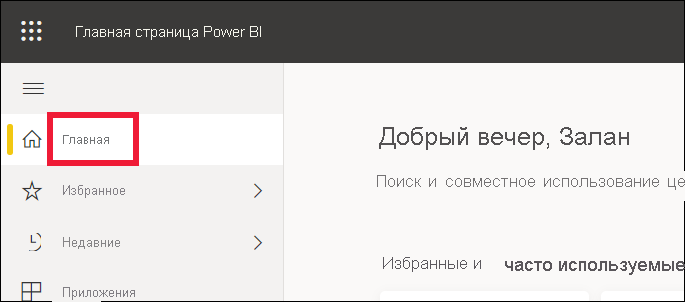
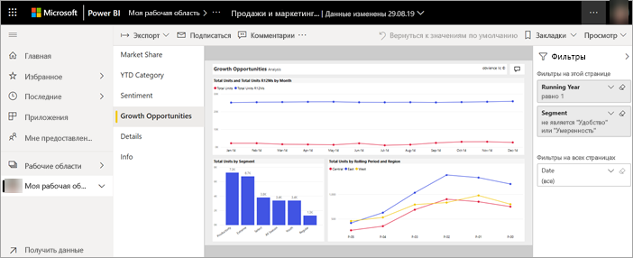
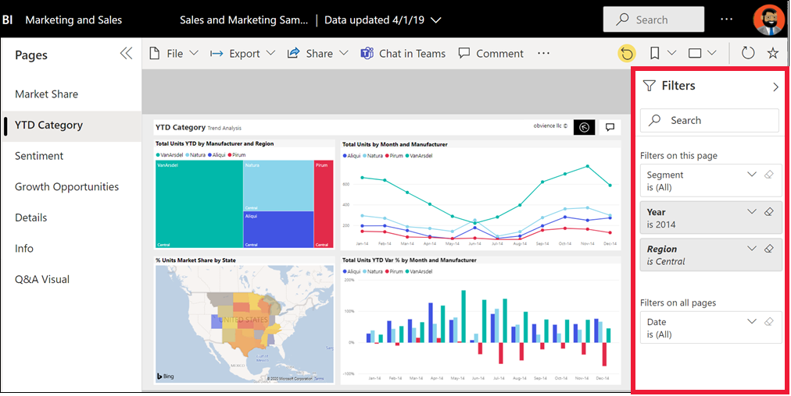
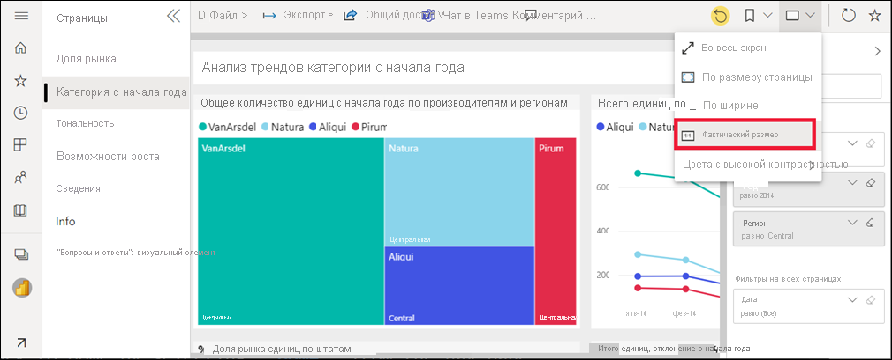
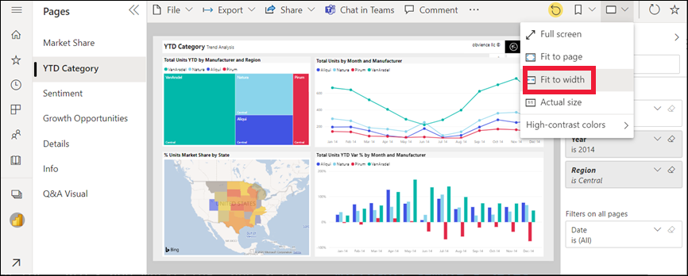

# Просмотр отчета в службе Power BI для *бизнес-пользователей*

[!INCLUDE[consumer-appliesto-yyny](../includes/consumer-appliesto-yyny.md)]

[!INCLUDE [power-bi-service-new-look-include](../includes/power-bi-service-new-look-include.md)]

Отчет состоит из одной или нескольких страниц с визуализациями. Отчеты создаются *разработчиками* Power BI. [Общий доступ к отчетам предоставляется *бизнес-пользователя напрямую*](end-user-shared-with-me.md) или в составе [приложения](end-user-apps.md). Чтобы открыть отчет, требуется лицензия Power BI Pro либо отчет должен входить в рабочую область, которая хранится в выделенной емкости Premium.

Есть много способов открыть отчет. Мы рассмотрим два из них: через главную страницу или через панель мониторинга. 

<!-- add art-->

## Открытие отчета через главную страницу Power BI
Давайте откроем отчет, к которому напрямую предоставлен общий доступ, а затем другой отчет, включенный в приложение.

   

### Открытие отчета, к которому вам предоставлен общий доступ
*Дизайнеры* Power BI могут предоставить вам доступ к отдельному отчету для совместной работы непосредственно с помощью ссылки в сообщении электронной почты или добавив вас автоматически к содержимому Power BI. Предоставляемые таким образом отчеты отображаются в контейнере **Мне предоставлен доступ** в области навигации, а также в разделе **Мне предоставлен доступ** на холсте главной страницы.

1. Откройте службу Power BI (app.powerbi.com).

2. В области навигации выберите **Главная**, чтобы отобразить холст главной страницы.  

   
   
3. Прокрутите вниз, пока не увидите раздел **Мне предоставлен доступ**. Найдите значок отчета . На этом снимке экрана показана одна панель мониторинга и один отчет. Отчет называется *Продажи и маркетинг — пример*. 
   
   

4. Выберите *карточку* отчета, чтобы открыть отчет.

   

5. Обратите внимание на вкладки в левой части.  Каждая из них представляет страницу *отчета*. В данный момент открыта страница *Возможность роста*. Перейдите на вкладку *Категории с начала года*, чтобы открыть эту страницу отчета. 

   

6. Разверните панель **Фильтры** справа. Здесь отображаются фильтры, примененные к текущей странице отчета или ко всему отчету.

   

7. При наведении указателя мыши на визуальный элемент отчета появляется несколько значков и пункт **Дополнительные параметры** (...). Чтобы просмотреть фильтры, примененные к определенному визуальному элементу, выберите значок фильтра. Здесь мы выбрали значок фильтра для графика *Total units by month and manufacturer* (Общее количество единиц по месяцам и производителям).

   

6. Теперь вы видите всю страницу отчета. Чтобы изменить отображение (масштаб) страницы, выберите раскрывающийся список "Вид" в правом верхнем углу, выберите **Фактический размер**, а затем щелкните **По ширине**.

   

   

Есть разные способы взаимодействия с отчетами для обнаружения дополнительных сведений и принятия бизнес-решений.  Для ознакомления со статьями об отчетах Power BI используйте оглавление в левой части окна. 

### Открытие отчета, который включен в приложение
Если вы получали приложения от коллег или из AppSource, они будут доступны на главной странице и в контейнере **Приложения** в области навигации. [Приложение](end-user-apps.md) — это совокупность панелей мониторинга и отчетов, составленная *дизайнером* Power BI.

### Предварительные требования
Скачайте приложение "Продажи и маркетинг".
1. В браузере перейдите по адресу appsource.microsoft.com.
1. Выполните поиск по запросу "Продажи и маркетинг" и выберите **Пример Microsoft — Продажи и маркетинг**.
1. Выберите **Получить** > **Продолжить** > **Установить**, чтобы установить приложение в контейнер приложений. 

Вы можете открыть приложение в контейнере приложений или на главной странице.
1. Вернитесь на главную страницу, выбрав пункт **Главная** в области навигации.

7. Прокрутите вниз, пока не увидите раздел **Мои приложения**.

   

8. Выберите новое приложение *Продажи и маркетинг*, чтобы открыть его. В зависимости от параметров, заданных *конструктором* приложения, откроется панель мониторинга или отчет. Это приложение откроется на панели мониторинга.  

## Открытие отчета из панели мониторинга
Отчеты можно открывать с панели мониторинга. Большинство [плиток](end-user-tiles.md) на панели мониторинга *закреплены* из отчетов. При выборе такой плитки открывается отчет, который использовался для ее создания. 

1. Щелкните плитку на панели мониторинга. В этом примере мы выбрали плитку гистограммы *Total Units YTD...* (Всего единиц с начала года...).

    

2.  Откроется связанный с ней отчет. Обратите внимание, что у нас открыта страница *YTD Category* (Категория с начала года). Это страница отчета с гистограммой, которую мы выбрали на панели мониторинга.

    

> [!NOTE]
> Не все плитки направляют к отчетам. При выборе плитки, [созданной с помощью функции "Вопросы и ответы"](end-user-q-and-a.md), откроется экран этой функции. Если вы выберете плитку, [созданную с помощью мини-приложения **Добавить плитку** на панели мониторинга](../create-reports/service-dashboard-add-widget.md), могут выполняться различные действия, такие как воспроизведение видео, открытие веб-сайта и т. д.  

##  Другие способы открытия отчета
Когда вы освоитесь с навигацией в службе Power BI, вы сможете выбрать для себя наиболее удобные рабочие процессы. Другие способы доступа к отчетам:
- из области навигации с помощью элементов [Избранное](end-user-favorite.md) и [Недавние](end-user-recent.md);    
- при помощи параметра [Просмотреть похожие](end-user-related.md);    
- из сообщения электронной почты, если кто-нибудь [предоставил вам доступ](../collaborate-share/service-share-reports.md) или вы [настроили оповещение](end-user-alerts.md);    
- из вашего [центра уведомлений](end-user-notification-center.md);    
- из рабочей области;
- и многое другое.

## Дальнейшие действия
[Открытие и просмотр панели мониторинга](end-user-dashboard-open.md)    
[Фильтры в отчетах](end-user-report-filter.md)

