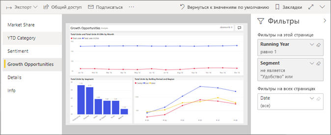
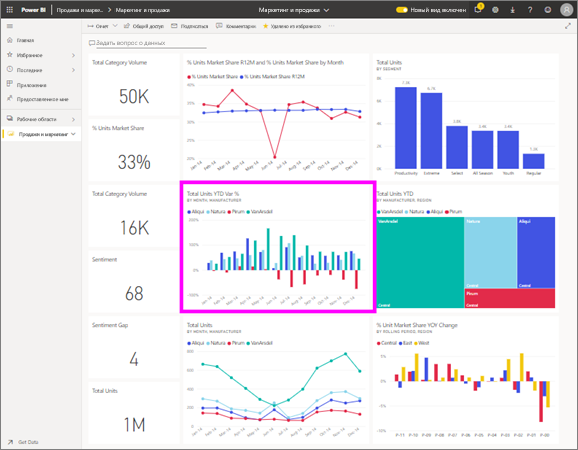

# Просмотр отчета в службе Power BI для *потребителей*
Отчет состоит из одной или нескольких страниц с визуализациями. Отчеты, создаваемые в Power BI *конструкторы* и [совместно используется с *потребителей* непосредственно](end-user-shared-with-me.md) или как часть [приложения](end-user-apps.md). 

Существует много разных способов для открытия отчета, и мы покажем вам два из них: откройте из дома и откройте из панели мониторинга. 

<!-- add art-->

## Откройте отчет из Power BI Home
Давайте откроем отчет, к которому напрямую предоставлен общий доступ, а затем другой отчет, включенный в приложение.

   

### Открытие отчета, к которому вам предоставлен общий доступ
Power BI *конструкторы* общий доступ к отчету непосредственно с вами. Отображается содержимое, которое является общим таким образом в **мне предоставлен доступ** контейнер в вашей nav панели, а также в **мне предоставлен доступ** части домашней холст.

1. Откройте службу Power BI (app.powerbi.com).

2. На панели навигации выберите **Главная** для отображения домашней холст.  

   
   
3. Прокрутите вниз, пока не увидите раздел **Мне предоставлен доступ**. Найдите значок отчета . На этом снимке экрана у нас есть одна панель мониторинга и один отчет с именем *продажи и маркетинг — пример*. 
   
   

4. Просто выберите отчет *карты* для открытия отчета.

   

5. Обратите внимание, что вкладки вдоль левой стороны.  Каждая из них представляет страницу *отчета*. У нас сейчас есть *возможности роста* страницу. Выберите *категории с начала года* вкладку, чтобы открыть эту страницу отчета, вместо этого. 

   

6. Сейчас мы наблюдаем всей странице отчета. Чтобы изменить параметры отображения (масштаб) страницы, щелкните раскрывающийся список представления в правом верхнем углу ( **>** ) и выберите **фактический размер**.

   

   

### Открытие отчета, который включен в приложение
Если вы получили приложений с коллегами или из AppSource, эти приложения доступны из, Главная и из **приложений** контейнера на панели навигации. [Приложения](end-user-apps.md) представляет собой набор панелей мониторинга и отчетов.

1. Перейдите на главную страницу, выбрав **Главная** из панели навигации.

7. Прокрутите вниз, пока не увидите раздел **Мои приложения**.

   

8. Выберите одно из приложений, чтобы открыть его. В зависимости от параметров, заданных *конструктором* приложения, откроется панель мониторинга, отчет или список содержимого приложения. Если при выборе приложения:
    - открывается отчет, то все готово;
    - открывается панель мониторинга, перейдите к разделу ***Открытие отчета с панели мониторинга***.
    - открывается список содержимого приложения, в разделе **Отчеты** выберите отчет, чтобы открыть его.

## Открытие отчета с панели мониторинга
Отчеты можно открывать с панели мониторинга. Большинство плиток на панели мониторинга *закреплены* из отчетов. При выборе такой плитки открывается отчет, который использовался для ее создания. 

1. Выберите плитку на панели мониторинга. В этом примере мы выбрали плитку гистограммы Total Units YTD... (Всего единиц с начала года...).

    

2.  Откроется связанный с ней отчет. Обратите внимание, что у нас открыта страница YTD Category (Категория с начала года). Это страница отчета с гистограммой, которую мы выбрали на панели мониторинга.

    

> [!NOTE]
> Не все плитки направляют к отчетам. При выборе плитки, [созданной с помощью функции "Вопросы и ответы"](end-user-q-and-a.md), откроется экран этой функции. Если вы выберете плитку, [созданную с помощью мини-приложения **Добавить плитку** на панели мониторинга](../service-dashboard-add-widget.md), возможны различные действия.  

##  Другие способы открытия отчета
Как вы привыкнете навигации в службе Power BI, мы вычислим рабочие процессы, которые лучше всего подходят для вас. Другие способы доступа к отчетам:
- Из панели с помощью навигации **"Избранное"** и **последние**    
- при помощи параметра [Просмотреть похожие](end-user-related.md);    
- из сообщения электронной почты, если кто-нибудь [предоставил вам доступ](../service-share-reports.md) или вы [настроили оповещение](end-user-alerts.md);    
- из вашего [центра уведомлений](end-user-notification-center.md);    
- и прочие.

## Дальнейшие действия
Есть [очень много способов взаимодействовать с отчетом](end-user-reading-view.md).  Его изучения следует выбирать вкладки к части холста отчета.

