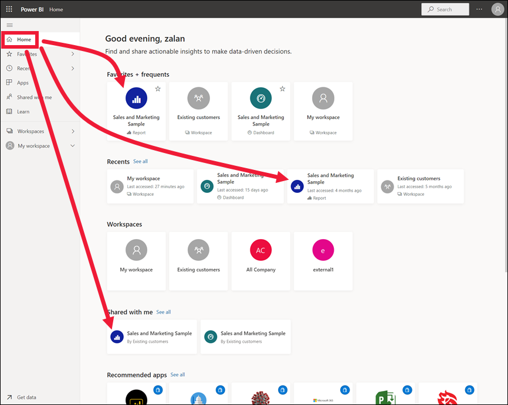

# Просмотр отчета в службе Power BI (app.powerbi.com)
Отчет состоит из одной или нескольких страниц с визуализациями. Отчеты создаются в *конструкторах отчетов* Power BI. [Общий доступ к отчетам предоставляется напрямую](end-user-shared-with-me.md) или в составе [приложения](end-user-apps.md). 

Есть много способов открыть отчет. Мы рассмотрим два из них: через домашнюю страницу или через панель мониторинга. 

<!-- add art-->

## Открытие отчета с домашней страницы
Давайте откроем отчет, к которому напрямую предоставлен общий доступ, а затем другой отчет, включенный в приложение.

   

### Открытие отчета, к которому вам предоставлен общий доступ
*Конструкторы* Power BI могут предоставить общий доступ к отчету напрямую, нажав кнопку **Совместно использовать** в строке меню сверху. Содержимое, к которому таким образом предоставлен общий доступ, отображается в контейнере **Мне предоставлен доступ** на панели навигации слева, а также в разделе **Мне предоставлен доступ** на домашней странице.

1. Откройте службу Power BI (app.powerbi.com).

2. На панели навигации слева выберите **Главная (предварительная версия)**, чтобы открыть домашнюю страницу.  

   
   
3. Прокрутите вниз, пока не увидите раздел **Мне предоставлен доступ**. Найдите значок отчета . На этом снимке экрана вы видите два отчета: *Financial* и *Northwind*. 
   
   

4. Выберите любую из карточек отчетов, чтобы открыть отчет.

   

5. Обратите внимание на вкладки в нижней части страницы. Каждая из них представляет страницу *отчета*. Сейчас открыта страница *IT Spend Trend* (Тенденции расходов на ИТ). Выберите другую вкладку, чтобы открыть соответствующую страницу отчета. 

   

6. Сейчас мы видим только часть этой страницы отчета. Чтобы изменить отображение (масштаб) страницы, выберите **Представление** > **По размеру страницы**.

   

   

### Открытие отчета, который включен в приложение
Если вы получили от коллег или из AppSource приложение, оно будет доступно на домашней странице и в контейнере **Приложения** на панели навигации слева. [Приложения](end-user-apps.md) представляет собой набор панелей мониторинга и отчетов.

1. Вернитесь на домашнюю страницу, выбрав **Home (Предварительная версия)** на панели навигации слева.

7. Прокрутите вниз, пока не увидите раздел **Мои приложения**.

   

8. Выберите одно из приложений, чтобы открыть его. В зависимости от параметров, заданных *конструктором* приложения, откроется панель мониторинга или отчет. Если при выборе приложения:
    - открывается отчет, то все готово;
    - открывается панель мониторинга, перейдите к разделу [Открытие отчета с панели мониторинга](#Open-a-report-from-a-dashboard).

## Открытие отчета с панели мониторинга
Отчеты можно открывать с панели мониторинга. Большинство плиток на панели мониторинга *закреплены* из отчетов. При выборе такой плитки открывается отчет, который использовался для ее создания. 

1. Выберите плитку на панели мониторинга. В этом примере мы выбрали плитку гистограммы Total Units YTD... (Всего единиц с начала года...).

    

2.  Откроется связанный с ней отчет. Обратите внимание, что у нас открыта страница YTD Category (Категория с начала года). Это страница отчета с гистограммой, которую мы выбрали на панели мониторинга.

    

> [!NOTE]
> Не все плитки направляют к отчетам. При выборе плитки, [созданной с помощью функции "Вопросы и ответы"](../service-dashboard-pin-tile-from-q-and-a.md), откроется экран этой функции. Если вы выберете плитку, [созданную с помощью мини-приложения **Добавить плитку** на панели мониторинга](../service-dashboard-add-widget.md), откроется мастер **изменения плитки**.  

##  Другие способы открытия отчета
Когда вы освоитесь с навигацией в службе Power BI, вы сможете выбрать для себя наиболее удобные рабочие процессы. Другие способы доступа к отчетам:
- из области навигации слева с помощью элементов **Избранное** и **Последние**;    
- при помощи параметра [Просмотреть похожие](end-user-related.md);    
- из сообщения электронной почты, если кто-нибудь [предоставил вам доступ](../service-share-reports.md) или вы [настроили оповещение](../service-set-data-alerts.md);    
- из [центра уведомлений] (end-user-notification-center.md);    
- и прочие.

## Дальнейшие действия
Есть [очень много способов взаимодействовать с отчетом](end-user-reading-view.md).  Для начала попробуйте поочередно выбрать каждую вкладку в нижней части холста отчета.

