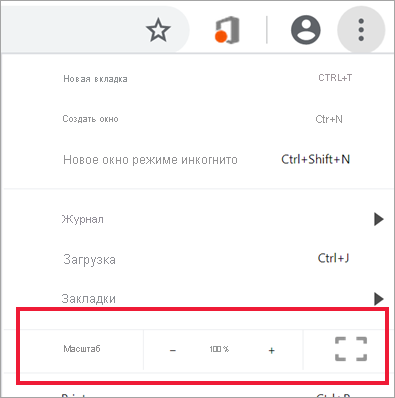

# Изменение отображения страницы отчета

[!INCLUDE[consumer-appliesto-yyny](../includes/consumer-appliesto-yyny.md)]

[!INCLUDE [power-bi-service-new-look-include](../includes/power-bi-service-new-look-include.md)]

Отчеты можно просматривать на различных устройствах с различными размерами экранов и соотношениями сторон. Вы можете изменить способ отображения страницы отчета в соответствии со своими потребностями.

## Изучите меню "Вид"

Параметры в меню **Вид** позволяют отображать страницы отчета с выбранным размером и шириной:

- Предположим, вы просматриваете отчет на маленьком экране, где отображение заголовков и условных обозначений затруднено.  Выберите **Вид** > **Фактический размер**, чтобы увеличить размер страницы отчета. Используйте полосы прокрутки для перемещения по отчету.

    

- Другой вариант — разместить отчет по ширине экрана, выбрав вариант **По ширине**. Так как это только ширина, а не высота, по-прежнему может потребоваться использовать полосу вертикальной прокрутки.

  

- Если вы не хотите видеть полосы прокрутки, но хотите максимально эффективно использовать размер экрана, выберите вариант **По размеру страницы**.

   

- Вы также можете выбрать четыре варианта **цветов высокой контрастности**: Высокая контрастность #1, высокая контрастность #2, высокая контрастность с черным и высокая контрастность с белым. Это дополнение специальных возможностей, которое можно использовать, чтобы люди со слабым зрением могли просматривать отчеты. Ниже приведен пример режима "Высокая контрастность 1". 

    

- Последний режим — **Во весь экран**; в нем страница отчета отображается без заголовков и меню. Это может быть хорошим выбором для небольших экранов, где трудно видеть детали.  Это также может быть хорошим выбором при проецировании страниц отчета на большом экране, чтобы просматривать отчет, но не работать с ним.  

    

При выходе из отчета ваши параметры в разделе **Вид** не сохраняются; будет восстановлено представление по умолчанию. Если важно сохранить эти параметры, используйте [Закладки](end-user-bookmarks.md).

## Изменение режима отображения страницы в браузере

С помощью элементов управления масштабированием в браузере можно уменьшать и увеличивать доступную область холста. Уменьшение масштаба приводит к увеличению доступной области холста, и наоборот. 

Чтобы изменить отображаемый размер отчета, можно также изменить размер всего окна браузера. 

## Увеличение масштаба визуального элемента
Иногда бывает трудно рассмотреть визуальный элемент в деталях. В этом случае можно увеличить отдельный визуальный элемент. Дополнительные сведения см. в статье [Режим фокусировки и полноэкранный режим](end-user-focus.md).

### Визуальный элемент в режиме *фокусировки*

### Визуальный элемент в *полноэкранном* режиме

## Дальнейшие действия

* [Ознакомление с панелью "Фильтры" отчета](end-user-report-filter.md)