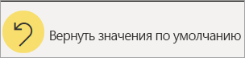

# Отчеты в Power BI

[!INCLUDE [power-bi-service-new-look-include](../includes/power-bi-service-new-look-include.md)]

Отчет Power BI — это разностороннее представление набора данных с визуальными элементами, которые отображают различные результаты и сведения, полученные из этого набора данных.  В отчете может быть один визуальный элемент или несколько страниц, заполненных визуальными элементами. В зависимости от вашей должности, возможно, вы *проектируете* отчеты. Также возможно, что вы *используете* отчеты. Эта статья предназначена для *потребителей*.

А. Этот отчет содержит шесть страниц (или вкладок); вы просматриваете страницу **Тональность**.    
Б. На этой странице отображается пять различных визуальных элементов и заголовок.    
В. В области *Фильтры* отображается фильтр, который применен ко всем страницам отчета. Чтобы свернуть область фильтров, щелкните стрелку ( **>** ).    
Г. Баннер Power BI отображает имя отчета и дату его последнего изменения. Нажмите значок стрелки, чтобы открыть меню с отображением имени владельца отчета.    
И. Панель действий отображает действия, которые можно выполнить с этим отчетом.  Например, вы можете добавить комментарий, просмотреть вкладку или экспортировать данные из отчета.  Нажмите **Дополнительные параметры** (...), чтобы раскрыть список дополнительных функций отчета.    

Если вы недавно начали использовать службу Power BI, ознакомьтесь со статьей [Основные понятия для пользователей службы Power BI](end-user-basic-concepts.md). Отчеты доступны для просмотра, публикации и добавления заметок на мобильных устройствах. Дополнительные сведения см. в разделе [Просмотр отчетов в мобильных приложениях Power BI](mobile/mobile-reports-in-the-mobile-apps.md).

## Преимущества отчетов

Power BI создает отчет на основе одного набора данных. *Создатели* отчетов создают в отчете визуальные элементы, которые представляют собой фрагменты данных. Визуальные элементы не являются статическими.  Обновление происходит при изменении базовых данных. Вы можете взаимодействовать с фильтрами и визуальными элементами по мере изучения данных, чтобы получать новую информацию и искать ответы на вопросы. Как и панели мониторинга, визуальные элементы предоставляют широкие возможности для взаимодействия и настройки.

### Безопасная работа с содержимым

В процессе работы с вашим содержимым использование фильтрации, среза, подписки и экспорта не может нарушить работу отчета. Ваша работа не касается базового набора данных или исходного общего содержимого. Это относится к панелям мониторинга, отчетам и приложениям.

> [!NOTE]
> Помните, что вы не можете повредить данные. Power BI отлично подходит для исследования и экспериментов; работайте, не беспокоясь о возможных изменениях.

### Сохранение изменений или возврат к параметрам по умолчанию

Это не значит, что вы не можете сохранять изменения. Они сохраняются, однако эти изменения касаются только вашего представления содержимого. Чтобы восстановить исходное представление отчета по умолчанию, выберите команду **Вернуться к значениям по умолчанию**.

## Панели мониторинга и отчеты

[Панели мониторинга](end-user-dashboards.md) зачастую путают с отчетами, так как они также являются полотнами, заполненными визуальными элементами. Но есть некоторые существенные различия.  

| **Возможность** | **Панели мониторинга** | **Отчеты** |
| --- | --- | --- |
| Страницы |Одна страница |Одна или несколько страниц |
| Источники данных |Один или несколько отчетов и один или несколько наборов данных на каждую панель мониторинга |Один набор данных на каждый отчет |
| Фильтрация |Невозможно выполнить фильтрацию и срез |Множество различных способов для выполнения фильтрации, выделения и среза |
| Настройка оповещений |Можно создавать оповещения, которые будут отправляться вам по электронной почте при соблюдении некоторых условий для панели мониторинга |Нет |
| Признак |Можно задать одну панель мониторинга в качестве избранной |Нельзя создать избранный отчет |
| Просмотр таблиц и полей базового набора данных |Нет. Можно экспортировать данные, но нельзя просматривать таблицы и поля набора данных непосредственно на панели мониторинга |Да. Можно просматривать таблицы, поля и значения набора данных, для которых у вас есть разрешения на просмотр |
| Настройка |Нет  |Можно фильтровать, экспортировать, просматривать связанное содержимое, добавлять закладки, создавать QR-коды, анализировать данные в Excel и делать многое другое |

<!--| Available in Power BI Desktop |No |Yes, can create and view reports in Desktop |
| Pinning |Can pin existing visuals (tiles) only from current dashboard to your other dashboards |Can pin visuals (as tiles) to any of your dashboards. Can pin entire report pages to any of your dashboards. | -->

## Создатели отчетов и пользователи отчетов

В зависимости от вашей роли, вы можете быть *создателем* отчетов для собственного пользования или для совместного использования с коллегами. Возможно, вы хотите узнать, как создавать и совместно использовать отчеты.

Вы можете также *использовать* отчеты, полученные от других. Возможно, вы хотите разобраться в особенностях использования отчетов и способах взаимодействия с ними. Если вы являетесь *пользователем* отчетов, вам нужны эти ссылки:

* Начните с [обзора службы Power BI](end-user-basic-concepts.md), чтобы узнать, где находятся отчеты и средства их создания.
* Узнайте, как [открыть отчет](end-user-report-open.md), а также узнайте обо [всех действиях, доступных потребителям](end-user-reading-view.md).
* Ознакомьтесь с обзорными сведениями об использовании на примере одного из наших [отчетов](../sample-tutorial-connect-to-the-samples.md).  
* Чтобы определить, какой набор данных используется в отчете и какие панели мониторинга отображают визуальные элементы из отчета (*закрепления*), см. статью [Просмотр связанного содержимого в службе Power BI](end-user-related.md).

> [!TIP]
> Если здесь вы не нашли ответ на интересующий вас вопрос, используйте оглавление слева для просмотра всех статей об *отчетах*.

## Дальнейшие действия

[Открытие и просмотр отчета](end-user-report-open.md)    
[Панели мониторинга в службе Power BI](end-user-dashboards.md)