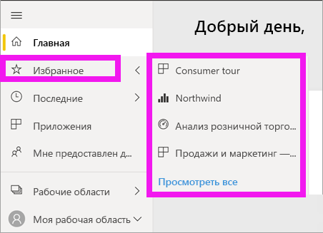

# Навигация: поиск, обнаружение и сортировка содержимого в службе Power BI

[!INCLUDE [power-bi-service-new-look-include](../includes/power-bi-service-new-look-include.md)]

Есть множество способов навигации по содержимому в службе Power BI. Содержимое в вашей рабочей области распределяется по типу: панели мониторинга и отчеты.  Кроме того, содержимое упорядочено по принципу использования: избранное, недавно просмотренное, основное, приложения и содержимое, к которому предоставлен общий доступ. Для простоты навигации все сведения на *домашней* странице Power BI собраны в одну страницу. Различные подходы к упорядочению содержимого позволяют быстро находить нужные данные в службе Power BI.  

## Навигация по рабочим областям

*Пользователи* Power BI обычно имеют только одну рабочую область: **Моя рабочая область**. **Моя рабочая область** имеет содержимое только в том случае, если вы уже скачали примеры корпорации Майкрософт или создали собственные панели мониторинга, отчеты или приложения.  

В разделе **Моя рабочая область** служба Power BI разделяет содержимое по типам: панели мониторинга, отчеты, книги и наборы данных. При выборе рабочей области вы увидите, как оно упорядочено. В этом примере **Моя рабочая область** содержит одну панель мониторинга, один отчет, один набор данных и не содержит книг.

________________________________________
## Навигация с помощью поля поиска
Представление содержимого **Моя рабочая область** упрощает поиск, фильтрацию и сортировку содержимого. Начните вводить название панели мониторинга, отчета, книги или имя владельца в поле поиска.  

Если количество элементов содержимого невелико, поиск и сортировка не требуются.  Но когда у вас много панелей мониторинга и отчетов, эти функции очень полезны. Например, в списке отчетов ниже содержится 83 элемента. 

Вы также можете сортировать содержимое по имени или владельцу. Обратите внимание на стрелку вверх справа от **Имени**. Мы сейчас сортируем 83 элемента в алфавитном порядке по имени. Чтобы использовать порядок сортировки по убыванию, выберите **Имя**. Стрелка вверх сменится на стрелку вниз.

Не все столбцы могут быть отсортированы. Наведите указатель мыши на заголовки столбцов, чтобы узнать, какие из них могут быть отсортированы.

___________________________________________________________________
## Использование области навигации
В области навигации содержимое представлено в классифицированном виде, позволяющем быстрее найти то, что вам нужно.  

- Содержимое, к которому вам предоставили доступ, доступно в разделе **Мне предоставлен доступ**.
- Последнее просмотренное содержимое доступно в разделе **Последние**. 
- Ваши приложения можно найти, выбрав **Приложения**.
- На странице **Главная** собрано наиболее важное содержимое, а также рекомендации и источники для обучения.

Кроме того, можно отметить содержимое как [избранное](end-user-favorite.md) и [основное](end-user-featured.md). Чтобы упорядочить содержимое, одну из панелей мониторинга или один из отчетов, которые вы просматриваете чаще всего, можно сделать *основными*. При каждом открытии службы Power BI первой будет отображаться основная панель мониторинга. У вас есть часто используемые информационные панели и приложения? Если вы добавите их в избранные, они всегда будут доступны в области навигации.

.

## Рекомендации и устранение неполадок
* В наборах данных **сортировка** по владельцу не поддерживается.

## Дальнейшие действия
[Сортировка визуальных элементов в отчетах](end-user-change-sort.md)

Появились дополнительные вопросы? [Ответы на них см. в сообществе Power BI.](https://community.powerbi.com/)
