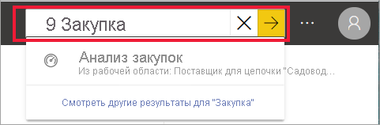
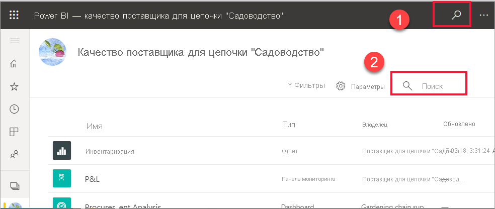
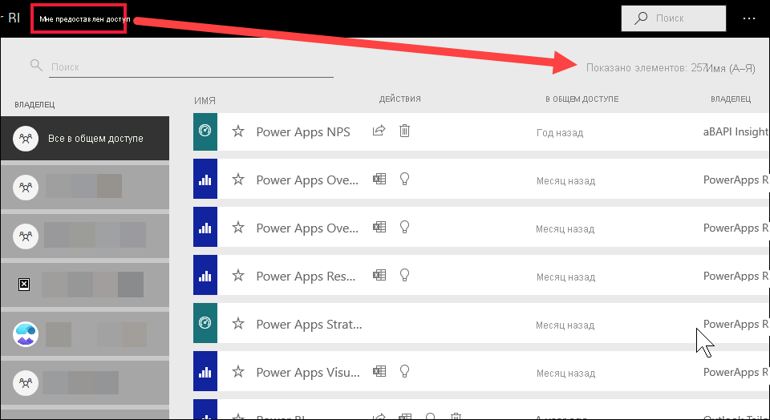

# Навигация для потребителей Power BI: глобальный поиск

[!INCLUDE[consumer-appliesto-yyny](../includes/consumer-appliesto-yyny.md)]

[!INCLUDE [power-bi-service-new-look-include](../includes/power-bi-service-new-look-include.md)]

Если вы не знакомы со службой Power BI, у вас будет только часть содержимого (панели мониторинга, отчеты, приложения). Однако по мере загрузки новых приложений и работы с предоставляемым вашими коллегами содержимым его объем может значительно увеличиваться. В таких случаях вам пригодятся функции поиска и сортировки.

## Поиск содержимого
 Поиск можно выполнять практически из любого места службы Power BI. Просто найдите поле поиска или значок поиска .

 Начните вводить название панели мониторинга, отчета, книги, рабочей области, приложения или имя владельца в поле поиска. Поиск нужного содержимого в службе Power BI будет выполняться автоматически. 

  

 В некоторых областях Power BI, таких как рабочие области, можно найти два разных поля поиска. Поле поиска в строке меню выполняет поиск всего содержимого, тогда как поле поиска на холсте рабочей области выполняет поиск только в этой рабочей области.

  

## Сортировка списков содержимого

Если имеется всего несколько фрагментов содержимого, сортировка может оказаться излишней.  Но при наличии длинных списков панелей мониторинга и отчетов сортировка поможет найти необходимые объекты. Например, список содержимого **Мне предоставлен доступ** содержит 257 элементов. 

Сейчас список содержимого сортируется в алфавитном порядке по имени от А до Я. Чтобы изменить критерий сортировки, щелкните стрелку справа от параметра **Имя (А–Я)** .

Сортировка также доступна в рабочих областях. В этом примере содержимое сортируется по дате **Обновлено**. Чтобы задать критерии сортировки для рабочих областей, выберите заголовок нужного столбца один раз, чтобы выбрать этот заголовок, а затем снова выберите его, чтобы изменить порядок сортировки. 

Не все столбцы могут быть отсортированы. Наведите указатель мыши на заголовки столбцов, чтобы узнать, какие из них могут быть отсортированы.

## Рекомендации и устранение неполадок
* В наборах данных **сортировка** по владельцу не поддерживается.

## Дальнейшие действия
[Сортировка визуальных элементов в отчетах](end-user-change-sort.md)

[Сортировка данных в визуальных элементах](end-user-change-sort.md)

Появились дополнительные вопросы? [Ответы на них см. в сообществе Power BI.](https://community.powerbi.com/)
