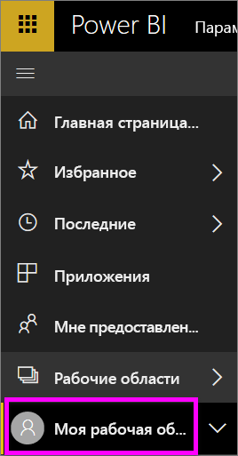
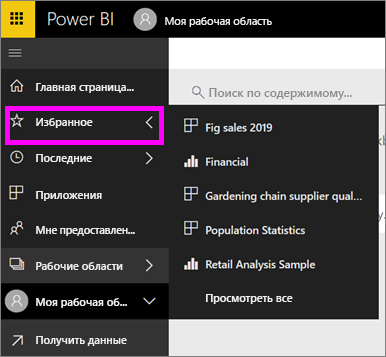

# Навигация: поиск, обнаружение и сортировка содержимого в службе Power BI
Есть множество способов навигации по содержимому в службе Power BI. Содержимое в рабочих областях распределяется по типу: панели мониторинга, отчеты, книги и наборы данных.  Кроме того, содержимое упорядочено по принципу использования: избранное, недавно просмотренное, основное, приложения и содержимое, к которому предоставлен общий доступ. Для простоты навигации все сведения на домашней странице собраны в одну страницу. Различные подходы к упорядочению содержимого позволяют быстро находить нужные данные в службе Power BI.  

## Навигация по рабочим областям

*Потребители* Power BI обычно имеют только одну рабочую область: **Моя рабочая область**. **Моя рабочая область** имеет содержимое только в том случае, если вы уже скачали примеры корпорации Майкрософт или создали собственное содержимое.  

В разделе **Моя рабочая область** служба Power BI разделяет содержимое по типам: панели мониторинга, отчеты, книги и наборы данных. При выборе рабочей области вы увидите, как оно упорядочено. В этом примере **Моя рабочая область** содержит одну панель мониторинга, два отчета, два набора данных и не содержит книг.

________________________________________

## Навигация с помощью панели навигации слева
На панели навигации слева представлено классифицированное содержимое. Это обеспечивает простой и быстрый поиск нужных данных.  

- Содержимое, к которому вам предоставили доступ, доступно в разделе **Мне предоставлен доступ**.
- Последнее просмотренное содержимое доступно в разделе **Последние**. 
- Ваши приложения можно найти, выбрав **Приложения**.
- На странице **Главная** собрано наиболее важное содержимое, а также рекомендации и источники для обучения.

Кроме того, можно отметить содержимое как [избранное](end-user-favorite.md) и [основное](end-user-featured.md). Чтобы упорядочить содержимое, одну из панелей мониторинга, которую вы просматриваете чаще всего, можно сделать *основной*. При каждом открытии службы Power BI первой будет отображаться основная панель мониторинга. У вас есть часто используемые информационные панели и приложения? Если вы настроите их как избранные, они всегда будут отображаться на панели навигации слева.

.

## Рекомендации и устранение неполадок
* В наборах данных **сортировка** по владельцу не поддерживается.

## Дальнейшие действия
[Power BI — основные понятия](end-user-basic-concepts.md)

Появились дополнительные вопросы? [Ответы на них см. в сообществе Power BI.](http://community.powerbi.com/)