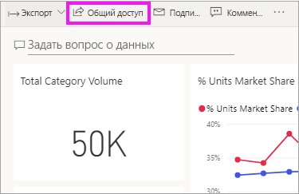
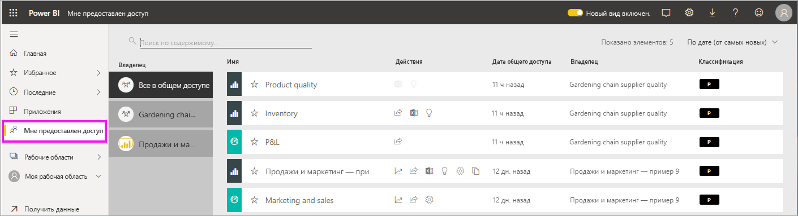
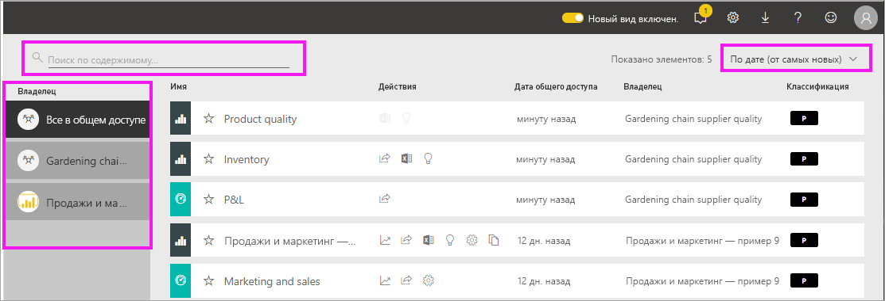

# Отображение панелей мониторинга и отчетов, к которым мне предоставлен доступ

Когда коллеги делятся с вами содержимым, используя кнопку **Предоставить общий доступ**, это содержимое отображается в вашем контейнере **Мне предоставлен доступ**. Панель мониторинга или отчет доступны только в списке **Мне предоставлен доступ**, но не в списке **Приложения**.

Узнайте, как Аманда использует список содержимого **Мне предоставлен доступ**, включая переходы и фильтрацию. Затем сделайте то же самое, выполнив пошаговые инструкции, приведенные под видео. Для просмотра панелей мониторинга, к которым вам предоставлен общий доступ, необходимо иметь лицензию Power BI Pro. Дополнительные сведения см. в статье [Что такое Power BI Premium?](../service-premium-what-is.md)
    

> [!NOTE]
> В этом видео используется более старая версия службы Power BI.
    

<iframe width="560" height="315" src="https://www.youtube.com/embed/G26dr2PsEpk" frameborder="0" allowfullscreen></iframe>

## Взаимодействие с общим содержимым

В зависимости от предоставленных разрешений у вас будут разные варианты взаимодействия с общими панелью мониторинга и отчетами, которыми с вами поделился их *автор*. таких как создание копий информационной панели, работа с отчетом [в режиме чтения](end-user-reading-view.md) и повторное предоставление общего доступа другим коллегам.

### Действия, доступные в контейнере **Мне предоставлен доступ**
Доступные действия будут зависеть от параметров, назначенных *автором* содержимого. Некоторые из параметров могут включать следующее.
* Щелкните значок звездочки для [добавления панели мониторинга или отчета в избранное](end-user-favorite.md) .
* Удаление панели мониторинга или отчета  .
* Повторное предоставление доступа к некоторым панелям мониторинга и отчетам  .
* [Открытие отчета в Excel](end-user-export.md)  
* [Просмотр аналитических сведений](end-user-insights.md), которые Power BI находит в данных .
  
  > [!NOTE]
  > Чтобы получить сведения о классификации EGRC, нажмите кнопку **классификации** или см. статью [Классификация данных на панелях мониторинга](../service-data-classification.md).
  > 

## Поиск и сортировка общих панелей мониторинга
Если список содержимого удлиняется, у вас есть несколько вариантов поиска нужных данных. Можно использовать поле поиска, сортировать по дате или выбрать значение в столбце **Владелец**.    

