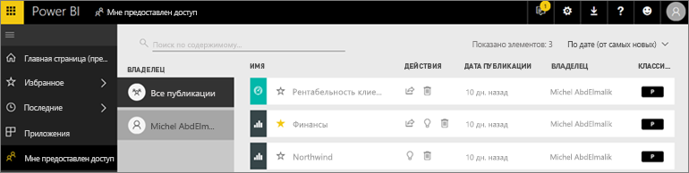
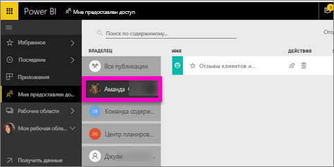

# Отображение панелей мониторинга и отчетов, к которым мне предоставлен доступ
## Мне предоставлен доступ

Когда коллеги делятся с вами содержимым, используя кнопку **Предоставить общий доступ**, это содержимое отображается в вашем контейнере **Мне предоставлен доступ**. Панель мониторинга или отчет доступны только в списке **Мне предоставлен доступ**, но не в списке **Приложения**.

Узнайте, как Аманда использует список содержимого **Мне предоставлен доступ**, включая переходы и фильтрацию. Затем сделайте то же самое, выполнив пошаговые инструкции, приведенные под видео. Для просмотра панелей мониторинга, к которым вам предоставлен общий доступ, необходимо иметь лицензию Power BI Pro. Дополнительные сведения см. в статье [Что такое Power BI Premium?](../service-premium.md)

<iframe width="560" height="315" src="https://www.youtube.com/embed/G26dr2PsEpk" frameborder="0" allowfullscreen></iframe>

В зависимости от предоставленных разрешений у вас будут разные варианты взаимодействия с панелью мониторинга и отчетами, которыми с вами поделился их автор. таких как создание копий информационной панели, работа с отчетом [в режиме чтения](end-user-reading-view.md) и повторное предоставление общего доступа другим коллегам.

## Действия, доступные в контейнере **Мне предоставлен доступ**
* Щелкните значок звездочки для [добавления панели мониторинга или отчета в избранное](end-user-favorite.md).
* Удаление панели мониторинга или отчета  
* Повторное предоставление доступа к некоторым панелям мониторинга и отчетам  
* [Поиск требуемых элементов с помощью поля поиска и сортировки](end-user-search-sort.md), если список длинный.
  
  > [!NOTE]
  > Чтобы получить сведения о классификации EGRC, нажмите кнопку классификации или см. статью [Классификация данных на панелях мониторинга](../service-data-classification.md).
  > 
  > 
* Выделите имя информационной панели, чтобы открыть ее и изучить. Открыв общую информационную панель, вы можете использовать раздел вопросов и ответов, чтобы задать вопросы о базовых данных, или выбрать плитку, чтобы открыть отчет в режиме чтения и работать с ним.

## Фильтрация общих информационных панелей по владельцу
Содержимое экрана **Мне предоставлен доступ** можно отфильтровать подробнее по владельцу. Например, если выбрать **Аманду**, появятся информационные панели, к которым предоставил доступ этот пользователь.

