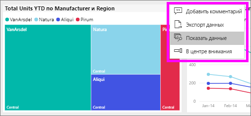
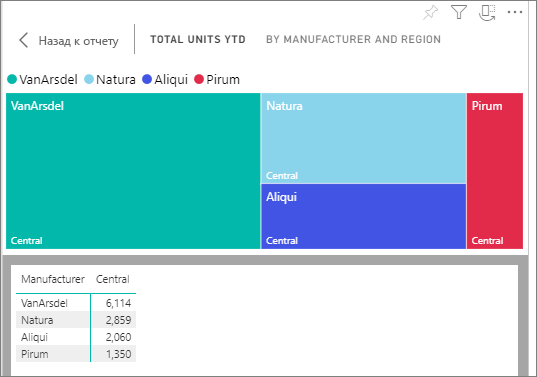
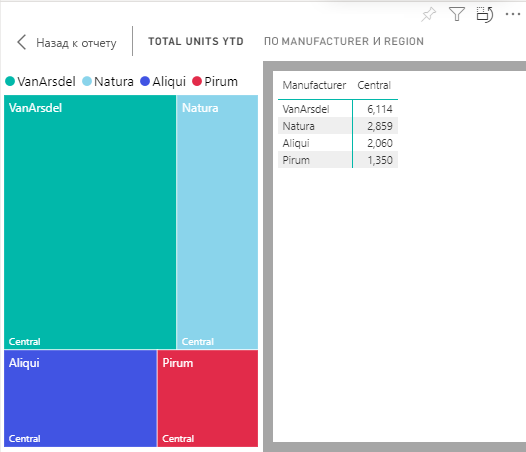

# Отображение данных, использованных для создания визуализации

Визуализация Power BI создается на основе данных из базовых наборов данных. Если вы хотите копнуть поглубже, Power BI дает возможность *просмотреть* данные, лежащие в основе визуального элемента. Если выбрать функцию **Показать данные**, Power BI отобразит рядом с визуализацией или под ней связанную информацию.

1. В службе Power BI [откройте отчет](end-user-report-open.md) и выберите визуализацию.  
2. Чтобы отобразить данные, лежащие в основе визуального элемента, нажмите кнопку с многоточием и выберите команду **Показать данные**.
   
   
3. По умолчанию данные отображаются под визуальным элементом.
   
   

4. Чтобы изменить ориентацию, выберите вертикальную ориентацию  в правом верхнем углу визуализации.
   
   

## Дальнейшие действия
[Визуализации в отчетах Power BI](../visuals/power-bi-report-visualizations.md)    
[Отчеты Power BI](end-user-reports.md)    
