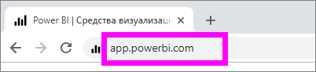
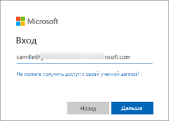
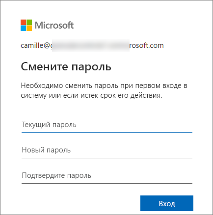
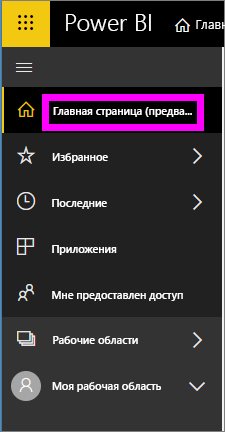
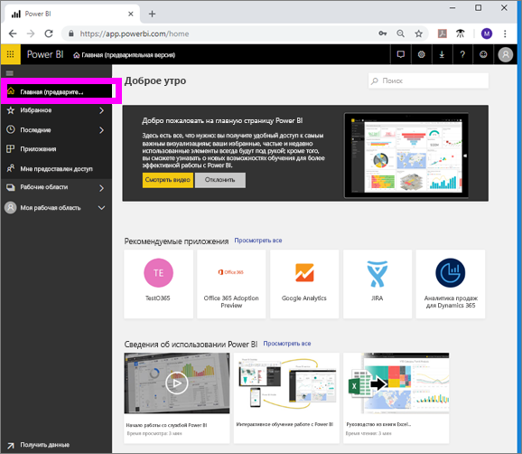
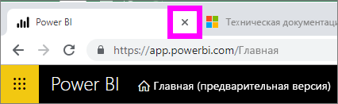
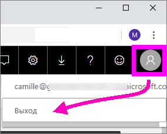

# Вход в службу Power BI

## Учетные записи Power BI
Чтобы войти в Power BI, необходима учетная запись. Есть два способа получить учетную запись Power BI. Первый — когда ваша компания приобретает лицензии Power BI для своих сотрудников. Второй — когда отдельные пользователи регистрируются для получения бесплатной пробной версии или личной лицензии. В этой статье рассматривается первый сценарий.

## Первый вход в систему

### Шаг 1. Откройте браузер.
Служба Power BI работает в браузере.  Поэтому первый шаг — откройте браузер и введите **app.powerbi.com**.

### Шаг 2. Введите адрес электронной почты.
При первом входе у пользователя запрашивается адрес электронной почты.  Это рабочий или учебный адрес электронной почты, который использовался для регистрации в Power BI.  

Найдите в папке "Входящие" сообщение электронной почты от администратора Power BI. Большинство администраторов отправляет пользователям приветственное сообщение электронной почты, в котором указан временный пароль. Используйте эту учетную запись электронной почты для входа. 

 
### Шаг 3. Создайте новый пароль.
Если администратор Power BI отправил вам временный пароль, введите его в поле **Текущий пароль**. Если вы не получили этот пароль в сообщении электронной почты, обратитесь к администратору Power BI.

Power BI запомнит ваши учетные данные, и вам не потребуется вводить имя пользователя (адрес электронной почты) при следующем входе. 

### Шаг 4. Просмотрите главную страницу.
При первом посещении Power BI открывается **главная** страница. Если **главная** страница не открывается, выберите ее в области навигации слева. 

На главной странице вы увидите все содержимое, которое вы можете использовать. Поначалу на главной странице может быть не слишком много содержимого, но не волнуйтесь, все изменится, когда вы начнете использовать Power BI совместно с коллегами. 

Если вы не хотите, чтобы при входе в Power BI открывалась главная страница, вы можете [задать **избранную** панель мониторинга или отчет](end-user-featured.md) для открытия. 

## Безопасная работа с содержимым
В качестве ***потребителей*** другие пользователи будут использовать содержимое совместно с вами, и вы сможете работать с этим содержимым для изучения данных и принятия бизнес-решений.  Когда вы применяете фильтры и срезы, подписываетесь на данные, экспортируете их и изменяете размер элементов, не беспокойтесь, — это не влияет на базовый набор данных или исходное общее содержимое (панели мониторинга и отчеты). Power BI — это безопасная среда для анализа и экспериментов. Это не значит, что вы не можете сохранять изменения. Они сохраняются, однако эти изменения касаются только **вашего** представления содержимого. А чтобы вернуться к исходному представлению по умолчанию, нужно просто нажать соответствующую кнопку.

## Выход из службы Power BI
При закрытии окна или выходе из Power BI изменения сохраняются: вы можете вернуться к работе с того же места, где остановились.

Чтобы закрыть Power BI, просто закройте вкладку браузера, в котором вы работаете. 

 

Если на компьютере работают и другие пользователи, мы рекомендуем выполнять выход при каждом закрытии Power BI.  Чтобы выйти из системы, в правом верхнем углу выберите изображение профиля и нажмите кнопку **Выйти**. В противном случае просто закройте вкладку браузера, когда закончите работу.

 

## Рекомендации и устранение неполадок
- Если вы зарегистрировались в Power BI как отдельный пользователь, войдите в систему с адресом электронной почты, который вы использовали для регистрации.

- Если в Power BI зарегистрировано несколько ваших учетных записей, при входе в систему вам будет предложено выбрать в списке учетную запись и ввести пароль. 

## Дальнейшие действия
[Просмотр приложения Power BI](end-user-app-view.md)
