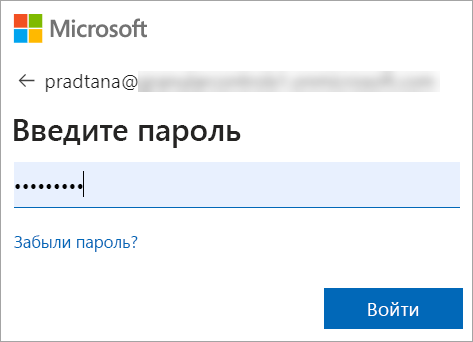
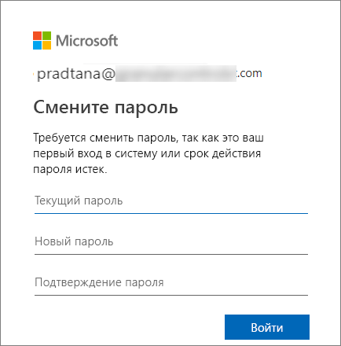
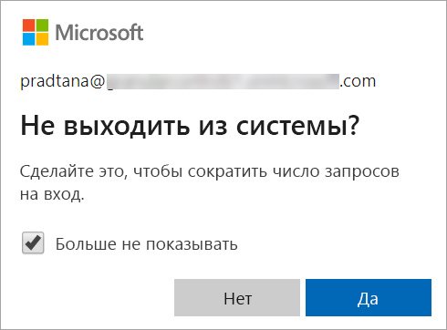
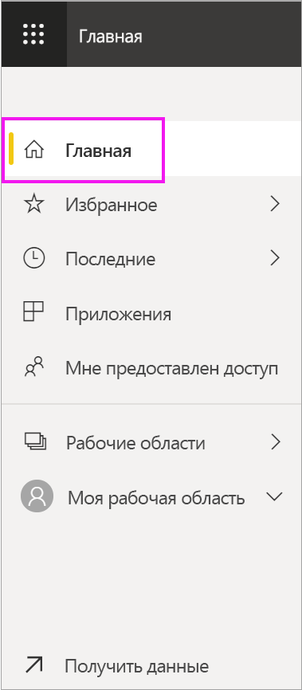
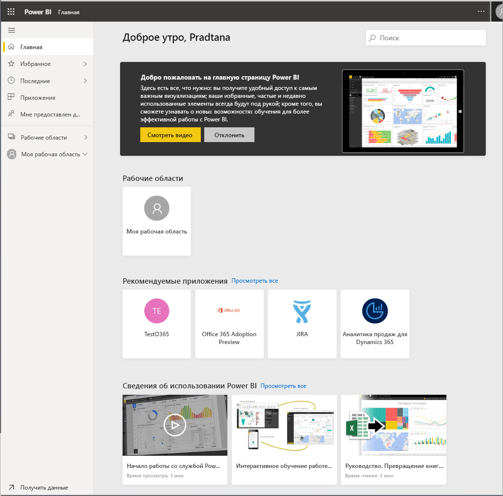

# Вход в службу Power BI

[!INCLUDE[consumer-appliesto-yyny](../includes/consumer-appliesto-yyny.md)]

## Учетные записи Power BI
Чтобы войти в Power BI, необходима учетная запись. Есть два способа получить учетную запись Power BI. Первый — когда ваша компания приобретает лицензии Power BI для своих сотрудников. Второй — когда отдельные пользователи регистрируются для получения бесплатной пробной версии или личной лицензии. В этой статье рассматривается первый сценарий.

## Первый вход в систему

### Шаг 1. Открытие браузера
Служба Power BI работает в браузере.  Поэтому первый шаг — откройте браузер и введите **app.powerbi.com**.

### Шаг 2. Введение адреса электронной почты
При первом входе у пользователя запрашивается адрес электронной почты.  Этот адрес электронной почты — это рабочая или учебная учетная запись, которая использовалась для регистрации в Power BI.  

Найдите в папке "Входящие" сообщение электронной почты от администратора Power BI. Большинство администраторов отправляет пользователям приветственное сообщение электронной почты, в котором указан временный пароль. Используйте эту учетную запись электронной почты для входа. 

 
### Шаг 3. Создание пароля
Если администратор Power BI отправил вам временный пароль, введите его в поле **Текущий пароль**. Если вы не получили пароль в сообщении электронной почты, обратитесь к администратору Power BI.

Если вы хотите, чтобы служба Power BI запомнила учетные данные, выберите **Да**. 

### Шаг 4. Проверка целевой страницы "Домашняя страница"
При первом посещении Power BI открывается целевая страница **Домашняя страница**. Если **домашняя страница** не открывается, выберите ее на панели навигации. 

На домашней странице вы увидите все содержимое, которое вы можете использовать. Поначалу на домашней странице может быть не слишком много содержимого, но не волнуйтесь, все изменится, когда вы начнете использовать Power BI совместно с коллегами. 

Если вы не хотите, чтобы при входе в Power BI открывалась домашняя страница, вы можете [настроить открытие **избранной** панели мониторинга или отчета](end-user-featured.md). 

## Безопасная работа с содержимым
В качестве ***потребителей*** другие пользователи будут использовать содержимое совместно с вами, и вы сможете работать с этим содержимым для изучения данных и принятия бизнес-решений.  Когда вы применяете фильтры и срезы, подписываетесь на данные, экспортируете их и изменяете размер элементов, не беспокойтесь, — это не влияет на базовый набор данных или исходное общее содержимое (панели мониторинга и отчеты). Power BI — это безопасная среда для анализа и экспериментов. Это не значит, что вы не можете сохранять изменения. Они сохраняются, однако эти изменения касаются только **вашего** представления содержимого. А чтобы вернуться к исходному представлению по умолчанию, нужно просто нажать соответствующую кнопку.

## Выход из службы Power BI
При закрытии окна или выходе из Power BI изменения сохраняются: вы можете вернуться к работе с того же места, где остановились.

Чтобы закрыть Power BI, закройте вкладку браузера, в котором вы работаете. 

 

Если на компьютере работают и другие пользователи, мы рекомендуем выполнять выход при каждом закрытии Power BI.  Чтобы выйти из системы, в правом верхнем углу выберите изображение профиля и нажмите кнопку **Выйти**. В противном случае закройте вкладку браузера, когда закончите работу.

 

## Рекомендации и устранение неполадок
- Если вы зарегистрировались в Power BI как отдельный пользователь, войдите в систему с адресом электронной почты, который вы использовали для регистрации.

- Некоторые люди используют Power BI с более чем одной учетной записью. В этом случае при входе вам будет предложено выбрать учетную запись из списка. 

## Дальнейшие действия
[Просмотр приложения Power BI](end-user-app-view.md)
