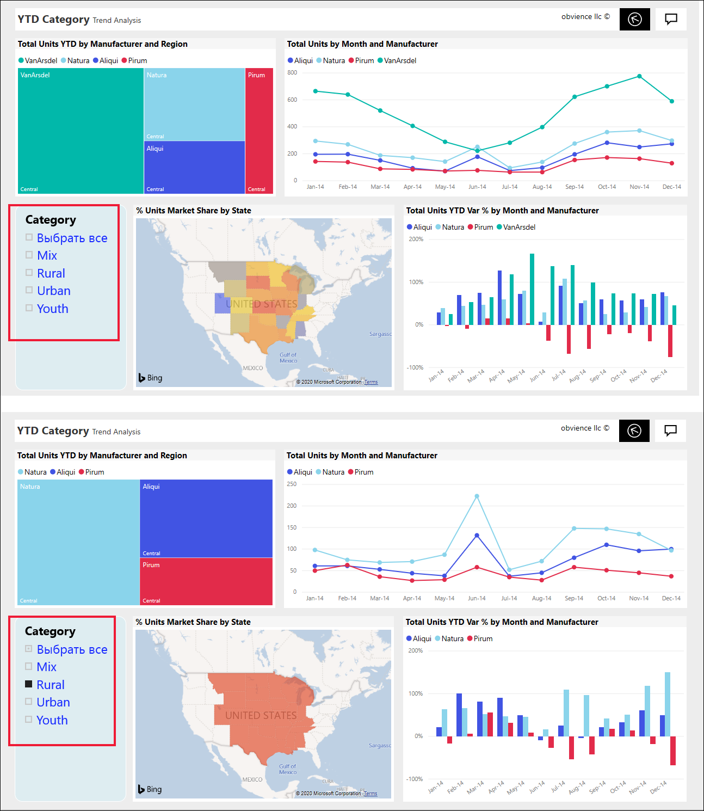
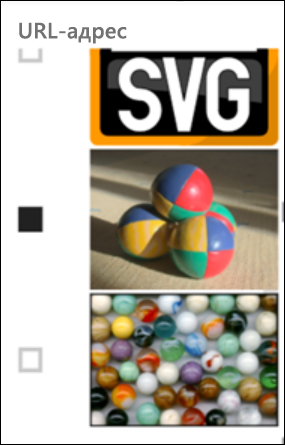
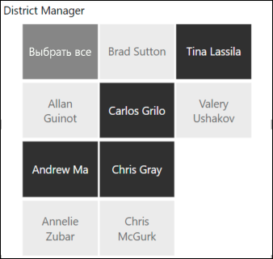
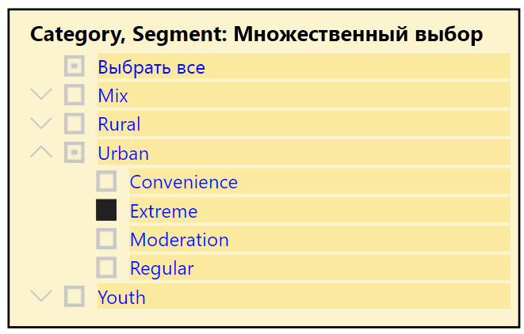
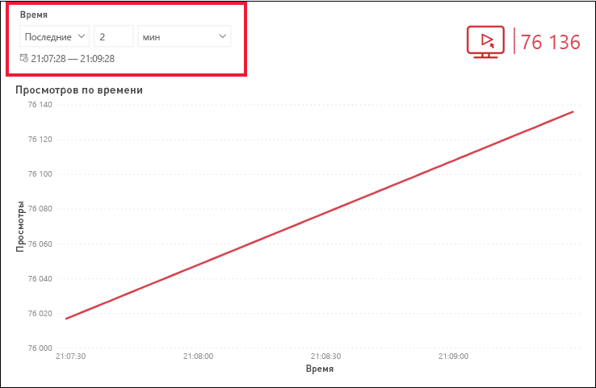
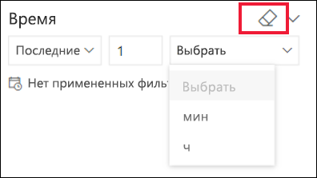

# Срезы в службе Power BI

[!INCLUDE[consumer-appliesto-ynnn](../includes/consumer-appliesto-yynn.md)]

Срез — это тип визуального элемента, который фильтрует другие визуальные элементы на странице отчета. При использовании отчетов Power BI вы обнаружите много типов срезов. На изображении выше показан тот же срез, но с другими выбранными элементами. Обратите внимание, что каждый выбранный элемент фильтрует остальные визуальные элементы на странице.  

## Как использовать срезы
При создании отчетов *конструкторы* добавляют срезы, чтобы помочь рассказать историю и предоставить средства для просмотра данных.

### Срез числового диапазона
 Приведенный выше срез числового диапазона помогает исследовать общие продажи по следующим аспектам: география, единицы запаса и дата заказа. Используйте дескрипторы для выбора диапазона. 

### Базовый вертикальный срез с флажками

В базовом срезе с флажками установите один или несколько флажков, чтобы увидеть влияние на другие визуальные элементы на странице. Используйте клавишу CTRL, чтобы выбрать несколько элементов. Иногда в *конструкторе* отчетов задается срез, позволяющий выбирать только одно значение за раз. 

### Срезы изображений и фигур
Если параметры среза являются изображениями или фигурами, возможности выбора схожи с флажками. Можно выбрать одно или несколько изображений или фигур, чтобы применить срез к другим визуальным элементам на странице. 

    

    

### Иерархический срез

В срезе с иерархией используйте угловые скобки, чтобы развернуть и свернуть иерархию. Заголовок обновляется и отображает выбранные элементы.

### Срез относительного времени
В связи с новыми сценариями быстрого обновления возможность фильтрации по меньшему периоду времени может быть очень полезной.
С помощью среза относительного времени можно применять фильтры на основе времени к любым данным даты или времени в отчете. Например, можно использовать срез относительного времени для отображения только представлений видео в течение последних 2 дней, часов или даже минут. 

## Деактивация среза
Чтобы деактивировать срез, щелкните значок ластика.

## Дальнейшие действия
Дополнительные сведения см. в следующих статьях:

[Типы визуализаций в Power BI](end-user-visualizations.md)

