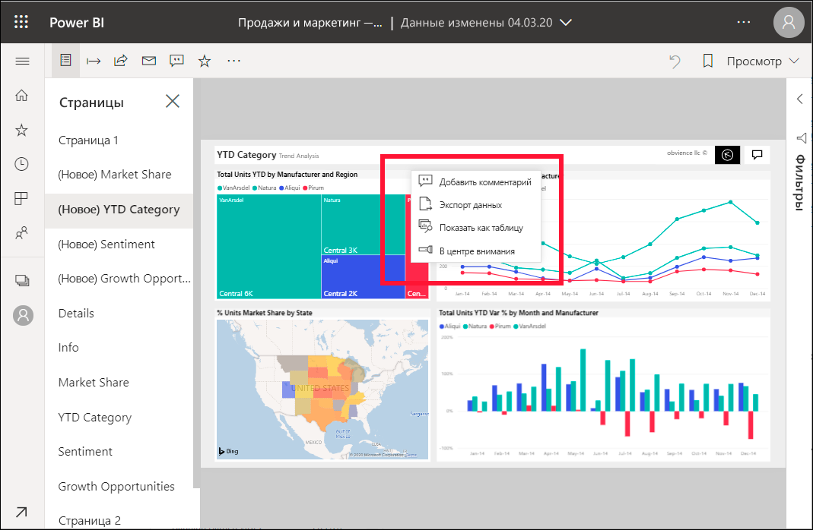
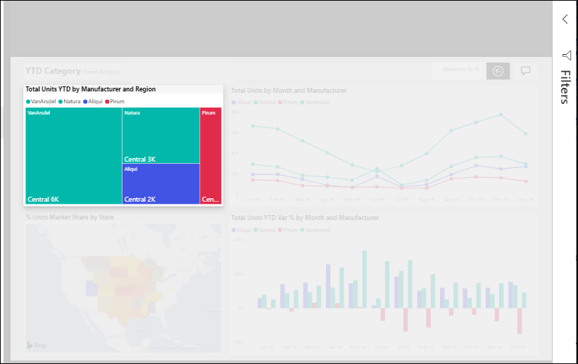

# Добавление функции "В центре внимания" в отчеты Power BI

[!INCLUDE[consumer-appliesto-yyny](../includes/consumer-appliesto-yyny.md)]

С помощью функции "В центре внимания" можно привлечь внимание к конкретному визуальному элементу на странице отчета.  Если при добавлении закладки выбран режим "В центре внимания", он сохранится в закладке.

## Добавление функции "В центре внимания"

1. [Откройте отчет](end-user-report-open.md) в службе Power BI.

2. Выберите визуальный элемент, который нужно выделить на странице отчета. Выберите раскрывающийся список **Другие действия (...)** .  

    

3. Выберите параметр **В центре внимания**. Выбранный визуальный элемент будет выделен, а все остальные визуальные элементы на странице станут практически прозрачными. 

    

## Дальнейшие действия

* [Отображение плитки панели мониторинга или визуального элемента отчета в режиме фокусировки](end-user-focus.md)

