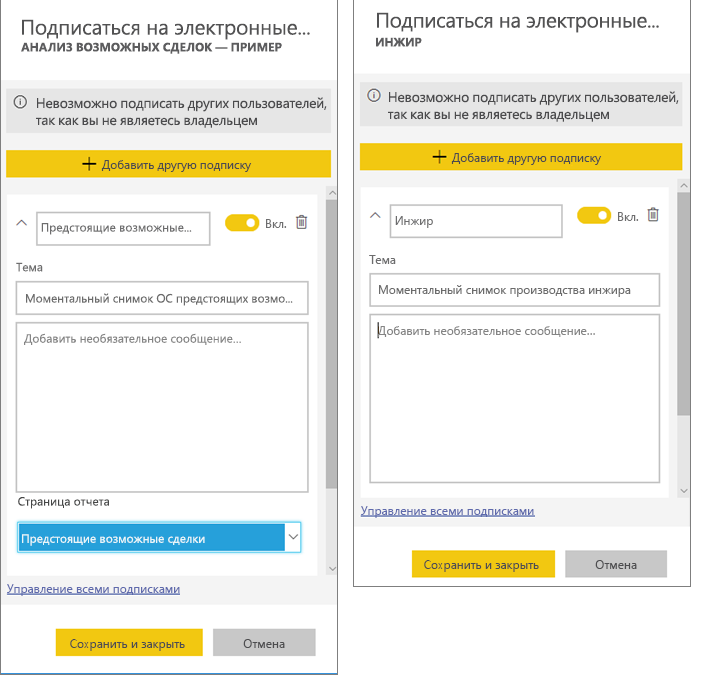
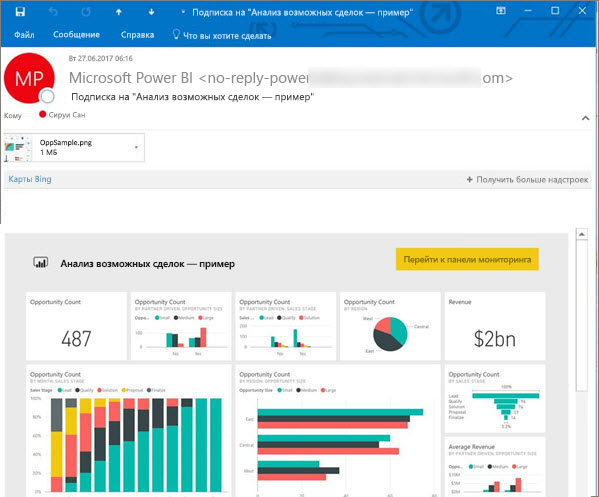
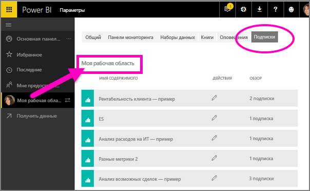

# Подписка на отчет или панель мониторинга в службе Power BI 
Теперь получать актуальные версии важных панелей мониторинга и отчетов стало проще, чем когда-либо. Подпишитесь на страницы наиболее важных отчетов и панели мониторинга, и Power BI будет отправлять вам моментальные снимки по электронной почте. Вы можете указать, с какой частотой это нужно делать: ежедневно или еженедельно. 

Для электронной почты и моментальных снимков будет использоваться язык, заданный в параметрах Power BI (см. статью [Поддерживаемые языки и страны (регионы) для Power BI](../supported-languages-countries-regions.md)). Если язык не задан, в Power BI используется язык, установленный в текущем браузере. Чтобы просмотреть или настроить предпочитаемый язык, выберите значок шестеренки  >   **> Параметры > Общие > Язык**. 

Вы получите электронное письмо со ссылкой "Перейти к отчету или панели мониторинга". На мобильных устройствах с приложениями Power BI при выборе этой ссылки запустится приложение (в отличие от сайта Power BI, где по умолчанию открывается отчет или панель мониторинга).

## Требования
- **Создание** подписки — это одна из функций Power BI Pro. 
- Электронные письма по подписке отправляются только при обновлении или изменении базового набора данных, поэтому подписки не работают для наборов данных, которые не поддерживают такие действия.

## Подписка на панель мониторинга или страницу отчета
Процедуры подписки на панель мониторинга и отчет почти не отличаются. Одна кнопка позволяет оформить подписки на панели мониторинга и отчеты службы Power BI.
 
.

1. Откройте панель мониторинга или отчет.
2. В верхней строке меню выберите **Subscribe** (Подписаться) или нажмите значок конверта .
   
   

3. Для включения и отключения подписки используйте ползунок желтого цвета.  Установив ползунок в положение "Выкл.", вы не удалите подписку. Для удаления подписки выберите значок корзины.

4. Также можно ввести данные для сообщения электронной почты. 

    На снимках экрана ниже обратите внимание, что при подписке на отчет вы фактически подписываетесь на *страницу* отчета.  Чтобы подписаться в отчете на несколько страниц, нажмите **Добавить другую подписку** и выберите другую страницу. 
      
   

5. Чтобы сохранить подписку, щелкните **Сохранить и закрыть**. Вы будете получать электронное письмо и моментальный снимок панели мониторинга или страницы отчета каждый раз, когда изменяется любой из базовых наборов данных. Если панель мониторинга или отчет обновляется несколько раз за день, письмо отправляется только при первом обновлении.  
   
   
   
Обновление страницы отчета не приводит к обновлению набора данных. Только владелец набора данных может вручную обновить набор данных. Чтобы найти имена базовых наборов данных, выберите **Просмотреть связанное** в строке меню вверху.
   

## Как настроить расписание отправки сообщений электронной почты
В следующей таблице представлена периодичность отправки сообщений электронной почты. Все зависит от метода подключения набора данных, на основе которого создается панель мониторинга или отчет (DirectQuery, Live Connect, импорт в Power BI или файл Excel в OneDrive либо SharePoint Online), а также доступных и выбранных параметров подписки (ежедневное или еженедельное обновление либо его отсутствие).

|  | **DirectQuery** | **Live Connect** | **Запланированное обновление (импорт)** | **Файл Excel в OneDrive или SharePoint Online** |
| --- | --- | --- | --- | --- |
| **С какой частотой обновляется отчет или панель мониторинга?** |Каждые 15 минут |Power BI выполняет проверку каждые 15 минут. Если набор данных изменился, отчет обновляется. |Обновление может быть ежедневным или еженедельным либо не выполняться вообще. Ежедневное обновление может выполняться до 8 раз в сутки. Еженедельное обновление — это по сути создаваемое пользователем расписание обновления с частотой от одного раза в неделю до одного раза в день. |Каждый час |
| **Какую частоту может указать пользователь для подписки на рассылку по электронной почте?** |Варианты: ежедневно или еженедельно |Варианты отсутствуют. Если отчет обновляется, пользователю отправляется сообщение электронной почты, но не чаще одного раза в день. |Если в расписании задано ежедневное обновление, возможно ежедневное и еженедельное выполнение операции.  Если в расписании задано еженедельное обновление, возможно только еженедельное выполнение операции. |Без вариантов: если набор данных обновляется, пользователю отправляется сообщение электронной почты, но не чаще одного раза в день. |

## Управление подписками
Только вы можете управлять своими подписками. Выберите **Подписаться** еще раз и щелкните **управление всеми подписками** (см. снимки экрана для шага 4, описанного выше). 

По истечении срока лицензии Pro действие подписки прекращается, панель мониторинга или отчет удаляется владельцем либо удаляется учетная запись пользователя, с которой была создана подписка.

## Рекомендации и устранение неполадок
* Для подписок на электронную почту панели мониторинга плитки, для которых действует безопасность на уровне строк (RLS), не отображаются.  Что касается подписок на отчеты по электронной почте, если для набора данных действует безопасность на уровне строк (RLS), вы не можете создавать подписки.
* Подписки на страницу отчета привязаны к ее имени. Если будет переименована страница отчета, на которую вы подписаны, подписку придется создать повторно.
* В Azure Active Directory вы можете настроить некоторые параметры организации, которые ограничивают возможность использования подписок через электронную почту в Power BI.  Среди прочего, такой эффект дает применение многофакторной проверки подлинности и ограничение диапазона IP-адресов для доступа к ресурсам.
* Настроив для наборов данных динамического подключения подписку на рассылку по электронной почте, вы будете получать сообщения электронной почты только при изменении данных. Следовательно, если обновление выполнено без изменения данных, Power BI не будет отправлять вам сообщение электронной почты.
* Подписки на рассылку по электронной почте не поддерживают большинство [пользовательских визуальных элементов](../power-bi-custom-visuals.md).  Единственным исключением являются [сертифицированные](../power-bi-custom-visuals-certified.md) пользовательские элементы.  
* Подписка по электронной почте сейчас не поддерживает настраиваемые визуальные элементы на базе языка R.  
* Плитки панели мониторинга, для которых действует безопасность на уровне строк (RLS), не отображаются.
* Подписки на рассылку по электронной почте обрабатываются с учетом состояний среза и стандартного фильтра отчета. Любые изменения стандартных значений, внесенные после оформления подписки, в письмах отображаться не будут.    
* Для подписок на панели мониторинга некоторые типы плиток пока не поддерживаются.  К ним относятся плитки потоковой передачи, видео и пользовательского веб-содержимого.     
* Попытка подписки на панели мониторинга и отчеты с изображениями очень большого размера может быть неудачной из-за ограничений электронной почты.    
* Power BI автоматически приостанавливает обновление наборов данных, связанных с панелями мониторинга и отчетами, которые не просматривались более 2 месяцев.  Но если добавить подписку на панель мониторинга или отчет, она не будет приостановлена даже при отсутствии посещений.    

## Дальнейшие действия
* Появились дополнительные вопросы? [Попробуйте задать вопрос в сообществе Power BI.](http://community.powerbi.com/)    
* [Ознакомьтесь с этой записью блога.](https://powerbi.microsoft.com/blog/introducing-dashboard-email-subscriptions-a-360-degree-view-of-your-business-in-your-inbox-every-day/)

