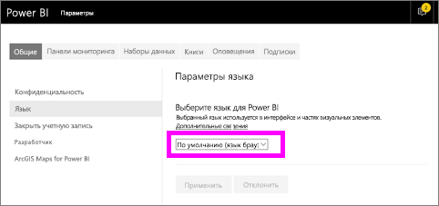
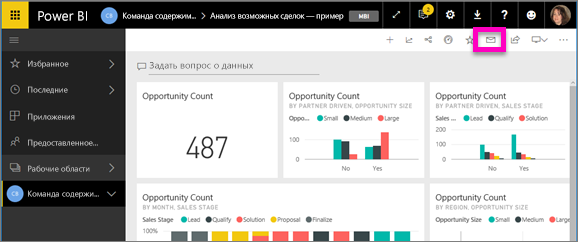
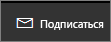
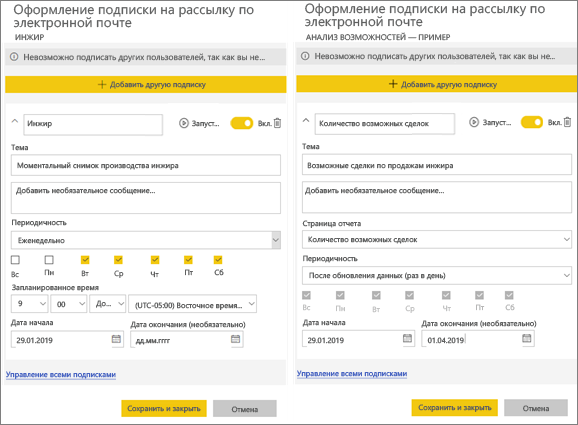
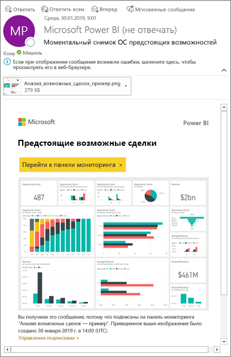
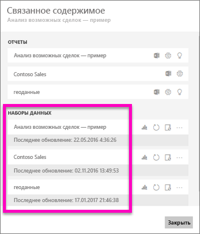
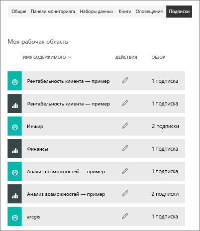

# Подписка на отчет или панель мониторинга в службе Power BI 
Теперь получать актуальные версии важных панелей мониторинга и отчетов стало проще, чем когда-либо. Подпишитесь на страницы наиболее важных отчетов и панели мониторинга, и Power BI будет отправлять вам моментальные снимки по электронной почте. Вы можете указать, с какой частотой это нужно делать: ежедневно, еженедельно или при обновлении данных. Можно даже задать конкретное время отправки сообщений электронной почты службой Power BI или отправить их немедленно.  

Для электронной почты и моментальных снимков будет использоваться язык, заданный в параметрах Power BI (см. статью [Поддерживаемые языки и страны (регионы) для Power BI](../supported-languages-countries-regions.md)). Если язык не задан, в Power BI используется язык, установленный в текущем браузере. Чтобы просмотреть или настроить предпочитаемый язык, выберите значок шестеренки  >   **> Параметры > Общие > Язык**. 

Вы получите электронное письмо со ссылкой "Перейти к отчету или панели мониторинга". На мобильных устройствах с приложениями Power BI при выборе этой ссылки запустится приложение (в отличие от сайта Power BI, где по умолчанию открывается отчет или панель мониторинга).

## Требования
**Создание** подписки — это одна из функций Power BI Pro.   

## Подписка на панель мониторинга или страницу отчета
Процедуры подписки на панель мониторинга и отчет почти не отличаются. Одна кнопка позволяет оформить подписки на панели мониторинга и отчеты службы Power BI.
 
.

1. Откройте панель мониторинга или отчет.
2. В верхней строке меню выберите **Подписаться** или нажмите значок конверта .
   
   

   
    
    Экран слева появляется, когда вы находитесь на панели мониторинга и выбираете **Подписаться**. Экран справа появляется, когда вы находитесь в отчете и выбираете **Подписаться**. Чтобы подписаться в отчете на несколько страниц, нажмите **Добавить другую подписку** и выберите другую страницу. 

4. Для включения и отключения подписки используйте ползунок желтого цвета.  Установив ползунок в положение "Выкл.", вы не удалите подписку. Для удаления подписки выберите значок корзины.

4. Также можно ввести данные для сообщения электронной почты. 

5. Выберите **частоту** для подписки.  Можно выбрать значение "Ежедневно", "Еженедельно" или "После обновления данных (ежедневно)".  Чтобы получать сообщения только в определенные дни, выберите вариант **Еженедельно**, а затем — нужные дни.  Например, если вы хотите получать рассылку по электронной почте только в рабочие дни, выберите частоту **Еженедельно** и снимите флажки для субботы и воскресенья.   

6. Запланируйте время отправки сообщений, выбрав в качестве значения частоты "ежедневно" или "еженедельно" и указав **запланированное** **время** для подписки.   

7. Запланируйте дату начала и окончания, указав даты в соответствующих полях. По умолчанию временем начала для вашей подписки будет дата ее создания с окончанием срока действия через год. Когда будет достигнута дата окончания подписки, ее действие прекращается до повторного включения.  Перед запланированной датой окончания подписки вы получите уведомление с запросом на продление.     

8. Чтобы просмотреть и протестировать подписку, нажмите **Запустить сейчас**.  Вам немедленно будет отправлено сообщение электронной почты. 

8. Если всё в порядке, сохраните подписку, нажав **Сохранить и закрыть**. Вы получите сообщение электронной почты и моментальный снимок панели мониторинга или отчет по заданному расписанию. Все подписки, для которых задана частота **После обновления данных**, будут отправлять сообщение только после первого запланированного обновления в этот день.
   
   
   
    Обновление страницы отчета не приводит к обновлению набора данных. Только владелец набора данных может вручную обновить набор данных. Чтобы найти имена базовых наборов данных, выберите **Просмотреть связанное** в строке меню вверху.
   
    

## Управление подписками
Только вы можете управлять своими подписками. Выберите **Подписаться** еще раз и щелкните **управление всеми подписками** в нижнем левом углу (см. снимки экрана выше). 

По истечении срока лицензии Pro действие подписки прекращается, панель мониторинга или отчет удаляется владельцем либо удаляется учетная запись пользователя, с которой была создана подписка.

## Рекомендации и устранение неполадок
* Панели мониторинга с более чем 25 закрепленными плитками или 4 закрепленными страницами динамического отчета могут отображаться не полностью в рассылках, отправляемых пользователям. Для корректного отображения электронных писем рекомендуется уменьшить число закрепленных плиток до менее 25 и число закрепленных динамических отчетов до менее 4.  
* Для подписок на электронную почту панели мониторинга плитки, для которых действует безопасность на уровне строк (RLS), не отображаются.  Что касается подписок на отчеты по электронной почте, если для набора данных действует безопасность на уровне строк (RLS), вы не можете создавать подписки.
* Подписки на страницу отчета привязаны к ее имени. Если будет переименована страница отчета, на которую вы подписаны, подписку придется создать повторно.
* Если вы не можете использовать функцию подписки, обратитесь к системному администратору. Возможно, ваша организация отключила эту функцию из-за проверки подлинности или по другим причинам.  
* Подписки на рассылку по электронной почте не поддерживают большинство [пользовательских визуальных элементов](../power-bi-custom-visuals.md).  Исключением являются [сертифицированные](../power-bi-custom-visuals-certified.md) пользовательские элементы.  
* Подписка по электронной почте сейчас не поддерживает настраиваемые визуальные элементы на базе языка R.  
* Для подписок на панели мониторинга некоторые типы плиток пока не поддерживаются.  К ним относятся плитки потоковой передачи, видео и пользовательского веб-содержимого.     
* Попытка подписки на панели мониторинга и отчеты с изображениями очень большого размера может быть неудачной из-за ограничений электронной почты.    
* Power BI автоматически приостанавливает обновление наборов данных, связанных с панелями мониторинга и отчетами, которые не просматривались более двух месяцев.  Но если добавить подписку на панель мониторинга или отчет, она не будет приостановлена даже при отсутствии посещений.    

## Дальнейшие действия

[Поиск и сортировка содержимого](end-user-search-sort.md)
