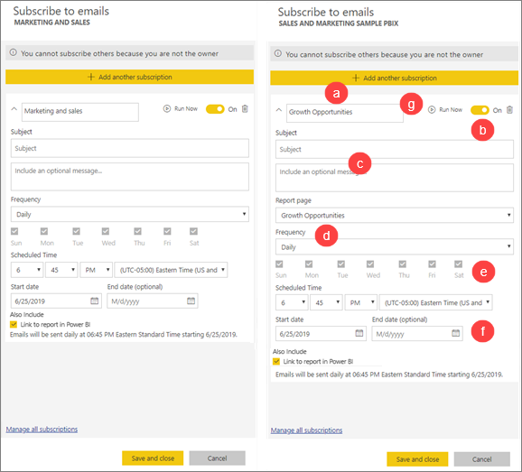

# Подписка на отчеты или панели мониторинга в службе Power BI 

[!INCLUDE[consumer-appliesto-ynny](../includes/consumer-appliesto-ynny.md)]

[!INCLUDE [power-bi-service-new-look-include](../includes/power-bi-service-new-look-include.md)]

Теперь получать актуальные версии важных панелей мониторинга и отчетов стало проще, чем когда-либо. Подпишитесь на страницы наиболее важных отчетов и панели мониторинга, и Power BI будет отправлять вам моментальные снимки по электронной почте. Вы можете указать, с какой частотой это нужно делать: ежедневно, еженедельно или при обновлении данных. Можно даже задать конкретное время отправки сообщений электронной почты службой Power BI или отправить их немедленно.  В целом можно настроить до 24 разных подписок для каждого отчета или панели мониторинга.

Для электронной почты и моментальных снимков будет использоваться язык, заданный в параметрах Power BI (см. статью [Поддерживаемые языки и страны (регионы) для Power BI](../supported-languages-countries-regions.md)). Если язык не задан, в Power BI используется язык, установленный в текущем браузере. Чтобы просмотреть или настроить предпочитаемый язык, выберите значок шестеренки  > **Параметры > Общие > Язык**. 

Вы получите электронное письмо со ссылкой "Перейти к отчету или панели мониторинга". На мобильных устройствах с приложениями Power BI при выборе этой ссылки запустится приложение (в отличие от сайта Power BI, где по умолчанию открывается отчет или панель мониторинга).

## Требования
Чтобы **создать** подписку для себя, требуется [лицензия](end-user-license.md) определенного типа. Если не удается создать подписку, обратитесь к администратору Power BI. Создавать **подписки для других пользователей** могут только владельцы панели мониторинга или отчетов. Подписка на отчет с разбивкой на страницы немного отличается. Дополнительные сведения см. в разделе [Создание подписки на отчет с разбивкой на страницы в службе Power BI для себя и других пользователей](paginated-reports-subscriptions.md). 

## Подписка на панель мониторинга или страницу отчета
Процедуры подписки на панель мониторинга и отчет почти не отличаются. Одна кнопка позволяет оформить подписки на панели мониторинга и отчеты службы Power BI.
 
.

1. Откройте панель мониторинга или отчет.
2. В верхней строке меню выберите **Подписаться** или нажмите значок конверта .
   

   
    
    Экран слева появляется, когда вы находитесь на панели мониторинга и выбираете **Подписаться**. Экран справа появляется, когда вы находитесь в отчете и выбираете **Подписаться**. 
    
    а. Чтобы подписаться в отчете на несколько страниц, нажмите кнопку **Добавить другую подписку** и выберите другую страницу в раскрывающемся списке вверху.

    б. Для включения и отключения подписки используйте ползунок желтого цвета.  Установив ползунок в положение "Выкл.", вы не удалите подписку. Для удаления подписки выберите значок корзины.

    в. Можно также указать тему и ввести данные для сообщения электронной почты. 

    г. Выберите **частоту** для подписки.  Можно выбрать значение "Ежедневно", "Еженедельно" или "После обновления данных (ежедневно)".  Чтобы получать сообщения только в определенные дни, выберите вариант **Еженедельно**, а затем — нужные дни.  Например, если вы хотите получать рассылку по электронной почте только в рабочие дни, выберите частоту **Еженедельно** и снимите флажки для субботы и воскресенья. Если выбрано **Ежемесячно**, введите дни месяца, в которые вы хотите получать рассылку.   

    и. При выборе варианта "Ежедневно", "Ежечасно", "Ежемесячно" или "Еженедельно" вы также можете указать запланированное время рассылки. Можно выполнять рассылку раз в час или через 15, 30 или 45 минут. Выберите время с утра (AM) или после полудня (PM). Можно также указать часовой пояс. Если вы выбираете "Ежечасно", выберите запланированное время начала подписки, и она будет повторяться каждый час после этого.  

    е. Запланируйте дату начала и окончания, указав даты в соответствующих полях. По умолчанию временем начала для вашей подписки будет дата ее создания с окончанием срока действия через год. Вы можете указать любую дату в будущем (до 9999 года) в любое время до истечения срока действия подписки. Когда будет достигнута дата окончания подписки, ее действие прекращается до повторного включения.  Перед запланированной датой окончания подписки вы получите уведомление с запросом на продление.     

    например Чтобы просмотреть и протестировать подписку, нажмите **Запустить сейчас**.  Вам немедленно будет отправлено сообщение электронной почты. 

3. Если всё в порядке, сохраните подписку, нажав **Сохранить и закрыть**. Вы получите сообщение электронной почты и моментальный снимок панели мониторинга или отчет по заданному расписанию. Все подписки, для которых задана частота **После обновления данных**, будут отправлять сообщение только после первого запланированного обновления в этот день.
   
   
   
    Обновление страницы отчета не приводит к обновлению набора данных. Только владелец набора данных может вручную обновить набор данных. Чтобы найти имя владельца для базовых наборов данных, щелкните раскрывающийся список в строке меню или просмотрите исходное сообщение электронной почты о подписке.
   
    

## Управление подписками
Только вы можете управлять подписками, которые сами создали. Выберите **Подписаться** еще раз и щелкните **управление всеми подписками** в нижнем левом углу (см. снимки экрана выше). Перечень отображаемых подписок зависит от того, какая рабочая область сейчас активна. Чтобы отобразить сразу все подписки для всех рабочих областей, активируйте параметр **Моя рабочая область**. Чтобы разобраться в том, что такое рабочие области, см. сведения о [рабочих областях в Power BI](end-user-workspaces.md). 

По истечении срока лицензии Pro действие подписки прекращается, панель мониторинга или отчет удаляется владельцем либо удаляется учетная запись пользователя, с которой была создана подписка.

## Рекомендации и устранение неполадок
* Чтобы избежать отправки сообщений подписки в папку спама, добавьте псевдоним электронной почты Power BI (no-reply-powerbi@microsoft.com) в список контактов. Если вы используете Microsoft Outlook, щелкните правой кнопкой мыши псевдоним и выберите **Добавить в контакты Outlook**. 
* Панели мониторинга с более чем 25 закрепленными плитками или четырьмя закрепленными страницами динамического отчета могут отображаться не полностью в рассылках, отправляемых пользователям. Для корректного отображения сообщений электронной почты рекомендуется обратиться к разработчику панели мониторинга и попросить его уменьшить число закрепленных плиток до 25 или менее, а число закрепленных динамических отчетов — до трех или менее.  
* Для подписок на электронную почту панели мониторинга плитки, для которых действует безопасность на уровне строк (RLS), не отображаются.  
* Если ссылки на содержимое в сообщении электронной почты перестали работать, возможно, содержимое было удалено. В сообщении электронной почты под снимком экрана можно увидеть, подписались ли вы самостоятельно или кто-то другой подписал вас. Если это был кто-то другой, попросите его отменить отправку электронной почты или повторно подписать вас.
* Для подписок на панели мониторинга некоторые типы плиток пока не поддерживаются. К ним относятся плитки потоковой передачи, видео и пользовательского веб-содержимого. 
* Подписки на страницу отчета привязаны к ее имени. Если будет переименована страница отчета, на которую вы подписаны, подписку придется создать повторно.
* Если вы не можете использовать функцию подписки, обратитесь к системному администратору. Возможно, ваша организация отключила эту функцию.  
* Подписки на рассылку по электронной почте не поддерживают большинство [пользовательских визуальных элементов](../developer/visuals/power-bi-custom-visuals.md).  Исключением являются [сертифицированные](../developer/visuals/power-bi-custom-visuals-certified.md) пользовательские визуальные элементы Power BI.    
* Подписки на рассылку по электронной почте обрабатываются с учетом состояний среза и стандартного фильтра отчета. Любые изменения стандартных значений, внесенные после оформления подписки, в письмах не отображаются. Отчеты с разбивкой на страницы поддерживают эту возможность и позволяют задавать значения конкретных параметров для каждой подписки.  
* Подписка по электронной почте сейчас не поддерживает визуальные элементы Power BI на базе языка R.  
* Для подписок на панели мониторинга некоторые типы плиток пока не поддерживаются.  К ним относятся плитки потоковой передачи, видео и пользовательского веб-содержимого.     
* Попытка подписки на панели мониторинга и отчеты с изображениями очень большого размера может быть неудачной из-за ограничений электронной почты.    
* Power BI автоматически приостанавливает обновление наборов данных, связанных с панелями мониторинга и отчетами, которые не просматривались более двух месяцев.  Однако если добавить подписку на панель мониторинга или отчет, она не приостанавливается даже при отсутствии посещений.
* В редких случаях доставка подписок получателям по электронной почте может занять больше пятнадцати минут.  В подобной ситуации мы рекомендуем выполнять обновление данных и подписку по электронной почте в разное время, чтобы обеспечить своевременную доставку.  Если проблема повторится, обратитесь в службу поддержки Power BI.

## Дальнейшие действия

[Поиск и сортировка содержимого](end-user-search-sort.md)
