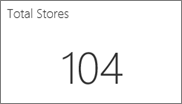
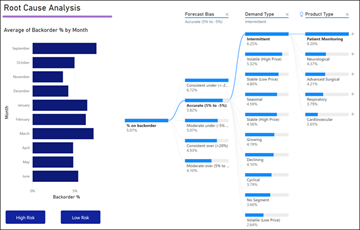
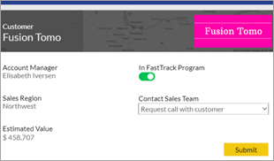
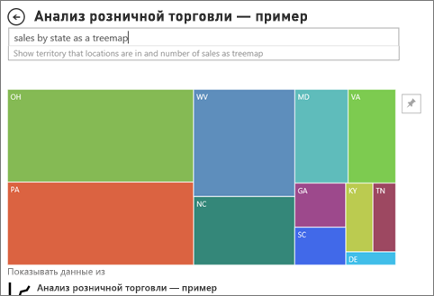

# Типы визуальных элементов в Power BI

[!INCLUDE[consumer-appliesto-yynn](../includes/consumer-appliesto-yynn.md)]

Визуальные элементы (также известные как *диаграммы* и *визуализации*) — это графические представления данных. Распространенные примеры — гистограммы, карты, точечные диаграммы и радиальные датчики. Визуальные элементы отображаются в отчетах, панелях мониторинга и разделах вопросов и ответов.

Визуальные элементы, описанные на этой странице, упакованы в Power BI. Эти визуальные элементы встречаются чаще всего. На этой странице дан краткий обзор этих предварительно упакованных визуальных элементов. Более подробные сведения о каждом из этих визуальных элементов см. в [документации по типам визуальных элементов для *конструкторов отчетов* Power BI](../visuals/power-bi-visualization-types-for-reports-and-q-and-a.md).

Визуальные элементы, не включаемые автоматически в Power BI, называются *пользовательскими визуальными элементами*. Пользовательские визуальные элементы можно импортировать в Power BI с внешних веб-сайтов, таких как Microsoft AppSource, или из внутренних источников, таких как магазин вашей организации. Для импорта пользовательских визуальных элементов требуются разрешения на изменение отчета. Чтобы узнать больше об этих визуальных элементах, посетите страницу [Визуальные элементы в Power BI](../developer/visuals/power-bi-custom-visuals.md).

## Перечень визуальных элементов, доступных в Power BI
Все эти визуальные элементы отображаются в панелях мониторинга и отчетах Power BI и [указываются в вопросах и ответах](end-user-q-and-a.md). Сведения о взаимодействии с визуальными элементами см. в статье [Взаимодействие с визуальными элементами в отчетах, информационных панелях и приложениях](end-user-visualizations.md).

### Диаграммы с областями: базовые (многоуровневые) и с накоплением

Базовая диаграмма с областями основана на графике, у которого заполнена область между осью и линией графика. Диаграммы с областями подчеркивают величину изменения в динамике по времени и могут использоваться для привлечения внимания к общему значению в рамках тренда. Например, данные, представляющие прибыль в динамике по времени, можно отобразить на диаграмме с областями, чтобы подчеркнуть общую прибыль.

### Линейчатые диаграммы и гистограммы

 

Линейчатые диаграммы лучше всего подходят для рассмотрения определенного значения по разным категориям.

### Карточки: с одним числом

Карточки с одним числом отображают один факт, одну точку данных. Иногда на панели мониторинга или в отчете Power BI очень важно отслеживать одно число, например показатель общего объема продаж, долю на рынке в годовом исчислении или общее число возможных сделок.  

### Карточки: многострочные

Многострочные карточки отображают одну или несколько точек данных, по одной на строке.

### Комбинированные диаграммы

Комбинированная диаграмма сочетает в себе гистограмму и график. Объединение двух диаграмм в одну позволяет быстрее сравнивать данные. Комбинированная диаграмма может иметь одну или две оси Y, поэтому требует особого внимания. 

Комбинированная диаграмма отлично подходит:
- при наличии графика и гистограммы с одной и той же осью X;
- для сравнения нескольких показателей с другими диапазонами значений;
- для демонстрации корреляции между двумя показателями в одном визуальном элементе;
- для проверки соответствия одного показателя целевому, который определяется другим показателем;
- чтобы освободить место на холсте.

### Дерево декомпозиции

Визуализация в виде дерева декомпозиции позволяет визуализировать данные в нескольких измерениях. Она автоматически выполняет статистическую обработку данных и позволяет детализировать измерения в любом порядке. Это визуализация искусственного интеллекта (ИИ), которая может искать новые измерения для выполнения детализации на основе определенных критериев. Она выступает ценным инструментом для специализированного изучения и проведения анализа первопричин.

### Кольцевые диаграммы

Кольцевые диаграммы похожи на круговые диаграммы.  Они показывают отношение частей к целому. Единственное отличие в том, что центр диаграммы пуст и в него можно добавить подпись или значок.

### Воронкообразные диаграммы

Воронкообразные диаграммы помогают визуализировать процесс, состоящий из этапов, в котором элементы последовательно переходят от одного этапа к другому.  Примером служит процесс продаж, который начинается с поиска потенциальных клиентов и заканчивается осуществлением покупки.

Например, воронка продаж, которая позволяет отследить перемещение клиентов по этапам: Интерес > Соответствующий интерес > Потенциальный клиент > Контракт > Закрыто. Форма воронки визуально передает состояние отслеживаемого процесса.
Каждый этап воронки представляет долю от общего количества. Таким образом, в большинстве случаев воронкообразная диаграмма имеет форму воронки: первый этап самый большой, а каждый следующий этап меньше предыдущего. Грушевидная воронка также удобна: она позволяет определить проблему в процессе. Но, как правило, первый этап, этап "вхождения", является самым крупным.

### Индикаторные диаграммы

Диаграмма "Радиальный датчик" имеет дугу и отображает одно значение, которое отражает ход достижения цели или значение ключевого показателя эффективности. Цель, или целевое значение, представляется линией. Текущий прогресс в достижении цели представляется областью с заливкой. Значение, которое представляет текущий прогресс, отображается полужирным шрифтом внутри дуги. Все возможные значения равномерно распределены по дуге, от минимального (крайнее левое значение) до максимального (крайнее правое значение).

В примере выше мы представляем продавца автомобилей, отслеживающего среднемесячный объем продаж нашего отдела продаж. Наша цель — 140. Это значение представляется линией черного цвета. Минимальное значение среднемесячных продаж — 0, а максимальное — 200. Область с синей заливкой показывает, что средний объем продаж за этот месяц составляет примерно 120. К счастью, еще есть неделя до достижения нашей цели.

Радиальный датчик отлично подходит для:
- отображения прогресса в достижении цели;
- представления процентильного показателя, например ключевого показателя эффективности;
- отображения степени приемлемости показателя;
- отображения информации, которую можно быстро воспринять и понять.

 ### Диаграмма ключевых факторов влияния

Диаграмма ключевых факторов влияния показывает главных участников влияния на выбранный результат или значение.

Эти факторы помогают понять, что влияет на ключевую метрику. Например, *из-за чего клиенты размещают второй заказ*или*почему продажи в июне прошлого года были такими высокими*. 

### Ключевые показатели эффективности

Ключевое показатель эффективности (КПЭ) — наглядный индикатор, который позволяет оценить достижение определенной измеримой цели. 

КПЭ отлично подходят для следующих задач:
- оценка хода выполнения (по каким показателям вы опережаете график или отстаете от него);
- определение расстояния до цели (насколько далеко вы от поставленной цели или опережаете график).

### Графики

График подчеркивает общую форму целой последовательности значений, обычно в зависимости от времени.

### Карты: базовые

Простая карта используется для сопоставления информации о категориях и количественной информации с пространственными расположениями.

### Карты: карты ArcGIS;

Сочетание карт ArcGIS и Power BI — это больше, чем просто отображение точек на карте. Прекрасные информативные визуальные элементы для карт можно создавать, используя базовые карты, типы расположения, темы, стили символов и ссылочные слои. Сочетание слоев официальных данных (например, данных переписи) на карте с пространственным анализом помогает лучше понять данные в визуальном элементе.

### Карты: фоновые картограммы

Картограмма с помощью заливки, оттенков или шаблонов показывает, как изменяется исследуемое значение по географическим регионам. Картограмма позволяет быстро отобразить относительные различия с помощью заливки, которая изменяется от светлой (меньше, встречается с меньшей частотой) до темной (больше, встречается с большей частотой).

### Карты: карты фигур

Сопоставители фигур используются для сравнения регионов на карте по цветам. На карте фигур невозможно отобразить точное географическое расположение точек данных на карте. Его основное назначение — проиллюстрировать относительное сравнение регионов на карте с помощью разных цветов.

### Матрица

Визуальный элемент "Матрица" — это разновидность визуального элемента таблицы (см. раздел "Таблица" ниже), поддерживающая ступенчатый макет. Конструкторы отчетов часто включают матрицы в отчеты и панели мониторинга, чтобы пользователи могли выбирать один или несколько элементов (строк, столбцов, ячеек) в матрице для перекрестного выделения других визуальных элементов на странице отчета.  

### Круговые диаграммы

Круговые диаграммы показывают отношение частей к целому. 

### Визуальный элемент Power Apps

Конструкторы отчетов могут создать приложение Power и внедрить его в отчет Power BI. Пользователи могут взаимодействовать с этим визуальным элементом в отчете Power BI. 

### "Вопросы и ответы": визуализация

>[!TIP]
>Как и [интерфейс вопросов и ответов на панелях мониторинга](../create-reports/power-bi-tutorial-q-and-a.md), визуальный элемент вопросов и ответов позволяет задавать вопросы о данных с помощью естественного языка. 

Дополнительные сведения см. в статье [Визуальные элементы вопросов и ответов в Power BI](../visuals/power-bi-visualization-types-for-reports-and-q-and-a.md).

### Ленточная диаграмма

Ленточные диаграммы показывают, какая категория данных имеет наивысший ранг (самое большое значение). Ленточные диаграммы лучше всего подходят для отображения изменений ранга. Наивысший ранг (значение) за каждый период времени всегда отображается в верхней части диаграммы.

### Точечные и пузырьковые диаграммы

Точечная диаграмма всегда включает две оси значений: вдоль горизонтальной оси отображается один набор числовых данных, а вдоль вертикальной — другой. На диаграмме отображаются точки пересечения числовых значений X и Y, объединяя их в отдельные точки данных. Точки данных могут распределяться вдоль горизонтальной оси равномерно или неравномерно в зависимости от данных.

В пузырьковой диаграмме точки данных заменяются пузырьками, размер которых определяется еще одним измерением данных.

Точечный график аналогичен пузырьковой или точечной диаграмме за исключением того, что позволяет отображать числовые или категориальные данные вдоль оси X. В этом примере вместо кругов используются квадраты, а данные по продажам выводятся по оси X.

### Точечная диаграмма высокой плотности

По определению выборка данных с высокой плотностью применяется для достаточно быстрого создания интерактивных визуальных элементов. Выборка с высокой плотностью использует алгоритм, который устраняет перекрывающиеся точки и гарантирует, что все точки в наборе данных будут представлены в визуальном элементе. Этот алгоритм не просто создает репрезентативную выборку данных.  

Он обеспечивает наилучшее сочетание времени отклика, представления и сохранения важных точек во всем наборе данных.

### срезы

Срез — это автономная диаграмма, которая может использоваться для фильтрации других визуализаций на странице. Срезы отображаются в самых разных форматах (категория, диапазон, дата и т. д.). Кроме того, их можно форматировать, чтобы выбрать только одно, большинство или все из доступных значений. 

Срезы отлично подходят для следующих задач:
- отображение часто применяемых и важных фильтров на холсте отчета для упрощения доступа к ним;
- упрощение определения текущего состояния фильтрации без необходимости открывать раскрывающийся список;
- фильтрация по ненужным и скрытым столбцам в таблицах данных;
- создание более специализированных отчетов путем размещения срезов рядом с важными визуальными элементами.

### Автономные изображения

Автономное изображение — это рисунок, который был добавлен в отчет или панель мониторинга. 

### Таблицы

Таблица — это сетка, содержащая связанные данные в логически упорядоченных строках и столбцах. Она также может содержать заголовки и строку с итогами. Таблицы хорошо подходят для количественного сравнения, где можно посмотреть разные значения одной категории. Например, в этой таблице показаны пять разных мер категории.

Таблицы отлично подходят для следующих задач:
- просмотра и сравнения подробных данных и точных значений (вместо визуального представления);
- отображения данных в табличном формате;
- отображения числовых данных по категориям.

### Карты дерева

Карты дерева — это диаграммы из цветных прямоугольников, размер которых соответствует значению.  Они могут иметь иерархическую структуру, в которой прямоугольники вкладываются в основные прямоугольники. Пространство внутри каждого прямоугольника выделяется на основе измеряемого значения. Прямоугольники упорядочиваются по размеру: от верхнего левого (самый большой) до нижнего правого (самый маленький).

Карта дерева отлично подходит:
- для отображения больших объемов иерархических данных;
- когда линейчатая диаграмма не может эффективно обрабатывать большое количество значений;
- для отображения пропорций между каждой частью и целым;
- для отображения шаблонов распределения показателя на каждом уровне категорий в иерархии;
- для отображения атрибутов путем кодирования по размеру и цвету;
- для выделения шаблонов, выпадающих показателей, наиболее важных участников и исключений.

### Каскадные диаграммы

Каскадные диаграммы отображают нарастающий итог по мере добавления или вычитания значений. Это удобно для понимания того, как ряд положительных и отрицательных изменений влияет на начальное значение (например, на чистую прибыль).

Столбцы закодированы цветом, поэтому можно быстро определить, увеличивается ли значение или уменьшается. Столбцы начального и конечного значения часто начинаются на горизонтальной оси, тогда как промежуточные значения представлены плавающими столбцами. Из-за своего вида такие диаграммы также называются мостом.

Каскадная диаграмма отлично подходит:
- при наличии изменений для показателя по времени или по разным категориям;
- для отслеживания основных изменений, влияющих на общее значение;
- для построения графика годовой прибыли компании путем отображения различных источников дохода и достижения общей прибыли (или убытков);
- для демонстрации начального и конечного количества сотрудников компании за год;
- для визуализации поступлений и затрат по месяцам и текущего баланса для вашего счета.

## Назначение используемого визуального элемента для вопросов и ответов
При вводе запросов на естественном языке с помощью вопросов и ответов Power BI можно указать тип визуального элемента в запросе.  Пример:

"***продажи по штатам в виде карты дерева***"

## Дальнейшие действия
[Взаимодействие с визуальными элементами в отчетах, информационных панелях и приложениях](end-user-visualizations.md)    
[THE RIGHT VISUAL REFERENCE FOR POWER BI - MAY 2017](https://www.sqlbi.com/wp-content/uploads/videotrainings/dashboarddesign/visuals-reference-may2017-A3.pdf) (Правильные визуальные объекты для Power BI. Май 2017 г.)

