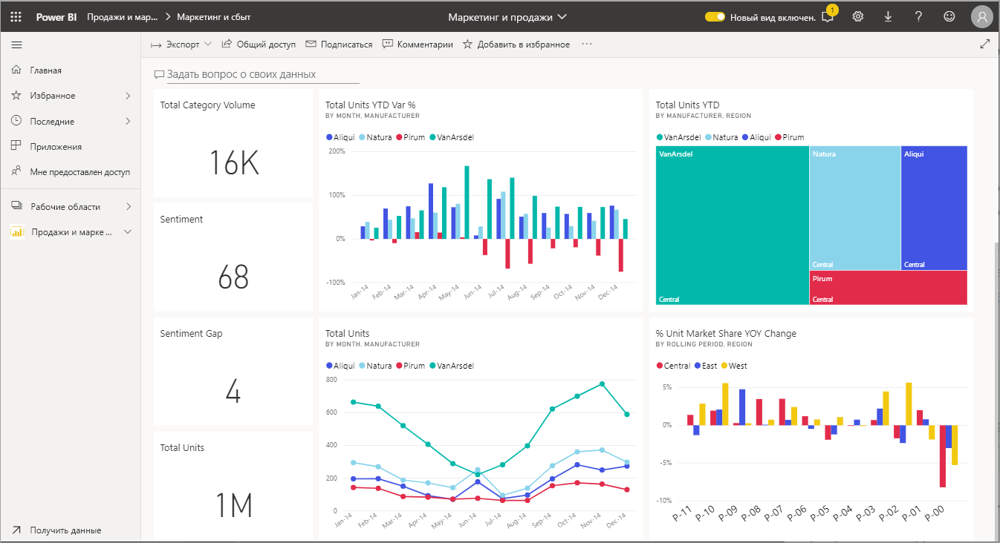
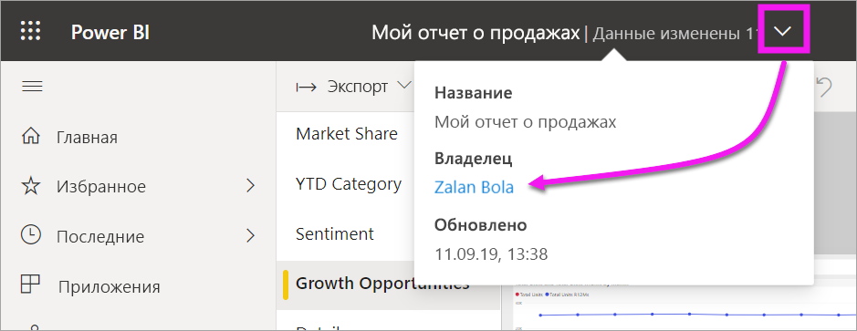

# Взаимодействие с визуальными элементами в отчетах, информационных панелях и приложениях

В основном, ***визуализации*** (или *визуальные элементы*), это тип диаграммы, построенные в Power BI *дизайнерами*, использующими данные из отчетов и наборов данных. 

Визуальные элементы размещаются на панелях мониторинга, в отчетах, а также могут создаваться в режиме реального времени с использованием службы вопросов и ответов Power BI. Разработчик может *закрепить* создаваемый в отчете визуальный элемент на панели мониторинга. [Визуальный элемент на панели мониторинга называется *плиткой*](end-user-tiles.md). На этой панели мониторинга представлено восемь плиток. 

> [!TIP]
> Мы рекомендуем сначала прочитать обзорную статью [об основных понятиях Power BI для *потребителей*](end-user-basic-concepts.md), а уже потом переходить к этому более подробному описанию.

## Возможности визуальных элементов

Визуальные элементы создаются *дизайнерами* отчетов и панелей инструментов и доступны для *потребителей*. У потребителя есть много вариантов взаимодействия с визуальными элементами, помогающих лучше анализировать данные и принимать бизнес решения на их основе. В следующей таблице перечислены все эти возможности и представлены ссылки на пошаговые инструкции по ним.

Администратор или *разработчик* может отключить отображение большинства из этих параметров. Некоторые из этих функций применяются только к определенным визуальным элементам.  Если у вас возникли вопросы, обратитесь к своему администратору либо к владельцу отчета или панели мониторинга. Чтобы определить владельца, воспользуйтесь раскрывающимся списком панели мониторинга или отчета. 

> [!IMPORTANT]
> Но сначала остановимся на средстве "Вопросы и ответы". Это средство Power BI для поиска на естественном языке. Вы пишете вопросы, используя родной язык, и служба "Вопросы и ответы" отвечает на них в форме визуальных элементов. Служба "Вопросы и ответы" позволяет потребителям создавать собственные визуальные элементы. Однако визуальные элементы, созданные в службе "Вопросы и ответы", нельзя сохранить. Но это очень удобный инструмент для получения конкретных сведений об имеющихся данных, для которых конструктор не предусмотрел отдельный отчет и (или) панель мониторинга. Дополнительные сведения об этой функции см. в статье ["Вопросы и ответы" в службе Power BI и Power BI Desktop](end-user-q-and-a.md).

|Task  |На панели мониторинга  |В отчете  | В "Вопросах и ответах"
|---------|---------|---------|--------|
|[Напишите свои комментарии к визуальным элементам или обсудите визуальные элементы с коллегами](end-user-comment.md).     |  да       |   да      |  нет  |
|[Откройте и изучите отчет, где был создан визуальный элемент](end-user-tiles.md).     |    да     |   не применяется      |  нет |
|[Просмотрите список фильтров и срезов, которые применяются к визуальному элементу](end-user-report-filter.md).     |    нет     |   да      |  да |
|[Откройте и изучите визуальный элемент в службе вопросов и ответов (если *разработчик* использовал ее для создания визуального элемента)](end-user-q-and-a.md).     |   да      |   не применяется      |  не применяется  |
|[Создайте визуальный элемент в службе вопросов и ответов (элемент будет доступен только для просмотра, и вы не сможете его сохранить)](end-user-q-and-a.md).     |   да      |   если разработчик добавил в отчет службу вопросов и ответов      |  да  |
|[Используйте Power BI, чтобы найти интересные факты или тренды](end-user-insights.md) в данных визуальных элементов.  Такие автоматически создаваемые визуальные элементы называются *аналитическими сведениями*.     |    да     |  для всего отчета, а не для отдельных визуальных элементов       | нет   |
|[Просматривайте по одному визуальному элементу за один раз, используя режим *фокусировки*](end-user-focus.md).     | да        |   да      | не применяется  |
|[Проверьте, когда визуальный элемент был обновлен в последний раз](end-user-fresh.md).     |  да       |    да     | не применяется  |
|[Просматривайте по одному визуальному элементу за один раз без рамок или панелей навигации, используя *полноэкранный режим* или *режим фокусировки*](end-user-focus.md).     |   да      |  да       | по умолчанию  |
|[Печать](end-user-print.md).     |  да       |   да      | нет  |
|[Поэкспериментируйте с визуальными элементами, добавляя и изменяя визуальные фильтры.](end-user-report-filter.md)     |    нет     |   да      | нет  |
|Наведите курсор на визуальный элемент, чтобы открыть дополнительные сведения и всплывающие подсказки.     |    да     |   да      | да  |
|[Примените перекрестную фильтрацию и перекрестное выделение других визуальных элементов на странице.](end-user-interactions.md)    |   нет      |   да      | не применяется  |
|[Просмотрите данные, использованные для создания визуального элемента](end-user-show-data.md).     |  нет       |   да      | нет  |
| [Измените способ сортировки визуального элемента](end-user-change-sort.md). | нет  | да  | Вы можете изменить сортировку, перефразировав вопрос  |
| Добавьте элемент "В центре внимания" к визуальному элементу. | нет  | да  |  нет |
| [Экспортируйте в Excel.](end-user-export.md) | да | да | нет|
| [Создайте оповещение](end-user-alerts.md), чтобы получать уведомление о превышении заданного порога для значения.  | да  | нет  | нет |
| [Выполните перекрестную фильтрацию и перекрестное выделение других визуальных элементов на странице](end-user-report-filter.md).  | нет      | да  | нет  |
| [Выполните детализацию визуального элемента с иерархией](end-user-drill.md).  | нет  | да   | нет |

## Дальнейшие действия
Вы можете вернуться к [основным понятиям для потребителей](end-user-basic-concepts.md)  .  
[Выберите визуальный элемент, чтобы открыть отчет](end-user-report-open.md)    
[Типы визуальных элементов, доступных в Power BI](end-user-visual-type.md)