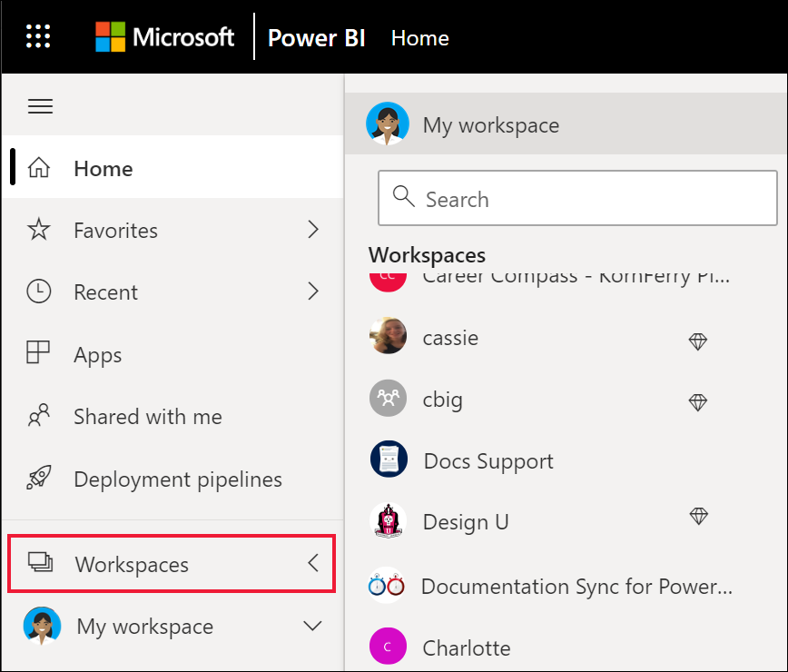

# Совместная работа в рабочих областях

 *Рабочие области* — это места для совместной работы с коллегами над определенным содержимым. *Конструкторы* Power BI создают рабочие области для хранения коллекций панелей мониторинга и отчетов. После этого конструктор может предоставить коллегам общий доступ к рабочей области. Конструкторы также могут объединять коллекцию панелей мониторинга и отчетов в *приложение* и распространять их на все сообщество, свою организацию или на конкретных пользователей или группы. Некоторые типы приложений, называемые *шаблонными приложениями* , при установке приложения создают рабочую область. [Дополнительные сведения о приложениях](end-user-apps.md). 

 Все пользователи, использующие службу Power BI, также имеют раздел **Моя рабочая область** .  Моя рабочая область — это личная песочница, где вы можете самостоятельно создать содержимое.

 Рабочие области можно просмотреть в Power BI на странице **Главная** или выбрав **Рабочие области** в области навигации.

 

## Типы рабочих областей
**Моя рабочая область** хранит все содержимое, которое вы создали и которое принадлежит вам. Это своего рода личная песочница или рабочая область для хранения личного содержимого. У многих *бизнес-пользователей* службы Power BI **Моя рабочая область** остается пустой, поскольку выполняемые ими задачи не предусматривают создание нового содержимого. *Бизнес-пользователи* используют создаваемые другими данные для принятия бизнес-решений. Если вам предстоит самостоятельно создавать содержимое, мы рекомендуем ознакомиться со [статьями о службе Power BI для ](../create-reports/index.yml)разработчиков.

В разделе **Рабочие области** находится все содержимое, относящееся к конкретному приложению. Создавая приложение, *разработчик* упаковывает вместе с ним все необходимое содержимое. Это могут быть панели мониторинга, отчеты и наборы данных. Приложения не обязательно включают все эти три вида содержимого. Например, приложение может содержать только одну панель мониторинга, по три элемента каждого вида и даже двадцать отчетов. Все зависит от того, что именно *разработчик* включает в приложение. Обычно рабочие области приложений, используемые совместно с *бизнес-пользователями* не содержат наборы данных.

В рабочей области с данными по продаже инжира содержится три отчета и одна панель мониторинга. 

## Разрешения в рабочих областях

Разрешения доступа определяют, что вы можете делать в рабочей области, чтобы команды могли работать совместно.  При предоставлении доступа к новой рабочей области *конструкторы* добавляют отдельных пользователей или группы в одну из ролей рабочей области: **Зритель** , **Участник** , **Автор** или **Администратор** . 

*Бизнес-пользователь* Power BI обычно взаимодействует с рабочими областями, используя роль **Зритель** . Но *конструктор* может также назначить вам роль **члена** или **участника** . Роль "Зритель" позволяет просматривать содержимое (панели мониторинга, отчеты, приложения), созданное другими пользователями, и взаимодействовать с ними. Так как роль "Зритель" не может получить доступ к базовому набору данных, это надежный способ взаимодействовать с содержимым и не беспокоиться о том, что вы повредите базовые данные.

Подробный список доступных возможностей в качестве *бизнес-пользователя* с ролью "Зритель" см. в разделе [Функции Power BI для бизнес-пользователей](end-user-features.md).

### Разрешения и роли рабочей области

Ниже указаны возможности четырех ролей: администраторов, членов, участников и зрителей. Для использования всех этих возможностей, за исключением просмотра и взаимодействия, требуется лицензия Power BI Pro.

[!INCLUDE[power-bi-workspace-roles-table](../includes/power-bi-workspace-roles-table.md)]

## Лицензирование, рабочие области и емкость
Лицензирование также имеет значение при определении разрешений для рабочей области. Для многих функций требуется, чтобы у пользователя была лицензия Power BI *Pro* или лицензия для рабочей области, хранящейся в емкости Premium. 

Часто *бизнес-пользователи* работают с бесплатной лицензией. [Дополнительные сведения о лицензировании](end-user-license.md). Если содержимое не хранится в емкости Premium, у пользователя не будет доступа.

Если Рабочая область хранится в емкости Premium, *бизнес-пользователи* смогут просматривать содержимое в этой рабочей области и взаимодействовать с ним. Значок бриллианта определяет рабочие области, которые хранятся в емкости Premium.

 Дополнительные сведения см. в статье [Использование службы Power BI в качестве потребителя](end-user-license.md).

## Дальнейшие действия
* [Приложения в Power BI](end-user-apps.md)    

* У вас появились вопросы? [Попробуйте задать вопрос в сообществе Power BI.](https://community.powerbi.com/)

