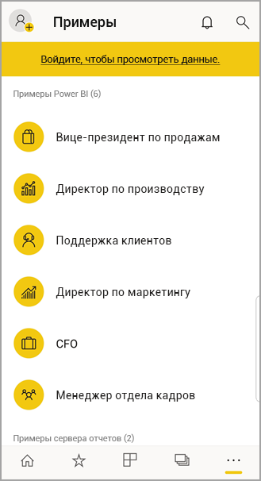

# Начало работы с мобильным приложением Power BI на устройствах под управлением Android
Приложение Android для Microsoft Power BI позволяет работать со службой Power BI, сервером отчетов Power BI и службами Reporting Services на мобильных устройствах. Благодаря возможностям динамического мобильного доступа с поддержкой сенсорного ввода вы можете легко просматривать и использовать корпоративные панели мониторинга как в локальной, так и облачной среде. Просматривайте данные на панелях мониторинга и используйте их совместно с коллегами в электронных и текстовых сообщениях. 

Создавайте отчеты Power BI в службе Power BI Desktop с последующей публикацией.

* [Публикуйте их в службе Power BI](../../power-bi-overview.md) и создавайте панели мониторинга.
* [Публикуйте их локально на Сервере отчетов Power BI](../../report-server/quickstart-create-powerbi-report.md).

Затем в приложении Power BI для Android работайте с панелями мониторинга и отчетами как локально, так и в облаке.

Узнайте о [новых возможностях мобильных приложений Power BI](../../mobile-whats-new-in-the-mobile-apps.md).

## Предварительные требования

### Получение приложения

[Скачайте приложение Power BI для Android](http://go.microsoft.com/fwlink/?LinkID=544867) из магазина Google Play.
  
Power BI можно запускать на разных устройствах Android под управлением операционной системы Android 5.0 или более поздней версии. Чтобы проверить версию ОС на устройстве, выберите **Settings** > **About device** > **Android version** (Параметры > Об устройстве > Версия Android). 

**Приступайте к работе, открыв приложение**    
Даже без регистрации или входа вы сможете просматривать в открытом приложении начальные страницы, которые дают некоторое представление о возможностях этого приложения Power BI на устройстве Android. Коснитесь пункта **Пропустить**, чтобы просмотреть и изучить примеры и получить практический опыт работы с приложением. [К примерам можно вернуться](mobile-android-app-get-started.md#try-the-power-bi-and-reporting-services-samples) в любой момент с домашней страницы панелей мониторинга.

Узнайте о [новых возможностях мобильных приложений Power BI](../../mobile-whats-new-in-the-mobile-apps.md).

## Регистрация в службе Power BI в Интернете
Если вы еще не зарегистрировались, перейдите в [службу Power BI (http://powerbi.com/)](http://powerbi.com/), чтобы зарегистрировать собственную учетную запись для создания и хранения информационных панелей и отчетов, а также консолидации ваших данных. Затем войдите в Power BI с вашего устройства Android, чтобы просматривать свои панели мониторинга из любого места.

1. В службе Power BI коснитесь кнопки [Зарегистрироваться](http://go.microsoft.com/fwlink/?LinkID=513879), чтобы создать учетную запись Power BI.
2. Начните [создавать собственные информационные панели и отчеты](../../service-get-started.md).

## Начало работы с приложением Power BI на мобильном устройстве
1. На устройстве Android откройте приложение Power BI для Android с помощью значка на стартовом экране.
   
   
2. Чтобы просмотреть панели мониторинга и отчеты Power BI, нажмите **Power BI**.  
   
   Если вы получите сообщение о том, что не удалось войти в Power BI, см. статью [Исправление ошибки "корпоративный SSL-сертификат не является доверенным"](mobile-android-app-error-corporate-ssl-account-is-untrusted.md).

   Чтобы просмотреть мобильные отчеты и ключевые показатели эффективности служб Reporting Services и сервера отчетов Power BI, выберите **Сервер отчетов**.
   
   

## Примеры для Power BI и Reporting Services
Вы можете работать с примерами Power BI и Reporting Services даже без регистрации. Загрузив приложение, вы можете просматривать образцы или приступить к работе. Возвращайтесь к образцам когда захотите с домашней страницы панели мониторинга.

### Примеры Power BI
Вы можете просматривать примеры панелей мониторинга Power BI и взаимодействовать с ними, но есть некоторые задачи, которые с ними невозможно выполнить. Нельзя открыть отчеты, соответствующие панелям мониторинга, предоставить к примерам общий доступ для других пользователей или добавить их в избранное.

1. Коснитесь кнопки глобальной навигации  в левом верхнем углу.
2. Коснитесь элементов **Настройки** > **Просмотреть наши примеры**, выберите роль и просмотрите образец панели мониторинга для этой роли.  
   
   

### Примеры мобильных отчетов Reporting Services
1. Коснитесь кнопки глобальной навигации  в левом верхнем углу.
2. Коснитесь **Примеры для Reporting Services**, откройте отчеты по розничным продажам или отчеты по сбыту и изучите ключевые показатели эффективности и мобильные отчеты.
   
   

## Поиск панели мониторинга или отчета
* Коснитесь значка лупы в правом верхнем углу , а затем введите искомое слово.
  
    
  
    По умолчанию поиск выполняется по всем панелям мониторинга и отчетам, но также можно выполнить поиск только по одному из них.

## Поиск содержимого в мобильных приложениях Power BI
В мобильных приложениях Power BI панели мониторинга и отчеты хранятся в разных расположениях в зависимости от источника данных. Прочтите статью о [поиске содержимого в мобильных приложениях](../../mobile-apps-quickstart-view-dashboard-report.md). Вы всегда можете найти нужное содержимое в мобильных приложениях Power BI. 

## Просмотр избранных панелей мониторинга, ключевых показателей эффективности и отчетов
В мобильных приложениях на странице "Избранное" отображаются все избранные панели мониторинга Power BI, а также ключевые показатели эффективности и отчеты сервера отчетов Power BI и служб Reporting Services. Когда в мобильном приложении Power BI вы добавляете панель мониторинга в *избранное*, панель становится доступной на всех ваших устройствах, а также в службе Power BI в браузере. 

* Выберите **Избранное**.
  
   
  
   На этой странице отображаются избранные элементы Power BI, а также веб-портала сервера отчетов Power BI и служб Reporting Services.
  
   

Дополнительные сведения об избранном в мобильных приложениях Power BI см. [здесь](mobile-apps-favorites.md).

## Поддержка для организаций в мобильных приложениях Power BI
Организации могут использовать Microsoft Intune для управления устройствами и приложениями, включая мобильные приложения Power BI для iOS и Android.

Microsoft Intune позволяет управлять такими элементами, как требование ПИН-кода доступа, управление способом обработки данных в приложении и даже шифрование данных приложения, если приложение не используется.

> [!NOTE]
> Если вы используете мобильное приложение Power BI на устройстве Android и в вашей организации настроены возможности Microsoft Intune MAM, то фоновое обновление данных будет отключено. Power BI обновит данные из службы Power BI в Интернете при следующем входе в приложение.
> 
> 

[Информация о настройке мобильных приложений Power BI для Android через Microsoft Intune](../../service-admin-mobile-intune.md). 

## Дальнейшие действия
Ниже перечислены дополнительные возможности, доступные при работе с панелями мониторинга и отчетами в приложении Power BI на устройствах Android, а также при работе с отчетами и ключевыми показателями эффективности на веб-портале сервера отчетов Power BI и служб Reporting Services.

### Панели мониторинга и отчеты Power BI
* Просмотр [приложений](../../service-create-distribute-apps.md).
* Просмотр своих [информационных панелей](../../mobile-apps-view-dashboard.md).
* Просмотр [плиток на информационных панелях](../../mobile-tiles-in-the-mobile-apps.md).
* Открытие [отчетов Power BI](../../mobile-reports-in-the-mobile-apps.md).
* Просмотр [приложений](../../service-create-distribute-apps.md).
* [Добавление заметок и совместное использование плиток](mobile-annotate-and-share-a-tile-from-the-mobile-apps.md).
* [Совместное использование информационных панелей](../../mobile-share-dashboard-from-the-mobile-apps.md).
* [Сканирование QR-кода Power BI](../../mobile-apps-qr-code.md) с телефона Android позволяет открыть определенную панель мониторинга или отчет. 
* Просмотр [уведомлений об изменениях в вашей учетной записи Power BI](../../mobile-apps-notification-center.md), например о панелях мониторинга, к которым ваши коллеги предоставили вам доступ.

### Отчеты и ключевые показатели эффективности на веб-портале сервера отчетов Power BI и служб Reporting Services
* [Просматривайте отчеты и ключевые показатели эффективности на веб-портале](mobile-app-ssrs-kpis-mobile-on-premises-reports.md) в мобильном приложении Power BI для устройств Android.
* Создавайте [ключевые показатели эффективности на веб-портале](https://docs.microsoft.com/sql/reporting-services/working-with-kpis-in-reporting-services).
* Создавайте [отчеты в Power BI Desktop и публикуйте их на веб-портале сервера отчетов Power BI](../../report-server/quickstart-create-powerbi-report.md).

### См. также:
* [Скачивание приложения Android](http://go.microsoft.com/fwlink/?LinkID=544867) из магазина приложений Android.
* [Что такое Power BI?](../../power-bi-overview.md)
* У вас появились вопросы? [Попробуйте задать вопрос в сообществе Power BI.](http://community.powerbi.com/)

