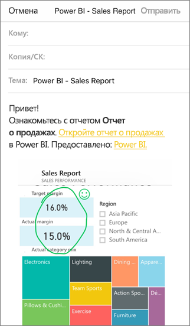

# Добавление заметок к плиткам, отчетам и визуальным элементам и их совместное использование в мобильных приложениях Power BI
Область применения:

|  |  |  |  |
|:--- |:--- |:--- |:--- |
| iPhones |iPad |Телефоны под управлением Android |Планшеты Android |

Вы можете добавить заметку к моментальному снимку плитки, отчета или визуализации и поделиться им из мобильного приложения Power BI для устройств iOS и Android. Получатели увидят этот элемент точно в таком же виде, как в момент отправки вашего электронного письма, а также получат ссылку на него. Моментальные снимки плиток можно отправлять кому угодно, не только коллегам в том же домене электронной почты. Перед отправкой моментального снимка вы можете добавить заметки: линии, текст или метки.

*Отчет с заметками*

Письмо с моментальным снимком плитки, отчета или визуализации также содержит ссылку на фактический объект в службе Power BI ([https://powerbi.com](https://powerbi.com)). Если у вас и этих пользователей есть лицензии Power BI Pro либо же содержимое находится в [емкости Premium](../../admin/service-premium-what-is.md) и вы поделились с ними элементом, получатели смогут щелкнуть ссылку и перейти непосредственно к соответствующей плитке, отчету или визуализации. 

Вы также можете [поделиться плиткой в мобильном приложении Power BI для устройств с Windows 10](mobile-windows-10-phone-app-get-started.md), не добавляя к ней заметки.

## Как открыть плитку для добавления заметок
1. Коснитесь плитки, чтобы открыть ее в режиме фокусировки.
2. Коснитесь значка "Заметка"  в правом верхнем углу плитки.
3. Теперь вы можете [добавлять заметки и предоставлять общий доступ к плитке](mobile-annotate-and-share-a-tile-from-the-mobile-apps.md#annotate-and-share-the-tile-report-or-visual).

## Как открыть отчет для добавления заметок
1. Откройте отчет. 
2. Коснитесь значка "Заметка"  в правом верхнем углу отчета.
3. Теперь вы можете [добавлять заметки и предоставлять общий доступ к отчету](mobile-annotate-and-share-a-tile-from-the-mobile-apps.md#annotate-and-share-the-tile-report-or-visual).

## Как открыть визуализацию для добавления заметок
1. В отчете откройте визуализацию, а затем коснитесь значка развертывания, чтобы открыть ее в режиме фокусировки. 
   
    
2. Коснитесь значка "Заметка"  в правом верхнем углу визуального элемента.
3. Теперь вы можете [добавлять заметки и предоставлять общий доступ к визуализации](mobile-annotate-and-share-a-tile-from-the-mobile-apps.md#annotate-and-share-the-tile-report-or-visual).

## Добавление заметок и общий доступ к плитке, отчету или визуализации
1. Вот как добавить заметку.  
   
   
   
   *Строка для заметок на устройствах iPhone и iPad*
   
   
   
   *Строка для заметок на устройствах Android*
   
   * Чтобы нарисовать линии разного цвета и толщины, коснитесь значка волнистой линии, выберите ширину и цвет и нарисуйте линию.  
   * Чтобы добавить комментарий, коснитесь значка **АА**, выберите размер и цвет шрифта и введите текст.  
   * Чтобы добавить на плитку метку (например, смайлик), коснитесь значка улыбающегося лица, выберите цвет и коснитесь места для вставки.   
2. Добавив заметки, коснитесь значка **общего доступа** в правом верхнем углу экрана.
3. Откройте приложение электронной почты, введите имена получателей и, если нужно, измените текст сообщения.  
   
   
   
   Сообщение содержит изображение и ссылку на конкретную плитку, отчет или визуализацию. 
4. Коснитесь кнопки **Отправить**.

## Дальнейшие действия
* [Общий доступ к панели мониторинга из мобильного приложения Power BI](mobile-share-dashboard-from-the-mobile-apps.md)
* У вас появились вопросы? [Попробуйте задать вопрос в сообществе Power BI.](https://community.powerbi.com/)
