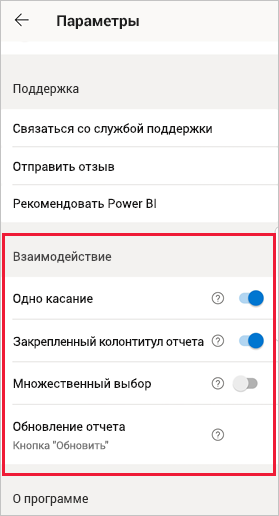
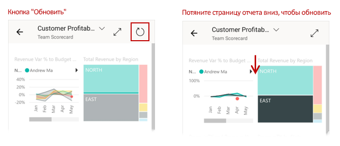
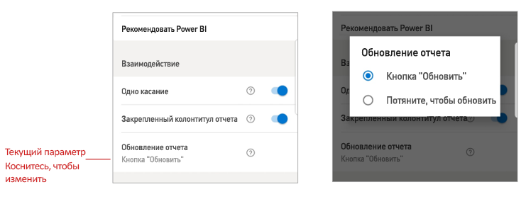

# Настройка параметров взаимодействия с отчетами

## Обзор

В мобильном приложении Power BI есть ряд настраиваемых параметров взаимодействия, позволяющих управлять взаимодействием с данными, а также определять, как работают некоторые элементы в мобильном приложении Power BI. В таблице ниже показаны параметры взаимодействия, доступные в настоящее время, и устройства, которые их используют.

|| Телефон Android | iPhone | Планшет Android  | iPad |
|-|:-:|:-:|:-:|:-:|
| [выбор взаимодействия с визуальными элементами отчета одиночным или двойным касанием](#single-tap); |✔|✔|||
| [выбор наборов и отдельных точек данных в визуальных элементах отчета;](#multi-select) |✔|✔|✔|✔|
| [выбор закрепленного или динамического нижнего колонтитула отчета;](#docked-report-footer) |✔|✔|||
| [выбор обновления отчета нажатием кнопки или с помощью действия "Потяните, чтобы обновить".](#report-refresh) |✔||||
|

Для перехода к параметрам взаимодействия коснитесь изображения профиля, чтобы открыть [боковую панель](./mobile-apps-home-page.md#header), выберите пункт **Параметры** и найдите раздел **Взаимодействие**.

В следующих разделах описываются различные параметры взаимодействия.

## Параметры взаимодействия

### Одно касание
После скачивания мобильного приложения Power BI в нем настроено взаимодействие одиночным касанием. Это означает, что при касании визуального элемента для выполнения какого-либо действия, например выбора объекта среза, перекрестного выделения, перехода по ссылке, нажатия кнопки и т. д., происходит одновременно выбор визуального элемента и выполнение требуемого действия.

При желании взаимодействие одиночным касанием можно отключить. В этом случае взаимодействие будет происходить двойным касанием. При использовании взаимодействия двойным касанием сначала нужно коснуться визуального элемента, чтобы выбрать его, а затем коснуться еще раз, чтобы выполнить нужное действие.

### Множественный выбор

Множественный выбор позволяет выбрать несколько точек данных на странице отчета. Если включен множественный выбор, каждая точка данных, которой вы коснулись, добавляется к другим выбранным точкам данных, при этом объединенные результаты автоматически выделяются во всех визуальных элементах на странице. Если множественное выделение отключено, то при выборе касанием точки данных выбор предыдущей точки данных отменяется.

Чтобы отменить выбор точки данных, коснитесь ее еще раз.

>[!NOTE]
>Множественный выбор не поддерживается в визуальных элементах Power BI.
>
>Режим множественного выбора будет поддерживаться в следующем выпуске Сервера отчетов Power BI.

### Закрепленный колонтитул отчета

Этот параметр определяет, закреплен ли колонтитул отчета в нижней части отчета (то есть находится в фиксированном положении и виден всегда) или же он скрывается и отображается при определенных действиях с отчетом, например при прокрутке.

На телефонах Android параметр закрепления нижнего колонтитула отчета по умолчанию **включен**, то есть колонтитул закреплен и всегда отображается в нижней части отчета. Если вы предпочитаете использовать динамический колонтитул, который скрывается и отображается в зависимости от действий в отчете, **отключите** этот параметр.

### Обновление отчета

Параметр обновления отчета определяет способ запуска обновления отчета. Вы можете добавить кнопку обновления в заголовки всех отчетов или использовать действие "Потяните, чтобы обновить" (нужно слегка потянуть сверху вниз) на странице отчета для его обновления. На рисунке ниже проиллюстрированы оба варианта. 

На телефонах с Android кнопка обновления добавляется по умолчанию.

Чтобы изменить параметр обновления отчета, перейдите к элементу "Обновление отчета" в параметрах взаимодействия. Вы увидите текущее значение. Коснитесь его, чтобы открыть всплывающее окно, в котором можно выбрать другое значение.

## Удаленная настройка

Администратор может также настроить взаимодействие удаленно, используя средство MDM и файл конфигурации приложения. Таким образом можно стандартизировать взаимодействие с отчетами в масштабе всей организации или для конкретных групп пользователей. Подробные сведения см. в статье [Удаленная настройка приложения Power BI с помощью средства управления мобильными устройствами (MDM)](./mobile-app-configuration.md).

## Дальнейшие действия
* [Взаимодействие с отчетами](./mobile-reports-in-the-mobile-apps.md#interact-with-reports)
* [Удаленная настройка приложения Power BI с помощью средства управления мобильными устройствами (MDM)](./mobile-app-configuration.md)
