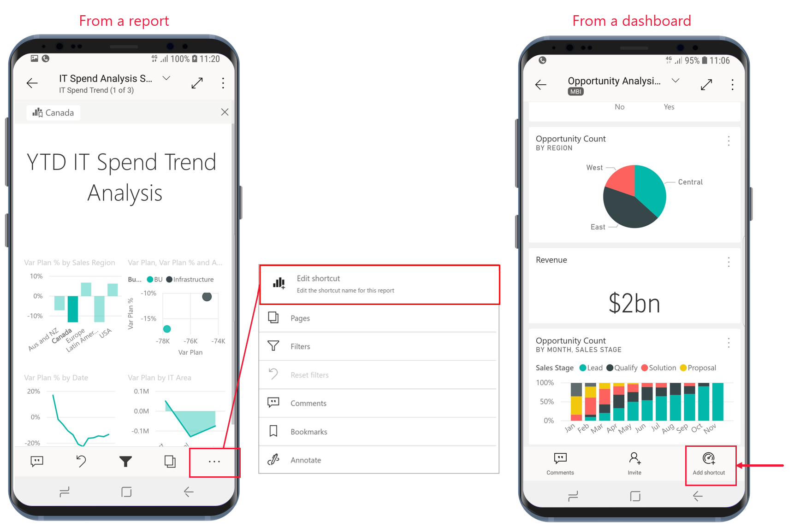

# Использование ярлыков приложений Android в приложении Power BI для Android

Применяется к:

|  |  |
|:--- |:--- |
| Телефоны под управлением Android |Планшеты Android |

В мобильном приложении Power BI для Android есть два простых способа перехода напрямую к нужным отчетам или панелям мониторинга без навигации в самом приложении: **ярлыки на начальном экране устройства** и **ярлыки в средстве запуска приложений**.
 * **Ярлыки на начальном экране устройства**. Вы можете создать ярлык для любого отчета или панели мониторинга и закрепить его на начальном экране устройства. Отчет или панель мониторинга не обязательно должны находиться в одной из рабочих областей. Вы также можете создавать ярлыки для отчетов и панелей мониторинга, которые находятся внутри приложений или даже во внешнем клиенте (B2B).
 * **Ярлыки в средстве запуска приложений**. Чтобы перейти напрямую к часто просматриваемым отчетам и панелям мониторинга, можно открыть средство запуска приложений длительным касанием его значка на начальном экране устройства. В меню быстрого доступа имеются ярлыки для трех часто просматриваемых элементов. Эти элементы время от времени меняются в соответствии с вашей активностью, которая отслеживается мобильным приложением Power BI.

 >[!NOTE]
 >Ярлыки приложений Android доступны начиная с версии Android 8.

## Создание ярлыка для отчета или панели мониторинга

Создать ярлык можно для любого отчета или панели мониторинга.

1. В меню действий выберите пункт **Дополнительно...** , а затем пункт **Добавить ярлык**.

   

   Кроме того, если приложение Power BI определяет, что вы часто обращаетесь к некоторому элементу, оно предлагает создать ярлык для него. Это происходит двумя способами.
   * При открытии часто просматриваемых отчетов и панелей мониторинга в баннере появляется команда **Добавить ярлык**.
   * Если вы часто используете ссылку для обращения к отчету (например, из сообщения электронной почты, заметки и т. д.), после нескольких переходов по ней откроется окно с запросом на создание ярлыка. Если нажать кнопку **Да**, откроется диалоговое окно **Добавление ярлыка** (см. ниже). Если же нажать кнопку **Не сейчас**, вы сразу перейдете к элементу, не создавая ярлык.
   
   Оба способа проиллюстрированы ниже.

   

 1. Откроется диалоговое окно **Добавление ярлыка** с именем элемента. При необходимости имя можно изменить. По завершении нажмите кнопку **Добавить**.

    

1. Необходимо будет подтвердить операцию. Нажмите кнопку **Добавить**, чтобы добавить ярлык на начальный экран устройства.

   

   На начальный экран устройства добавится ярлык панели мониторинга или отчета с указанным именем.

   

## Изменение имени ярлыка

Чтобы изменить имя ярлыка, в меню действий выберите пункт **Дополнительно...** , а затем пункт **Изменить имя ярлыка**.

 

## Доступ к часто просматриваемому содержимому через средство запуска мобильного приложения Power BI

Через средство запуска мобильного приложения Power BI можно обращаться напрямую к часто просматриваемым элементам.

Длительно коснитесь средства запуска приложения, чтобы открыть меню быстрого доступа к часто просматриваемым элементам. Затем коснитесь ярлыка, чтобы открыть нужный элемент.

Вы можете создать постоянный ярлык для любого из перечисленных элементов, просто перетащив нужный значок ярлыка на начальный экран устройства.

## Дальнейшие действия
* [Поиск содержимого и доступ к нему с помощью Google Поиска](mobile-app-find-access-google-search.md)
* Если вы используете iOS и вам нужна информация о ярлыках Siri, обратитесь к статье [Использование ярлыков Siri в приложении Power BI Mobile для iOS](mobile-apps-ios-siri-shortcuts.md).
* [Избранное в мобильных приложениях Power BI](mobile-apps-favorites.md)
