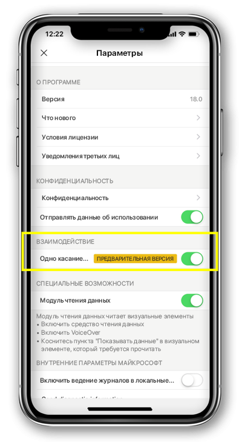

# Настройка взаимодействия с отчетом через одинарное или двойное касание
Область применения:

|  |  | 
|:--- |:--- |
| iPhone |Телефоны под управлением Android |

Отчет Power BI — это интерактивное представление данных с визуальными элементами, которые отображают различные результаты и сведения, полученные из этих данных.

Вы можете настроить способы взаимодействия с данными. Можно выбрать, использовать для взаимодействия одинарное или двойное касание.

* При использовании двойного касания первое касание выбирает визуальный элемент, а второе — выполняет действия, такие как выбор элемента среза, перекрестное выделение или щелчок ссылки, нажатие кнопки и т. д.

* При использовании одинарного касания оно выполняет оба действия — выбирает визуальный элемент и выполняет действие.

Начиная с Power BI версии 18.0 для iOS и 112540 для Android, все новые установки по умолчанию будут управляться одинарным касанием.
Пользователям, которые уже установили на телефоне Power BI, при переходе на эти новые версии будет предложено переключиться на одинарное касание.

## Изменение поведения взаимодействия

Для изменения поведения взаимодействия можно перейти к параметрам приложения и включить либо выключить взаимодействие через одинарное касание.

Эта статья применима к горизонтальным и вертикальным отчетам.

## Дальнейшие действия
* [Просмотр отчетов Power BI, оптимизированных для телефона, и взаимодействие с ними](mobile-apps-view-phone-report.md)
* У вас появились вопросы? [Попробуйте задать вопрос в сообществе Power BI.](http://community.powerbi.com/)

