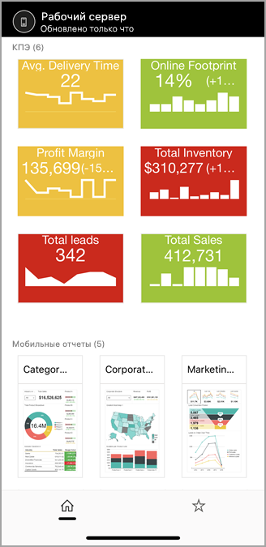
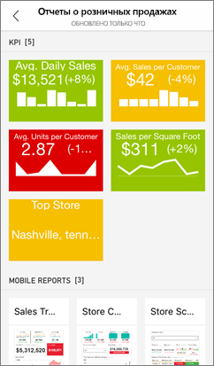
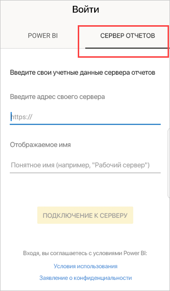
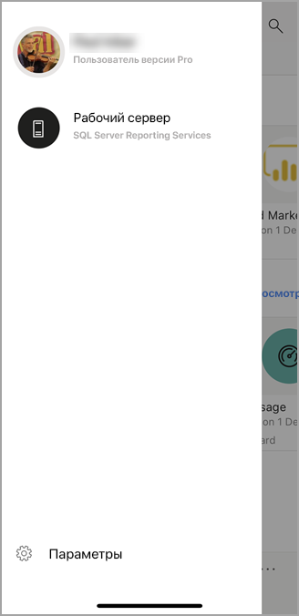
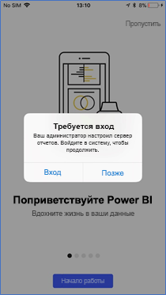
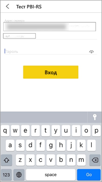
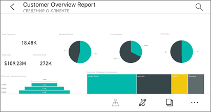
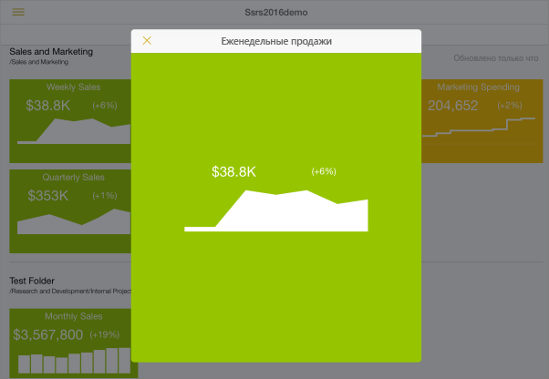
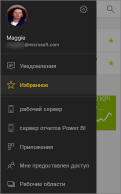
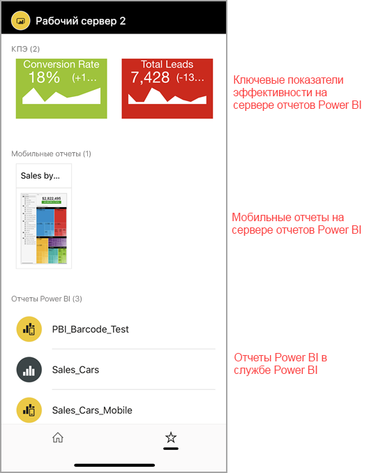

# Просмотр локальных отчетов на сервере отчетов и ключевых показателей эффективности в мобильных приложениях Power BI

Мобильные приложения Power BI обеспечивают динамический мобильный доступ с поддержкой сенсорного ввода к локальным бизнес-данным на сервере отчетов Power BI и в службах SQL Server 2016 Reporting Services (SSRS).

Область применения:

|  |  |  |  |
|:--- |:--- |:--- |:--- |
| iPhone |iPad |Телефоны под управлением Android |Планшеты Android |

## Начните с главного
**Мобильные приложения расположены не там, где создается содержимое Power BI, а там, где вы просматриваете его.**

* Вы и ваши коллеги можете [создавать отчеты Power BI с помощью Power BI Desktop, а затем публиковать их на веб-портале сервера отчетов Power BI](../../report-server/quickstart-create-powerbi-report.md). 
* Создавайте [ключевые показатели эффективности непосредственно на веб-портале](https://docs.microsoft.com/sql/reporting-services/working-with-kpis-in-reporting-services), включайте их в папки и добавляйте в избранное для быстрого поиска. 
* [Создайте мобильные отчеты Reporting Services](https://docs.microsoft.com/sql/reporting-services/mobile-reports/create-mobile-reports-with-sql-server-mobile-report-publisher) при помощи издателя мобильных отчетов для SQL Server 2016 Enterprise Edition и опубликуйте их на [веб-портале служб Reporting Services](https://docs.microsoft.com/sql/reporting-services/web-portal-ssrs-native-mode).  

Затем в мобильных приложениях Power BI можно подключиться к пяти серверам отчетов, чтобы отобразить в папках или списке избранных элементов отчеты Power BI и ключевые показатели эффективности. 

## Изучение примеров в мобильных приложениях без подключения к серверу
Ознакомиться с ключевыми показателями эффективности и функциями мобильных отчетов Reporting Services можно даже без доступа к веб-порталу служб Reporting Services. 

1. Коснитесь кнопки глобальной навигации  в левом верхнем углу экрана, а затем коснитесь значка шестеренки .
2. Щелкните **Примеры для Reporting Services**, а затем просмотрите и изучите примеры ключевых показателей эффективности и мобильных отчетов.
   
   

## Подключение к локальному серверу отчетов
Вы можете просматривать локальные отчеты Power BI, мобильные отчеты Reporting Services и ключевые показатели эффективности в мобильных приложениях Power BI. 

1. Откройте приложение Power BI на своем мобильном устройстве.
2. Если вы еще не вошли в Power BI, выберите **Сервер отчетов**.
   
   
   
   Если вы уже вошли в приложение Power BI, коснитесь кнопки глобальной навигации , а затем коснитесь значка шестеренки  в правом верхнем углу.
3. Выберите **Подключение к серверу**.
   
    

     Мобильному приложению необходимо обеспечить доступ к серверу. Это можно сделать несколькими способами:

    - Проще всего использовать ту же сеть или VPN.
    - Можно использовать прокси веб-приложения для подключения вне организации. См. дополнительные сведения о [подключении к Reporting Services с помощью OAuth](mobile-oauth-ssrs.md). 
    - Откройте подключение (порт) в брандмауэре.

1. Введите адрес сервера, имя пользователя и пароль. Используйте следующий формат для адреса сервера:
   
     `http://<servername>/reports`
   
     OR
   
     `https://<servername>/reports`
   
   В начале строки подключения укажите префикс **http** или **https**.
   
    
5. (Необязательно.) В разделе **Дополнительные параметры** при желании можно присвоить серверу понятное имя.
6. Новый сервер отобразится на навигационной панели слева. В нашем примере ему присвоено имя "power bi report server".
   
   

## Подключение к локальному серверу отчетов в iOS

Если вы работаете с Power BI в мобильном приложении для iOS, возможно, ИТ-администратор определил политику настройки приложения. В этом случае процедура подключения к серверу отчетов упрощается и вам требуется предоставлять меньше сведений. 

1. Появляется сообщение о том, что для мобильного приложения настроен доступ к серверу отчетов. Коснитесь элемента **Вход**.

    

2.  На странице **Подключение к серверу** сведения о сервере отчетов уже заполнены. Нажмите **Подключиться**.

    

3. Введите пароль, чтобы пройти проверку подлинности, а затем коснитесь элемента **Вход**. 

    

Теперь вы можете просматривать ключевые показатели эффективности и отчеты Power BI, хранящиеся на сервере отчетов, и взаимодействовать с ними.

## Просмотр отчетов Power BI и ключевых показателей эффективности в приложении Power BI
Отчеты Power BI, мобильные отчеты Reporting Services и ключевые показатели эффективности отображаются в тех же папках, в которых они расположены на веб-портале служб Reporting Services. 

* Коснитесь отчета Power BI . Он открывается в альбомной ориентации и доступен для работы в приложении Power BI.

    > [!NOTE]
  > Детализация углублением и обобщением в настоящий момент не включена в отчетах Power BI на сервере отчетов Power BI.
  
    
* В Power BI Desktop владельцы отчета могут [оптимизировать отчет](../../desktop-create-phone-report.md) для мобильных приложений Power BI. На мобильных телефонах в оптимизированных отчетах есть специальный значок  и макет.
  
    
* Выберите ключевой показатель эффективности, чтобы просмотреть его в режиме фокуса.
  
    

## Просмотр избранных ключевых показателей эффективности и отчетов
На веб-портале ключевые показатели эффективности и отчеты можно отметить как избранные. Так вы сможете просматривать эти данные на мобильном устройстве в одной папке вместе с избранными панелями мониторинга Power BI.

* Выберите **Избранное**.
  
   
  
   Ваши избранные ключевые показатели эффективности и отчеты находятся на этой странице веб-портала вместе с панелями мониторинга Power BI в службе Power BI:
  
   

## Удаление подключения к серверу отчетов
1. Внизу левой панели навигации выберите **Параметры**.
2. Выберите имя сервера, с которым хотите разорвать соединение.
3. Коснитесь пункта **Удалить сервер**.

## Дальнейшие действия
* [Что такое Power BI?](../../power-bi-overview.md)  
* У вас появились вопросы? [Попробуйте задать вопрос в сообществе Power BI.](http://community.powerbi.com/)

