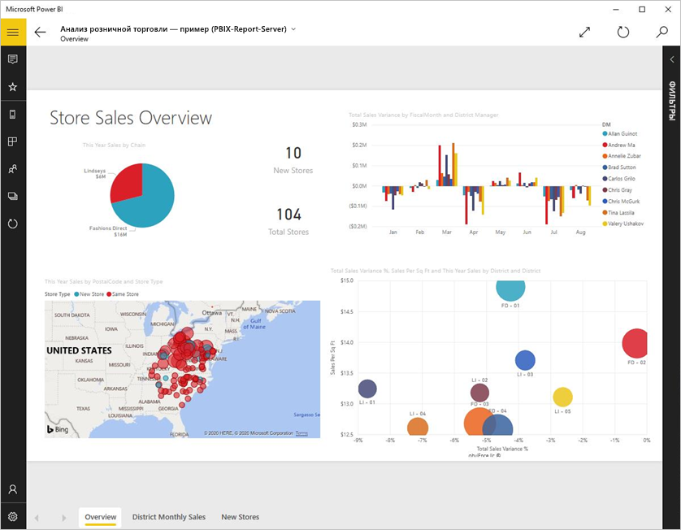
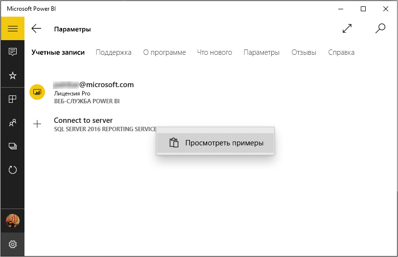
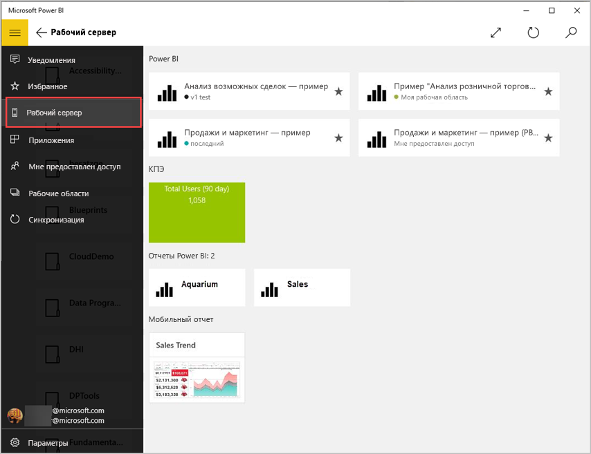
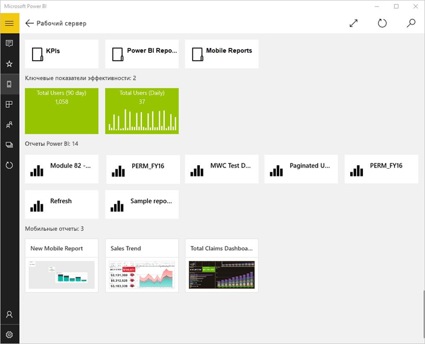
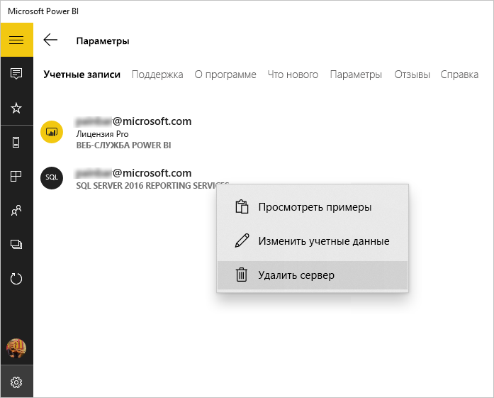

# Просмотр локальных отчетов и КПЭ в приложении Power BI для Windows
Приложение Power BI для Windows 10 обеспечивает доступ в режиме реального времени к важнейшей бизнес-информации в Reporting Services SQL Server 2016. 

## Начните с главного
Вы можете [создавать мобильные отчеты Reporting Services](/sql/reporting-services/mobile-reports/create-mobile-reports-with-sql-server-mobile-report-publisher) при помощи издателя мобильных отчетов для SQL Server 2016 Enterprise Edition и публиковать их на [веб-портале служб Reporting Services](/sql/reporting-services/web-portal-ssrs-native-mode). Создавайте ключевые показатели эффективности прямо на веб-портале. Объединяйте их в папки и добавляйте в избранное, чтобы легко находить. 

В приложении Power BI для Windows 10 КПЭ, мобильные отчеты и отчеты Power BI отображаются в папках или в списке избранного. 

> [!NOTE]
> Ваше устройство должно работать под управлением Windows 10. Лучше всего приложение работает на устройствах, где доступно не менее 1 ГБ ОЗУ и 8 ГБ внутренней памяти.

>[!NOTE]
>Поддержка мобильного приложения Power BI для **телефонов под управлением Windows 10 Mobile** будет прекращена 16 марта 2021 г. [Дополнительные сведения](/legal/powerbi/powerbi-mobile/power-bi-mobile-app-end-of-support-for-windows-phones)

## Изучение примеров без сервера SQL Server 2016 Reporting Services
Ознакомиться с функциями мобильных отчетов Reporting Services можно даже в отсутствие доступа к веб-порталу Reporting Services.

1. Откройте приложение Power BI на устройстве Windows 10.
2. Коснитесь кнопки глобальной навигации  в левом верхнем углу.
3. Коснитесь значка **Параметры**, щелкните правой кнопкой мыши или нажмите и удерживайте элемент **Подключение к серверу**, а затем выберите команду **Просмотреть примеры**.
   
   
4. Откройте папку отчетов по розничным продажам или отчетов по сбыту и изучите ключевые показатели эффективности и мобильные отчеты.
   
   

Просмотрите примеры и изучите ключевые показатели эффективности и мобильные отчеты.

## Подключение к серверу отчетов Reporting Services
1. В нижней части области навигации выберите **Параметры** .
2. Выберите **Подключение к серверу**.
3. Введите адрес сервера, имя пользователя и пароль. Используйте следующий формат для адреса сервера:
   
     `https://<servername>/reports` ИЛИ `https://<servername>/reports`
   
   > [!NOTE]
   > В начале строки подключения укажите префикс **http** или **https**.
   > 
   > 
   
    По желанию коснитесь пункта **Дополнительный параметр**, чтобы присвоить имя серверу.
4. Коснитесь значка галочки для подключения. 
   
   Новый сервер появится в области навигации.
   
   
   
   >[!TIP]
   >С помощью кнопки глобальной навигации  вы можете в любой момент переключиться между мобильными отчетами Reporting Services и панелями мониторинга в службе Power BI. 
   > 

   >[!NOTE]
   >Серверы отчетов, настроенные с использованием настраиваемых портов, не поддерживаются и недоступны из приложения Power BI для Windows. 

## Просмотр ключевых показателей эффективности и мобильных отчетов Reporting Services в приложении Power BI
Отчеты Power BI (предварительная версия), КПЭ и мобильные отчеты Reporting Services отображаются в тех же папках, в которых они расположены на веб-портале служб Reporting Services.

* Выберите ключевой показатель эффективности, чтобы просмотреть его в режиме фокуса.
  
    
* Выберите мобильный отчет, чтобы открыть его в приложении Power BI, где с ним можно взаимодействовать.
  
    

## Просмотр избранных ключевых показателей эффективности и отчетов
На веб-портале Reporting Services КПЭ, мобильные отчеты и отчеты Power BI можно отметить как избранные и удобно просматривать на устройстве с Windows 10 в одной папке вместе с избранными панелями мониторинга и отчетами Power BI.

* Выберите **Избранное**.
  
   
  
   Все, чтобы вы добавили в избранное на веб-портале, отобразиться на этой странице.
  
Дополнительные сведения об избранном в мобильных приложениях Power BI см. [здесь](mobile-apps-favorites.md).

## Удаление подключения к серверу отчетов
В приложении для iPhone в каждый момент времени может быть установлено подключение только к одному серверу отчетов. Чтобы подключиться к другому серверу, необходимо разорвать соединение с текущим.

1. В нижней части области навигации выберите **Параметры** .
2. Нажмите и удерживайте имя сервера, с которым хотите разорвать соединение.
3. Коснитесь пункта **Удалить сервер**.
   
    

## Создание мобильных отчетов и ключевых показателей эффективности Reporting Services
Ключевые показателей эффективности и мобильные отчеты Reporting Services не создаются в приложении Power BI. Для их создания используются приложение SQL Server Mobile Report Publisher и веб-портал служб SQL Server 2016 Reporting Services.

* Вы можете [создавать собственные мобильные отчеты](/sql/reporting-services/mobile-reports/create-mobile-reports-with-sql-server-mobile-report-publisher) и публиковать их на веб-портале Reporting Services.
* Создание [ключевых показателей эффективности на веб-портале Reporting Services](/sql/reporting-services/working-with-kpis-in-reporting-services)

## Дальнейшие действия
* [Начало работы с мобильным приложением Power BI для Windows 10](mobile-windows-10-phone-app-get-started.md)  
* [Что такое Power BI?](../../fundamentals/power-bi-overview.md)  
* У вас появились вопросы? [Попробуйте задать вопрос в сообществе Power BI.](https://community.powerbi.com/)