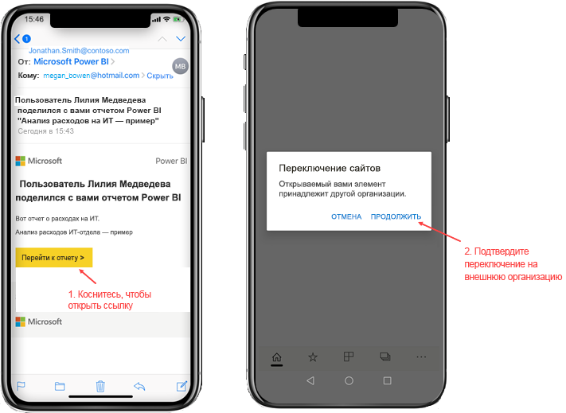
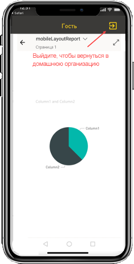
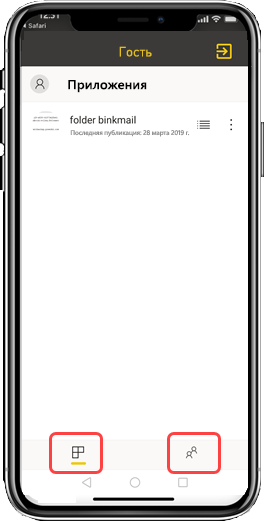

# Просмотр содержимого Power BI, к которому предоставила доступ другая организация.

Power BI интегрируется с Azure Active Directory "бизнес — бизнес" (Azure AD B2B), чтобы обеспечить безопасное распространение содержимого Power BI для гостевых пользователей за пределами организации. Внешние гостевые пользователи могут использовать мобильное приложение Power BI для доступа к содержимому Power BI, к которому им предоставлен доступ. 

Область применения:

|  |  |  |  |
|:--- |:--- |:--- |:--- |
| iPhones |iPad |Телефоны под управлением Android |Планшеты Android |

## Доступ к общему содержимому

**Сначала пользователь из внешней организации должен поделиться с вами элементом.** Когда [вам предоставляет доступ к элементу](../../collaborate-share/service-share-dashboards.md) пользователь из вашей или другой организации, вы получаете сообщение электронной почты со ссылкой на этот элемент. При переходе по этой ссылке на мобильном устройстве открывается мобильное приложение Power BI. Если приложение распознает, что доступ к элементу был предоставлен из внешней организации, оно подключается к этой организации с использованием ваших учетных данных. Затем приложение загружает все элементы, к которым вам предоставили доступ из этой организации.

> [!NOTE]
> Если вам впервые предоставляется доступ к элементу как внешнему гостевому пользователю, необходимо запросить приглашение в браузере. Приглашение нельзя запросить в приложении Power BI.

Когда вы подключены к внешней организации, в приложении отображается черный заголовок. Он указывает на то, что вы подключены не к своей организации. Чтобы снова подключиться к своей организации, выйдите из гостевого режима.

Несмотря на то, что для подключения к внешней организации требуется ссылка на артефакт Power BI, после подключения вы сможете получить доступ ко всем общим элементам (а не только к элементу, который вы открыли из сообщения электронной почты). Чтобы просмотреть все элементы, доступные вам во внешней организации, перейдите в меню приложения и выберите пункт **Мне предоставлен доступ**. В разделе **Приложения** приводятся приложения, которые вы можете использовать.

## Ограничения

- У пользователя должна быть активная учетная запись Power BI и домашний клиент.
- Пользователь должен войти в свой домашний клиент Power BI, чтобы получить доступ к содержимому из внешнего клиента.
- Условный доступ и другие политики Intune не поддерживаются в Azure AD B2B и Power BI Mobile. Это означает, что в приложении применяются только политики домашней организации, если они существуют.
- Push-уведомления принимаются только с сайта домашней организации (даже если пользователь подключен как гость к внешней организации). При открытии уведомления приложение подключается к сайту домашней организации пользователя.
- Если пользователь завершил работу приложения, при повторном открытии приложение автоматически подключается к домашней организации пользователя.
- При подключении к внешней организации становятся недоступны некоторые возможности: избранные элементы, предупреждения об изменении данных, комментирование и совместное использование.
- Автономные данные недоступны при подключении к внешней организации.
- Если на устройстве установлено приложение "Корпоративный портал", устройство должно быть зарегистрировано.
