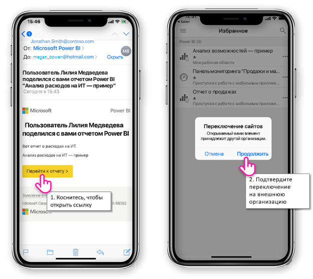
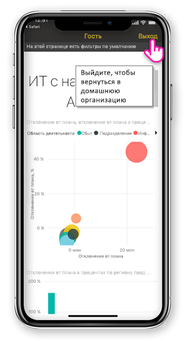
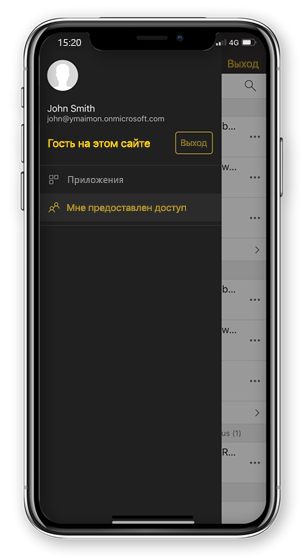

# Просмотр содержимого Power BI, которыми с вами из внешней организации

Power BI интегрируется с Azure Active Directory предприятие предприятие (Azure AD B2B), чтобы обеспечить безопасное распространение содержимого Power BI для гостевых пользователей за пределами вашей организации. И внешние пользователи-гости могут использовать мобильное приложение Power BI для доступа к содержимому Power BI, что им предоставлен доступ. 

Область применения:

|  |  |  |  |
|:--- |:--- |:--- |:--- |
| iPhone |iPad |Телефоны под управлением Android |Планшеты Android |

## Доступ к общего содержимого

**Во-первых необходим кто-то из внешней организации поделиться с вами элемент.** Когда кто-нибудь [предоставил вам элемент](../../service-share-dashboards.md), либо из той же организации или в сторонней организации, вы получите сообщение электронной почты со ссылкой, общий элемент. Выполнив эту ссылку в мобильном устройстве откроется в мобильном приложении Power BI. Если приложение распознает, что элемент был предоставлен общий доступ из внешней организации, приложение выполняет повторное подключение к этой организации с помощью удостоверения. Приложение загружает все элементы, которые вам был предоставлен этой организации.

> [!NOTE]
> Если это первое, что вам предоставлен как внешний гостевой пользователь должен запросить приглашение в браузере. Вы можете не удается запросить приглашение в приложении Power BI.

До тех пор, пока вы подключены к внешней организации, в приложении появляется черный заголовок. Этот заголовок указывает, что вы не подключены к вашей домашней организации. Для подключения к вашей домашней организации, выйти из гостевого режима.

Несмотря на то, что вам нужно указать ссылку артефакта Power BI для подключения к внешней организации, как только приложение переключается, доступны все элементы, которыми с вами (а не только элемент, который открывается сообщение электронной почты). Чтобы просмотреть все элементы, вы можете получить доступ к внешней организации, перейдите в меню приложения и выберите **мне предоставлен доступ**. В разделе **приложений** найти приложения, которые можно использовать также.

## Ограничения

- Условный доступ и другие политики Intune не поддерживаются в Azure AD B2B, так и в Power BI для мобильных устройств. Что означает, что приложение определяет только домашней организации политики, если они существуют.
- Push-уведомлений принимаются только на сайте домашней организации (даже если он подключен как Гость к внешней организации). Снова откройте уведомление подключается приложение, чтобы сайт домашней организации пользователя.
- Если пользователь завершает работу приложения, при повторном открытии приложение автоматически подключается к домашней организации пользователя.
- При подключении к внешней организации, некоторые действия отключены: Избранное элементы, предупреждения об изменении данных, комментирование и совместного использования.
- Автономные данные недоступны, подключенных к внешней организации.
- Если у вас есть приложение корпоративного портала, установленном на вашем устройстве, устройства должны быть зарегистрированы.
