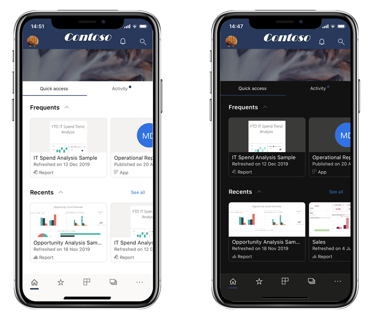

# Темный режим

Чтобы обеспечить вам максимально удобную работу, мобильное приложение Power BI для iOS поддерживает светлый и темный режим отображения. В темном режиме яркость экрана значительно снижена, что упрощает просмотр содержимого.

 В темном режиме весь интерфейс приложения отображается с темным фоном. Отображение другого содержимого Power BI при этом не меняется. Отчеты, панели мониторинга и приложения всегда отображаются в соответствии с задумкой дизайнера.
 
 По умолчанию мобильное приложение Power BI использует параметры устройства для определения режима экрана. Если устройство настроено для работы в темном режиме, приложение тоже включит темный режим.
 
 Чтобы переключиться между светлым и темным режимами или разрешить параметрам устройства определять режим, перейдите в раздел **Параметры > Предпочтения** и коснитесь элемента **Внешний вид**, чтобы выбрать нужный режим.

