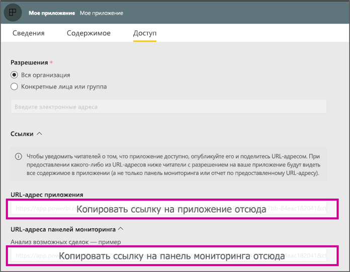

# <a name="create-a-link-to-a-specific-location-in-the-power-bi-mobile-apps"></a>Создание ссылки на определенное расположение в мобильных приложениях Power BI
Вы можете использовать ссылки для прямого доступа к определенным элементам в Power BI: отчету, панели мониторинга и плитке.

В большинстве случаев доступно два сценария использования ссылок в Power BI Mobile: 

* Чтобы открыть Power BI **извне приложения** и отобразить определенное содержимое (отчет, панель мониторинга или приложение). Обычно это сценарий интеграции, когда требуется открыть Power BI Mobile из другого приложения. 
* Чтобы **перейти** внутрь Power BI. Обычно это имеет место, когда требуется создать пользовательскую навигацию в Power BI.


## <a name="use-links-from-outside-of-power-bi"></a>использование ссылок за пределами Power BI
При использовании ссылки извне приложения Power BI нужно убедиться, что она будет открыта приложением, а если приложение не установлено на устройстве, пользователю должно быть предложено установить его. Мы создали специальный формат ссылки для поддержки такого поведения. Этот формат ссылки позволяет убедиться, что устройство использует приложение для открытия ссылки, а если приложение не установлено на устройстве, пользователю будет предложено перейти в магазин и получить его.

Ссылка должна начинаться следующим образом  
```html
https://app.powerbi.com/Redirect?[**QUERYPARAMS**]
```

> [!IMPORTANT]
> Если содержимое размещается в специальном центре обработки данных, например для правительственных учреждений, Китая и т. п. Ссылка должна начинаться с подходящего адреса Power BI, например `app.powerbigov.us` или `app.powerbi.cn`.   
>


Параметры запроса **QUERY PARAMS**:
* **action** (обязательно) = OpenApp/OpenDashboard/OpenTile/OpenReport
* **appId** — если нужно открыть отчет или панель мониторинга, являющиеся частью приложения. 
* **groupObjectId** — если нужно открыть отчет или панель мониторинга, являющиеся частью рабочей области (но не моей рабочей области).
* **dashboardObjectId** — идентификатор объекта панели мониторинга (если для параметра action задано значение OpenDashboard или OpenTile).
* **reportObjectId** — идентификатор объекта отчета (если для параметра action задано значение OpenReport).
* **tileObjectId** — идентификатор объекта плитки (если для параметра action задано значение OpenTile).
* **reportPage** — если нужно открыть конкретный раздел отчета (если для параметра action задано значение OpenReport).
* **ctid** — идентификатор организации элемента (относится к сценарию B2B, его можно опустить, если элемент относится к организации пользователя).

**Примеры:**

* Открытие ссылки приложения 
  ```html
  https://app.powerbi.com/Redirect?action=OpenApp&appId=appidguid&ctid=organizationid
  ```

* Открытие панели мониторинга, которая включена в приложение 
  ```html
  https://app.powerbi.com/Redirect?action=OpenDashboard&appId=**appidguid**&dashboardObjectId=**dashboardidguid**&ctid=**organizationid**
  ```

* Открытие отчета, который включен в рабочую область
  ```html
  https://app.powerbi.com/Redirect?Action=OpenReport&reportObjectId=**reportidguid**&groupObjectId=**groupidguid**&reportPage=**ReportSectionName**
  ```

### <a name="how-to-get-the-right-link-format"></a>Получение правильного формата ссылки

#### <a name="links-of-apps-and-items-in-app"></a>Ссылки для приложения и элементов в нем

Для **приложений, а также отчетов и панелей мониторинга, являющихся частью приложения**, получить ссылку проще всего, перейдя в рабочую область приложения и выбрав "Обновить приложение". Откроется окно "Публикация приложения", где на вкладке "Доступ" находится раздел **Ссылки**. Развернув этот раздел, вы увидите список из приложения и всех его ссылок на содержимое, который можно использовать для прямого доступа к ним.



#### <a name="links-of-items-not-in-app"></a>Ссылки на элементы, отсутствующие в приложении 

Для отчетов и панелей мониторинга, которые не являются частью приложения, нужно извлечь идентификаторы из URL-адреса элемента.

Например, чтобы найти 36-символьный идентификатор объекта **панели мониторинга**, перейдите на требуемую панель мониторинга в службе Power BI. 

```html
https://app.powerbi.com/groups/me/dashboards/**dashboard guid comes here**?ctid=**organization id comes here**`
```

Чтобы найти 36-символьный идентификатор объекта **отчета**, перейдите к требуемому отчету в службе Power BI.
Это пример отчета из раздела "Моя рабочая область"

```html
https://app.powerbi.com/groups/me/reports/**report guid comes here**/ReportSection3?ctid=**organization id comes here**`
```
Указанный выше URL-адрес содержит также определенную страницу отчета **"ReportSection3"** .

Это пример отчета из рабочей области (отличной от раздела "Моя рабочая область")

```html
https://app.powerbi.com/groups/**groupid comes here**/reports/**reportid comes here**/ReportSection1?ctid=**organizationid comes here**
```

## <a name="use-links-inside-power-bi"></a>Использование ссылок внутри Power BI

Ссылки внутри Power BI работают в мобильных приложениях точно так же, как и в службе Power BI.

Если вы хотите добавить ссылку на отчет, указывающий на другой элемент Power BI, можно просто скопировать URL-адрес этого элемента из адресной строки браузера. См. дополнительные сведения о [добавлении гиперссылки в текстовое поле в отчете](https://docs.microsoft.com/power-bi/service-add-hyperlink-to-text-box).

## <a name="use-report-url-with-filter"></a>Использование URL-адреса отчета с фильтром
Как и в службе Power BI, приложения Power BI Mobile также поддерживают URL-адрес отчета, содержащий параметр запроса фильтра. Вы можете открыть отчет в приложении Power BI Mobile и отфильтровать его до определенного состояния. Например, этот URL-адрес открывает отчет о продажах и фильтрует его по территориям

```html
https://app.powerbi.com/groups/me/reports/**report guid comes here**/ReportSection3?ctid=**organization id comes here**&filter=Store/Territory eq 'NC'
```

См. дополнительные сведения о [создании параметра запроса для фильтрации отчетов](https://docs.microsoft.com/power-bi/service-url-filters).

## <a name="next-steps"></a>Дальнейшие действия
Ваши отзывы помогают нам решить, что следует добавить в следующие выпуски, поэтому не забудьте проголосовать за функции, которые хотели бы увидеть в мобильных приложениях Power BI. 

* [Приложения Power BI для мобильных устройств](mobile-apps-for-mobile-devices.md)
* Подпишитесь на страницу @MSPowerBI в Twitter
* Присоединяйтесь к обсуждению в [сообществе Power BI](http://community.powerbi.com/).
* [Что такое Power BI?](../../power-bi-overview.md)

