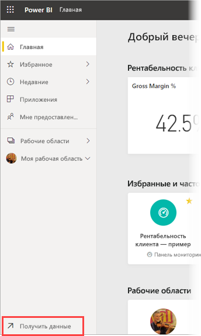
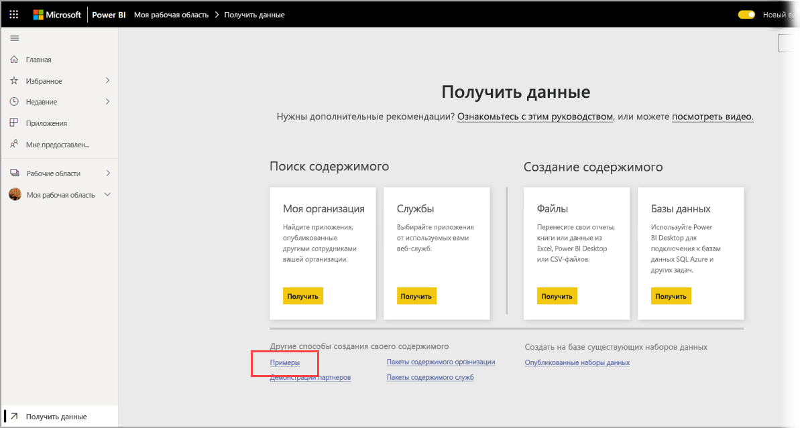
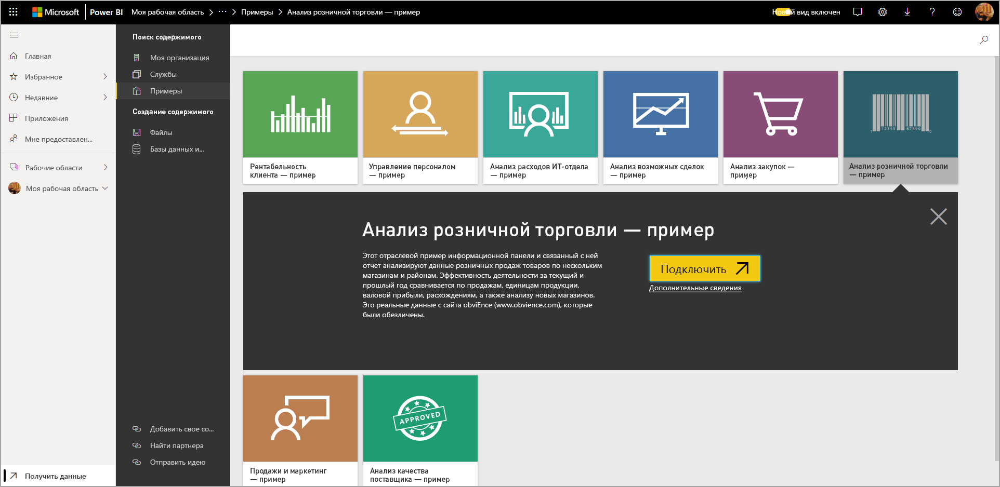
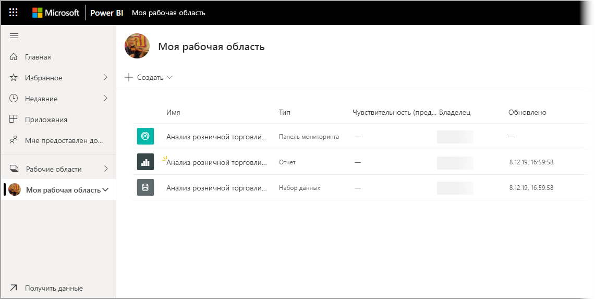

# Скачивание примеров в раздел "Моя рабочая область" в службе Power BI

В некоторых представленных здесь документах по мобильному приложению в качестве иллюстрации используется пример данных. Для выполнения инструкций на своем устройстве вы можете скачать пример данных в свою учетную запись службы Power BI, откуда вы сможете открывать его в мобильном приложении Power BI. В этой статье описывается, как скачать пример данных в учетную запись службы Power BI. 

## Предварительные требования

Для скачивания данных необходима учетная запись службы Power BI. Если вы не зарегистрированы в Power BI, перед началом работы [пройдите бесплатную регистрацию](https://app.powerbi.com/signupredirect?pbi_source=web).

## Скачивание образца

1. Откройте [службу Power BI](https://app.powerbi.com) в браузере и выполните вход.

2. В левом нижнем углу панели навигации выберите **Получить данные**. Если панель навигации скрыта и вы не видите ссылку "Получить данные", отобразите панель, щелкнув значок "Показать/скрыть панель навигации" .  
   
    

3. На странице "Получить данные" щелкните ссылку **Примеры**.
   
   

4. Выберите пример для скачивания. Необходимо выбрать именно тот пример, который указан в руководстве или статье. Выбрав пример, щелкните **Подключиться**.
  
   
   
5. Power BI импортирует выбранный пример и добавит панель мониторинга, отчет и набор данных из него в текущую рабочую область.
   
   
  
Теперь все готово для просмотра примеров на мобильном устройстве.

## Дальнейшие действия
* [Краткое руководство](mobile-apps-quickstart-view-dashboard-report.md)
* У вас появились вопросы? См. [раздел мобильных приложений в сообществе Power BI](https://go.microsoft.com/fwlink/?linkid=839277)
