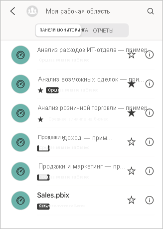

# Добавление элементов в избранное и их просмотр в мобильных приложениях Power BI
Область применения:

|  |  |  |  |  |
|:--- |:--- |:--- |:--- |:--- |
| iPhone |iPad |Телефоны под управлением Android |Планшеты Android |Устройства под управлением Windows 10 |

Узнайте о том, как добавлять в избранное и просматривать избранные панели мониторинга, отчеты и приложения Power BI, а также избранные локальные ключевые показатели эффективности и отчеты решения "Сервер отчетов Power BI" и служб Reporting Services в мобильных приложениях.

Когда вы добавляете элемент в избранное в мобильных приложениях Power BI, он отображается на странице избранного в службе Power BI ([https://powerbi.com](https://powerbi.com)) и на всех ваших мобильных устройствах. 

Вы также можете [добавлять в избранное приложения и панели мониторинга Power BI в службе Power BI](../end-user-favorite.md). В таком случае эти элементы появятся в мобильном приложении на странице избранного.

На веб-портале сервера отчетов Power BI и служб Reporting Services ключевые показатели эффективности и отчеты можно отметить как избранные. Так вы сможете просматривать эти данные на мобильном устройстве в одной папке вместе с избранными панелями мониторинга Power BI.

## Просмотр избранных элементов в Power BI
* Коснитесь меню навигации вверху () и выберите **Избранное**.
  
  
  
  Все избранные элементы отображаются на этой странице.
  
  

## Добавление приложения в избранное
1. В списке приложений в мобильном приложении нажмите кнопку с многоточием (…) рядом с приложением и выберите пункт **Добавить в избранное**.
   
    
   
    Теперь оно будет отображаться вместе с другими избранными приложениями и панелями мониторинга.
   
    

## Добавление панели мониторинга или отчета в избранное в мобильных приложениях iOS и Windows 10
Отчет или панель мониторинга Power BI можно добавить в избранное из списка панелей мониторинга или отчетов либо непосредственно с панели или из отчета.

* В мобильном приложении в списке панелей мониторинга или отчетов коснитесь пустой звездочки рядом с именем . Звездочка станет желтой .
  
    
* На ленте в верхней части панели мониторинга или отчета коснитесь пустой звездочки . Звездочка станет желтой .
  
    

## Добавление панели мониторинга или отчета в избранное в мобильных приложениях Android
Отчет или панель мониторинга можно добавить в избранное из списка панелей мониторинга или отчетов либо непосредственно с панели или из отчета.

* В мобильном приложении в списке панелей мониторинга или отчетов коснитесь вертикального многоточия (…) рядом с именем и выберите пункт **Добавить в избранное**. Рядом с именем появится желтая звездочка .
  
    
* На ленте в верхней части панели мониторинга или отчета коснитесь пустой звездочки . Звездочка станет темно-серой .
  
    

## Добавление отчетов и ключевых показателей эффективности сервера отчетов Power BI и служб Reporting Services в "Избранное"
Хотя избранные отчеты и ключевые показатели эффективности сервера отчетов Power BI и служб Reporting Services можно просматривать в мобильных приложениях Power BI, вы не может добавить их в "Избранное" в мобильных приложениях. Вы [можете отметить их как "Избранное" на веб-портале](../../report-server/tutorial-explore-report-server-web-portal.md#tag-your-favorites). 

## Дальнейшие действия
* [Избранные панели мониторинга в Power BI](../end-user-favorite.md) 
* У вас появились вопросы? [Попробуйте задать вопрос в сообществе Power BI.](http://community.powerbi.com/)

