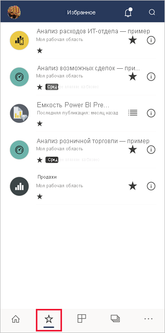

# Добавление элементов в избранное и их просмотр в мобильных приложениях Power BI
Область применения:

|  |  |  |  |  |
|:--- |:--- |:--- |:--- |:--- |
| iPhones |устройства iPad. |Телефоны под управлением Android |Планшеты Android |Устройства Windows 10: |

>[!NOTE]
>Поддержка мобильного приложения Power BI для **телефонов под управлением Windows 10 Mobile** будет прекращена 16 марта 2021 г. [Дополнительные сведения](/legal/powerbi/powerbi-mobile/power-bi-mobile-app-end-of-support-for-windows-phones)

Узнайте о том, как добавлять в избранное и просматривать избранные панели мониторинга, отчеты и приложения Power BI, а также избранные локальные ключевые показатели эффективности и отчеты решения "Сервер отчетов Power BI" и служб Reporting Services в мобильных приложениях.

Когда вы добавляете элемент в избранное в мобильных приложениях Power BI, он отображается на странице избранного в [службе Power BI](https://powerbi.com) и на всех ваших мобильных устройствах.

Чтобы открыть страницу "Избранное", коснитесь значка "Избранное" на панели навигации.

Вы также можете [добавлять в избранное приложения и панели мониторинга Power BI в службе Power BI](../end-user-favorite.md). В таком случае эти элементы появятся в мобильном приложении на странице избранного.

На веб-портале сервера отчетов Power BI и служб Reporting Services ключевые показатели эффективности и отчеты можно отметить как избранные. Так вы сможете просматривать эти данные на мобильном устройстве в одной папке вместе с избранными панелями мониторинга Power BI.

## Добавление приложения в избранное
1. Чтобы открыть страницу приложений, на панели навигации внизу коснитесь значка "Приложения".

2. На устройстве iOS коснитесь кнопки сведений справа от имени приложения, которое нужно добавить в избранное. На устройствах Android вместо кнопки сведений отображается элемент "Дополнительные параметры" (...). 

3. В открывшемся разделе сведений о приложении коснитесь звездочки.
   
    
   
    Теперь приложение будет отображаться на странице избранного вместе с другими избранными панелями мониторинга, отчетами и приложениями.
   
## Добавление панели мониторинга или отчета в избранное в мобильных приложениях iOS и Windows 10
Отчет или панель мониторинга Power BI можно добавить в избранное из списка панелей мониторинга или отчетов либо непосредственно с панели или из отчета.

* В мобильном приложении в списке панелей мониторинга или отчетов коснитесь пустой звездочки рядом с именем . Звездочка станет черной .
  
    
* В панели мониторинга или отчете нажмите **Дополнительно** (...) в заголовке и нажмите значок пустой звездочки  в появившемся меню. Звездочка станет черной .
  
    

## Добавление панели мониторинга или отчета в избранное в мобильных приложениях Android
Отчет или панель мониторинга можно добавить в избранное из списка панелей мониторинга или отчетов либо непосредственно с панели или из отчета.

* В мобильном приложении в списке панелей мониторинга или отчетов коснитесь значка звездочки рядом с именем отчета или панели мониторинга, чтобы внести элемент в список "Избранное" или удалить его из такого списка.
  
    

* В панели мониторинга или отчете нажмите **Дополнительно (...)** и выберите **Избранное**.
  
    

## Добавление отчетов и ключевых показателей эффективности сервера отчетов Power BI и служб Reporting Services в "Избранное"
Хотя избранные отчеты и ключевые показатели эффективности сервера отчетов Power BI и служб Reporting Services можно просматривать в мобильных приложениях Power BI, вы не может добавить их в "Избранное" в мобильных приложениях. Вы [можете отметить их как "Избранное" на веб-портале](../../report-server/tutorial-explore-report-server-web-portal.md#tag-your-favorites). 

## Дальнейшие действия
* [Избранные панели мониторинга в Power BI](../end-user-favorite.md) 
* Вопросы? [Задайте их в сообществе Power BI](https://community.powerbi.com/).