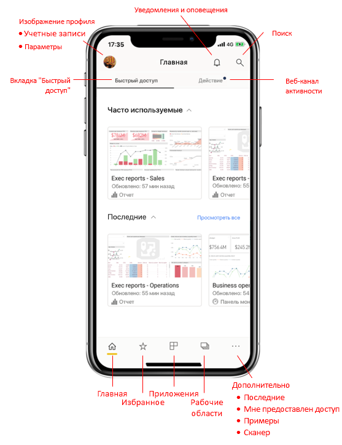

# Краткий обзор домашней страницы мобильного приложения
В этом обзоре вы ознакомитесь с домашней страницей мобильного приложения Power BI и доступными на ней элементами навигации для быстрого доступа.

Применяется к:

|  |  |  |
|:--- |:--- |:--- |
| iPhone | iPad | Android | 

Когда вы открываете приложение Power BI Mobile, вы оказываетесь на домашней странице, с которой можно быстро получить доступ к наиболее часто используемым или недавно просмотренным отчетам, панелям мониторинга и приложениям. Кроме того, имеется веб-канал действий, предоставляющий сведения о происходящем с вашим содержимым Power BI, а также удобные средства навигации для быстрого перехода к нужному содержимому.

 
## Вкладка "Быстрый доступ"

На вкладке "Быстрый доступ" представлены часто используемые и недавно просмотренные отчеты, панели мониторинга и приложения, сгруппированные в два свертываемых раздела. Чтобы увидеть более длинный список недавно просмотренных элементов, коснитесь элемента **Смотреть все** справа от надписи "Последние". 

## Веб-канал активности

Веб-канал действий помогает отслеживать все, что происходит с вашим содержимым Power BI. В нем приводятся все последние уведомления, предупреждения, комментарии и @mentions.

В веб-канале предоставляются следующие новости:
* **Обновленные данные**: при обновлении базовых данных в одном из отчетов или одной из информационных панелей, включенных в избранное или список последних элементов.
* **Новые комментарии**: когда пользователь создает комментарий в отчете или панели мониторинга, включенных в избранное или список последних элементов, или упоминает вас в комментарии.
* **Оповещения о данных**: когда данные достигают порогового значения, установленного ранее в [оповещении о данных](../../mobile-set-data-alerts-in-the-mobile-apps.md).
* **Обновления приложений**: когда создатель приложения публикует обновление для приложения, которым вы пользуетесь.

 Коснитесь элемента, чтобы перейти в соответствующее место и получить дополнительную информацию.

Элементы действий объединяются, поэтому все обновления данных, поступающие из одного и того же приложения или рабочей области, группируются. Вы можете использовать кнопку  стрелка для развертывания и просмотра сгруппированных элементов. Самый последний элемент всегда будет находиться в начале списка.

## Панель навигации

В нижней части страницы находится панель мониторинга.

Панель навигации обеспечивает быстрый доступ к следующим компонентам:

*  **Домашняя** — возврат на домашнюю страницу;
*  **Избранное** — отчеты, панели мониторинга и приложения, помеченные как [избранные](../../mobile-apps-favorites.md);
*  **Приложения** — приложения, которые вы установили в своей учетной записи;
*  **Рабочие области** — рабочие папки с отчетами и панелями мониторинга, которые создают разработчики содержимого;
*  **Последние** — элементы, которые вы недавно просматривали;
*  **Мне предоставлен доступ** — элементы, к которым вам предоставили доступ другие пользователи;
*  **Примеры** — примеры, которые можно использовать для освоения возможностей Power BI;
*  **Сканер** — камера устройства, которую можно использовать для сканирования [штрихкодов](../../mobile-apps-scan-barcode-iphone.md) и [QR-кодов](../../mobile-apps-qr-code.md).

## Заголовок

В верхней части страницы в заголовке отображается имя текущей страницы, отчета или панели мониторинга Power BI.

В заголовке доступны перечисленные ниже элементы навигации.
* **Изображение профиля или аватар** — открывается боковая панель, где можно [переключаться между учетными записями службы Power BI и Сервера отчетов](../../mobile-app-ssrs-kpis-mobile-on-premises-reports.md), а также получать доступ к параметрам мобильного приложения Power BI.

    

* **Уведомления** — открывается [страница уведомлений](../../mobile-apps-notification-center.md), на которой можно просматривать уведомления. О наличии новых уведомлений свидетельствует точка на значке уведомлений в виде колокольчика.

    

* **Поиск** — поиск содержимого Power BI в вашей подписке.

    

## Дальнейшие действия
В этом обзоре вы изучили домашнюю страницу мобильного приложения Power BI. Получить дополнительные сведения об использовании мобильного приложения Power BI можно в следующих ресурсах: 
* [Изучение панелей мониторинга и отчетов](../../mobile-apps-quickstart-view-dashboard-report.md)
* [Explore reports in the Power BI mobile apps](../../mobile-reports-in-the-mobile-apps.md) (Просмотр отчетов в мобильных приложениях Power BI)
