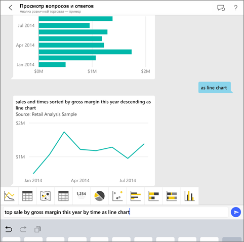
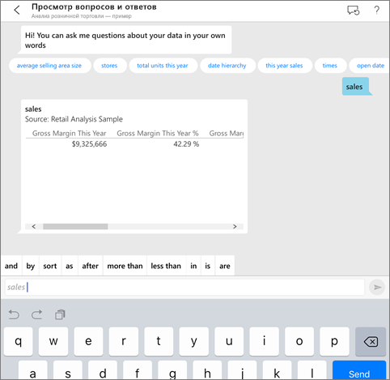
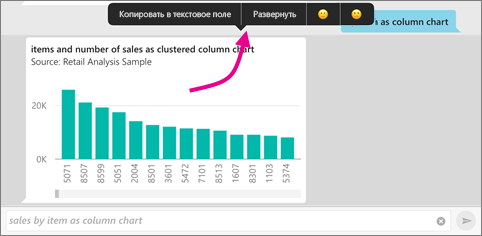
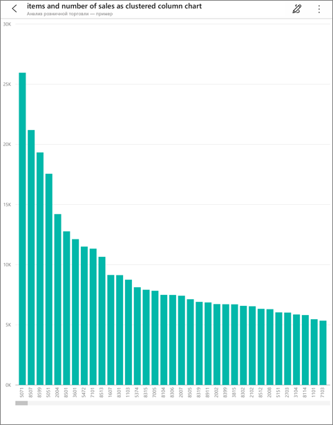
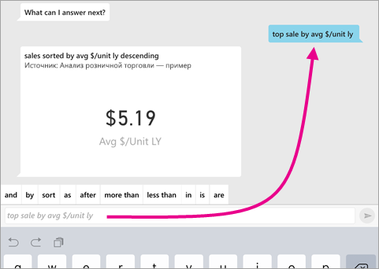
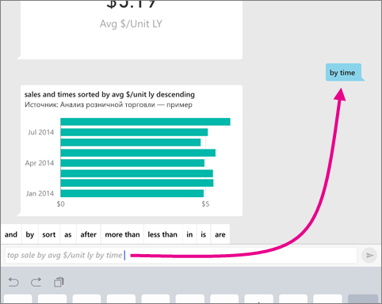
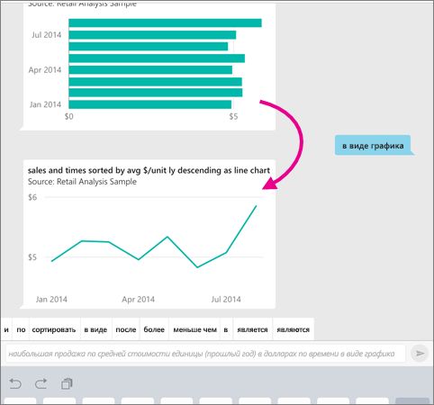
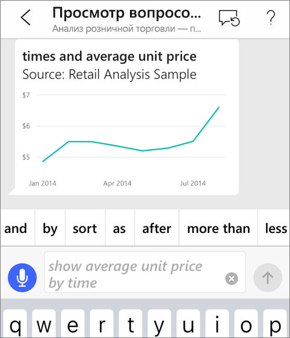
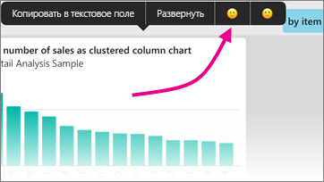

# Виртуальный аналитик "Вопросы и ответы" в приложениях iOS (Power BI)

Чтобы получить ответ на вопрос о своих данных, задайте его своими словами. При изучении этой статьи вы будете задавать вопросы и просматривать аналитические сведения о тестовых данных в виртуальном аналитике "Вопросы и ответы", который доступен в мобильном приложении Microsoft Power BI на iPad, iPhone и iPod Touch. 

Применяется к:

|  |  |
|:--- |:--- |
| iPhone |iPad |

Виртуальный аналитик "Вопросы и ответы" — это диалоговый интерфейс бизнес-аналитики, который обращается к базовым данным функции "Вопросы и ответы" в службе Power BI [(https://powerbi.com)](https://powerbi.com). Он предлагает аналитические сведения, а также может отвечать на вопросы, которые вы вводите или произносите.

Если вы не зарегистрированы в Power BI, перед началом работы [пройдите бесплатную регистрацию](https://app.powerbi.com/signupredirect?pbi_source=web).

## Предварительные требования

* **Установка приложения Power BI для iOS**: [Скачайте приложение для iOS](https://go.microsoft.com/fwlink/?LinkId=522062) на устройство iPhone или iPad.
Приложение Power BI для iOS поддерживается в следующих версиях:
    * iPad с iOS 11 или более поздней версии;
    * iPhone 5 или более поздней версии с iOS 11 или более поздней версии.
* **Скачайте примеры "Анализ розничной торговли" и "Анализ возможных сделок"** : При изучении этого краткого руководства вам прежде всего нужно скачать примеры "Анализ розничной торговли" и "Анализ возможных сделок" из службы Power BI. [Узнайте, как скачать пример](./mobile-apps-download-samples.md) в учетную запись Power BI, чтобы приступить к работе. Не забудьте, что нужно выбрать примеры "Анализ розничной торговли" и "Анализ возможных сделок".

После выполнения предварительных требований вы готовы опробовать виртуальный аналитик раздела "Вопросы и ответы".

## Отправка вопросов на устройствах iPhone и iPad
1. На устройстве iPhone или iPad на панели навигации внизу нажмите кнопку "Рабочие области" , выберите "Мои рабочие области" и откройте панель мониторинга "Анализ розничной торговли — пример".

2. Коснитесь значка виртуального аналитика "Вопросы и ответы"  в меню действий в нижней части страницы (на iPad — в верхней части страницы).
     Виртуальный аналитик "Вопросы и ответы" предоставляет ряд предложений для начала работы.
3. Введите **show**, в списке предложений выберите **sales** (продажи) и коснитесь значка **Send** (Отправить) .

    
4. Выберите **by** (по) из ключевых слов, затем выберите **item** (элемент) в списке предложений и коснитесь значка **Send** (Отправить) .

    
5. Выберите **as** (как) из ключевых слов, коснитесь значка гистограммы , а затем коснитесь значка **Send** (Отправить) .
6. Нажмите и удерживайте полученную гистограмму, а затем нажмите кнопку **Expand** (Развернуть).

    

    Гистограмма откроется в приложении в режиме фокусировки.

    
7. Нажмите кнопку со стрелкой в верхнем левом углу, чтобы вернуться в окно чата виртуального аналитика "Вопросы и ответы".
8. Нажмите кнопку X справа от текстового поля, чтобы удалить текст и начать заново.
9. Попробуйте отправить новый вопрос. Выберите **top** из ключевых слов, а затем выберите **sale by avg $/unit ly** (Сред. стоимость единицы (прошлый год), долл.)  >  **Send** (Отправить) .

    
10. Выберите **by** (по) из ключевых слов, затем выберите **time** (время) из списка предложений в верхней части и коснитесь значка **Send** (Отправить) .

     
11. Введите **as** (как), выберите значок графика  из списка предложений и коснитесь значка **Send** (Отправить) .

    

## Попробуйте задать вопрос с помощью голосового ввода
Теперь вы можете задавать вопросы о данных в мобильном приложении Power BI не только с помощью текста, но и речи.

1. Коснитесь значка виртуального аналитика "Вопросы и ответы"  в меню действий в нижней части страницы (на iPad — в верхней части страницы).
2. Коснитесь значка микрофона .

    

1. Когда значок микрофона станет активным, начните говорить. Например, скажите "средняя цена за единицу по времени", а затем коснитесь значка **Отправить** .

    

### Вопросы о конфиденциальности при использовании голосового ввода
См. раздел с описанием [новых возможностей iOS](https://go.microsoft.com/fwlink/?linkid=845624), посвященный распознаванию речи, в руководстве для разработчиков Apple iOS.

## Справка и отзывы
* Требуется помощь? Введите слово Hi (Привет) или Help (Справка), и вы получите помощь и сможете задать новый вопрос.
* Хотите поделиться своим мнением о результатах? Щелкните и удерживайте диаграмму или другой результат, а затем коснитесь значка в виде улыбающегося или хмурого лица.

    

    Ваши отзывы анонимны. Они помогают нам лучше отвечать на ваши вопросы.

## Улучшение результатов, полученных с помощью виртуального аналитика "Вопросы и ответы"
Вы можете улучшить результаты, которые получаете вы или ваши клиенты при использовании виртуального аналитика "Вопросы и ответы" с набором данных. Для этого нужно задать более точный вопрос или усовершенствовать набор данных.

### Как задавать вопросы
* Следуйте этим [рекомендациям по отправке вопросов с помощью функции "Вопросы и ответы"](../end-user-q-and-a-tips.md) в службе Power BI или виртуального аналитика "Вопросы и ответы" в мобильном приложении iOS.

### Как улучшить набор данных
* Усовершенствуйте набор данных в Power BI Desktop или в службе Power BI, чтобы [ваши данные правильно работали с функцией "Вопросы и ответы" и виртуальным аналитиком "Вопросы и ответы"](../../service-prepare-data-for-q-and-a.md).

## Дальнейшие действия
* [Вопросы и ответы в Power BI](../end-user-q-and-a.md)
* У вас появились вопросы? См. [раздел мобильных приложений в сообществе Power BI](https://go.microsoft.com/fwlink/?linkid=839277)
