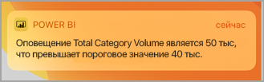
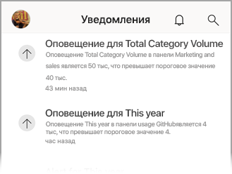

# Получение уведомлений в мобильных приложениях Power BI
Область применения:

|  |  |  |  |  |
|:--- |:--- |:--- |:--- |:--- |
| iPhone |iPad |Телефоны под управлением Android |Планшеты Android |Устройства под управлением Windows 10 |

Благодаря уведомлениям вы получаете информацию, связанную с вашей работой в Power BI, в службе Power BI или непосредственно на своем мобильном устройстве. При открытии страницы "Уведомления" вы видите последовательность сообщений для [установленных вами оповещений](mobile-set-data-alerts-in-the-mobile-apps.md) о новых информационных панелях, к которым вам предоставлен доступ, об изменениях в вашей рабочей области группы, сведения о мероприятиях и встречах, связанных с Power BI, и многое другое.

> [!NOTE]
> На устройстве с iOS при первом входе в [обновленную версию приложения Power BI](https://powerbi.microsoft.com/mobile/) появляется вопрос о том, хотите ли вы, чтобы служба Power BI отправляла вам уведомления. Кроме того, задать параметры уведомления Power BI можно в **настройках** устройства. 
> 
> 

## Просмотр уведомлений на мобильном устройстве
1. При поступлении уведомления на мобильное устройство Power BI по умолчанию воспроизводит звук и выводит баннер.
   
   
   
   Или на iPad:
   
   
   
   [Параметры уведомлений Power BI](mobile-apps-notification-center.md#change-or-turn-off-notifications-on-your-mobile-device) можно изменить.
2. Если вы получили уведомления, при входе в Power BI на мобильном устройстве вы увидите желтую точку на значке главного меню  (в Android) или на значке **Уведомления**. 
   
   
3. Выберите значок "Уведомления"  (Windows 10).
   
    Новые уведомления отображаются вверху списка, а непрочитанные сообщения выделяются. Уведомления хранятся в течение 90 дней, если вы их не удаляете или их количество не достигает максимального (100 штук).
   
   
4. Чтобы закрыть уведомление, нажмите и удерживайте его и выберите **Закрыть**.

## Включение и отключение уведомлений на мобильном устройстве
Параметры уведомлений Power BI можно изменить.

1. На устройстве iOS выберите **Настройки** > **Уведомления**. 
   
    На телефоне с Android перейдите в раздел **Настройки уведомлений**.
   
    На устройстве с Windows в разделе **Параметры** выберите **Система** > **Уведомления и действия**.
2. В списке приложений выберите **Power BI**. 
3. Здесь можно полностью отключить уведомления или выбрать нужные.
   
    **На устройстве iPhone**
   
    
   
    **На телефоне с Android**
   
    

    **На устройстве Windows 10**

    

## Дальнейшие действия
* [Оповещения о данных в службе Power BI](../../service-set-data-alerts.md)
* [Настройка оповещений о данных в приложении Power BI для iOS на устройствах iPhone и iPad](mobile-set-data-alerts-in-the-mobile-apps.md)
* [Настройка оповещений о данных в мобильном приложении Power BI для Windows 10](mobile-set-data-alerts-in-the-mobile-apps.md)
* [Скачать последние версии приложений Power BI](https://powerbi.microsoft.com/mobile/) для мобильных устройств

