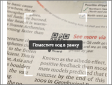
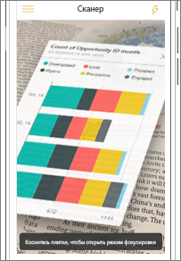
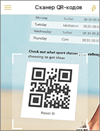
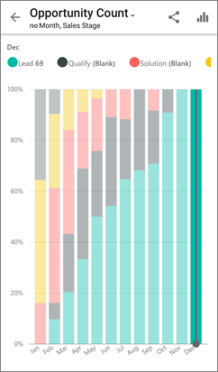

# Сканирование QR-кода Power BI на мобильном устройстве
Область применения:

|  |  |  |
|:--- |:--- |:--- |:--- |
| iPhone |Телефоны под управлением Android |Планшеты Android |

QR-коды в Power BI могут связывать любой предмет реального времени с соответствующей информацией BI &#151; навигация или поиск не требуются.

Допустим, коллега [создал QR-код в службе Power BI](../../service-create-qr-code-for-tile.md) для отчета или плитки на панели мониторинга, предоставил вам доступ к панели или отчету и поместил QR-код в ключевое расположение — например в электронную почту или определенную папку. 

Вы можете отсканировать QR-код для мгновенного доступа к соответствующей плитке или отчету прямо на телефоне с помощью сканера в приложении Power BI либо другого аналогичного сканера, установленного на вашем устройстве. 

Если ваши коллеги не предоставили вам доступ к отчету или панели мониторинга, запросить доступ можно непосредственно из мобильного приложения. 

> [!NOTE]
> Кроме того, можно [сосканировать QR-код отчета с помощью приложения Power BI для смешанной реальности](mobile-mixed-reality-app.md#scan-a-report-qr-code-in-holographic-view).

## Сканирование QR-кода Power BI на устройстве iPhone с помощью сканера Power BI
1. В мобильном приложении Power BI откройте меню глобальной структуры навигации  в левом верхнем углу экрана. 
2. Прокрутите экран вниз, найдите и выберите элемент **Сканер**. 
   
    
3. Если камера не включена, разрешите приложению Power BI ее использовать. Это нужно сделать один раз. 
4. Наведите сканер на QR-код Power BI. 
   
    
5. Плитка или отчет появится на фоне в режиме дополненной реальности.
   
    
6. Коснитесь отчета или плитки, чтобы открыть их в режиме фокусировки, или вернитесь к сканеру.

### Сканирование QR-кода с помощью внешнего сканера, установленного на устройстве iPhone
1. Откройте сканер на телефоне и наведите его на соответствующий QR-код Power BI, чтобы получить доступ к плитке или отчету. 
2. Если на вашем iPhone не установлено приложение Power BI, откроется [каталог Apple App Store, откуда вы сможете его скачать](http://go.microsoft.com/fwlink/?LinkId=522062).

## Сканирование QR-кода Power BI на устройстве Android с помощью сканера Power BI
1. В мобильном приложении Power BI нажмите кнопку глобальной структуры навигации  в левом верхнем углу экрана. 
2. Прокрутите экран вниз и выберите **QR-сканер**.
   
    
3. Если камера не включена, разрешите приложению Power BI ее использовать. Это нужно сделать один раз. 
4. Наведите сканер на QR-код Power BI. 
   
    
5. Плитка или отчет откроется в Power BI автоматически.
   
    

### Сканирование QR-кода внешним сканером, установленным на устройстве Android
1. Откройте сканер на устройстве Android и наведите сканер на соответствующий QR-код Power BI, чтобы получить доступ к плитке или отчету. 
2. Если у вас не установлено приложение Power BI, откроется [каталог Google Play, где его можно будет скачать](http://go.microsoft.com/fwlink/?LinkID=544867). 

## Дальнейшие действия
* [Подключение к данным Power BI из реального мира](mobile-apps-data-in-real-world-context.md) с помощью мобильных приложений
* [Создание QR-кода для плитки в службе Power BI](../../service-create-qr-code-for-tile.md)
* [Создание QR-кода для отчета в Power BI](../../service-create-qr-code-for-report.md)
* Кроме того, можно [сосканировать QR-код с помощью приложения Power BI для смешанной реальности](mobile-mixed-reality-app.md).
* У вас появились вопросы? [Попробуйте задать вопрос в сообществе Power BI.](http://community.powerbi.com/)

