# Краткое руководство. Просмотр панелей мониторинга и отчетов в мобильных приложениях Power BI
В этом кратком руководстве представлены примеры панелей мониторинга и отчетов в мобильных приложениях Power BI на устройстве Android. Эти же действия можно выполнять в мобильных приложениях на других платформах. 

Область применения:

|  |  |  |  |
|:--- |:--- |:--- |:--- |
| iPhone | iPad | Android | Windows 10 |

Панели мониторинга — это портал к жизнедеятельности и рабочим процессам вашей компании. Она представляет общую картину и служит единой точкой контроля текущего состояния бизнеса. Отчет — это интерактивное представление данных с визуальными элементами, которые отображают разные данные и связанные аналитические сведения. 

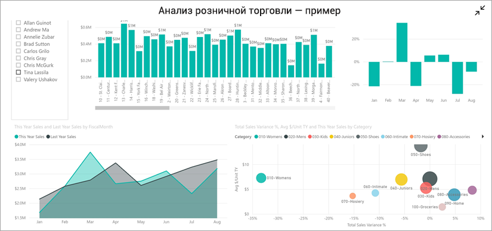

## Предварительные требования

### Регистрация в Power BI
Если вы не зарегистрированы в Power BI, перед началом работы [пройдите бесплатную регистрацию](https://app.powerbi.com/signupredirect?pbi_source=web).

### Установка приложения Power BI для Android
[Скачайте приложение Power BI для Android](http://go.microsoft.com/fwlink/?LinkID=544867) из магазина Google Play.

Power BI работает на устройствах Android под управлением операционной системы Android 5.0 или более поздней версии. Чтобы проверить версию ОС на устройстве, выберите **Settings** > **About device** > **Android version** (Параметры > Об устройстве > Версия Android).

### Загрузка примера "Анализ розничной торговли"
Для работы с этим кратким руководством вам нужно скачать пример "Анализ розничной торговли" в службе Power BI.

1. Откройте службу Power BI в браузере (app.powerbi.com) и войдите в нее.

1. Щелкните значок глобальной навигации, чтобы открыть область навигации слева.

    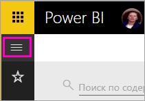

2. На панели навигации слева выберите **Рабочие области** > **Моя рабочая область**.

    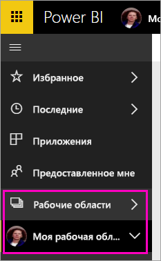

3. В левом нижнем углу выберите **Получить данные**.
   
    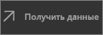

3. На странице "Получение данных" щелкните значок **Примеры**.
   
   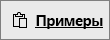

4. Выберите пример **Анализ розничной торговли**.
 
    
 
8. Нажмите кнопку **Подключиться**.  
  
   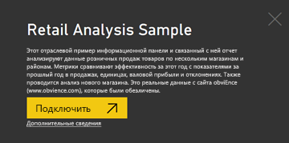
   
5. Power BI импортирует выбранный пример и добавит панель мониторинга, отчет и набор данных из него в текущую рабочую область.
   
   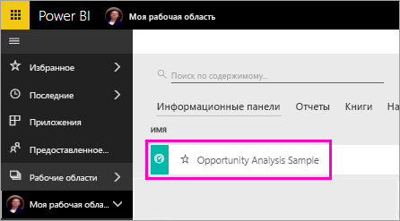

Теперь все готово для просмотра примера на устройстве Android.

## Просмотр панели мониторинга на устройстве Android
1. На устройстве Android откройте приложение Power BI и введите учетные данные учетной записи Power BI, которую вы использовали ранее в браузерном интерфейсе службы Power BI.

1.  Коснитесь кнопки глобальной навигации .

2.  Коснитесь элементов **Рабочие области** > **Моя рабочая область**.

    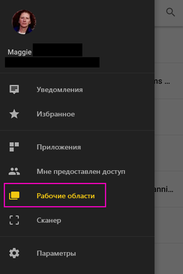

3. Коснитесь панели мониторинга для примера "Анализ розничной торговли", чтобы открыть ее.
 
    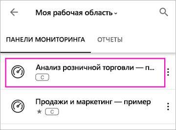
   
    Под названием каждой панели мониторинга есть обозначение (в нашем примере это буква C) метода классификации данных в этой панели мониторинга. Узнайте подробнее о [классификации данных в Power BI](../../service-data-classification.md).

    Панели мониторинга Power BI на устройстве Android выглядят немного иначе. Все плитки отображаются с той же шириной, но идут одна за другой сверху вниз.

4. Коснитесь значка со звездой  в строке заголовка, чтобы добавить панель мониторинга в избранное.

    Список избранного считается общим для мобильного приложения и службы Power BI.

4. Прокрутите список вниз и коснитесь заполненного графика "This Year's Sales, Last Year's Sales".

    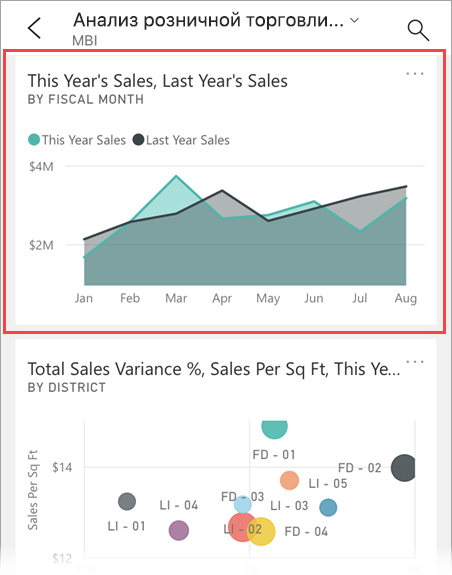

    График откроется в режиме фокусировки.

7. В режиме фокусировки коснитесь в диаграмме "Апрель". Теперь в верхней части диаграммы отображаются все значения за апрель.

    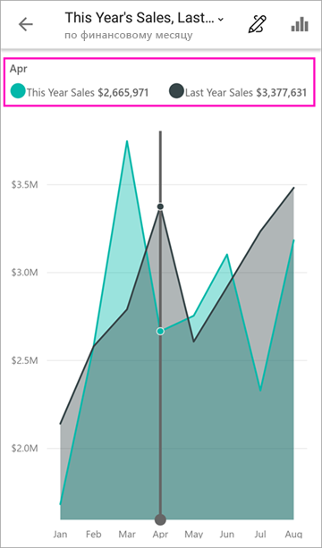

8. Коснитесь значка отчета  в правом верхнем углу. Откроется отчет, связанный с этой плиткой, в альбомной ориентации.

    

9. Коснитесь желтого пузырька "040 - Juniors" на пузырьковой диаграмме. Вы увидите, что в других визуальных элементах теперь выделены связанные с ним значения. 

    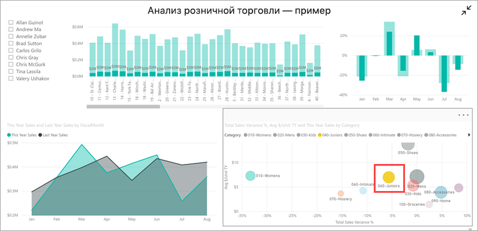

10. Проведите пальцем вверх, чтобы открыть внизу панель инструментов, и коснитесь на ней значка карандаша.

    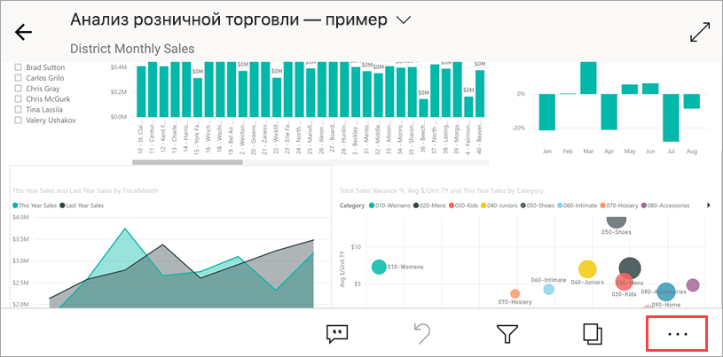

11. Коснитесь значка со смайлом на панели инструментов "Заметки" и добавьте на страницу отчета произвольные смайлики.
 
    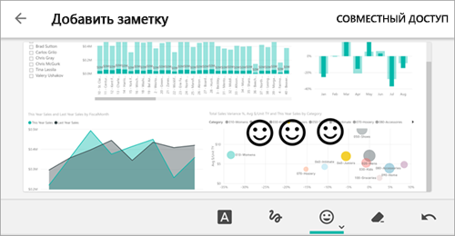

12. Коснитесь **Отправить** в правом верхнем углу.

1. Введите адреса электронной почты и при необходимости добавьте сообщение.  

    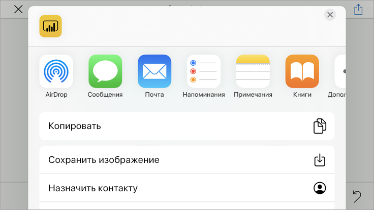

    Этот моментальный снимок можно передать любому пользователю даже за пределами вашей организации. Если вы отправите это сообщение корпоративному пользователю с учетной записью Power BI, он сможет еще и открыть пример отчета "Анализ розничной торговли".

## Очистка ресурсов

Завершив работу с этим кратким руководством, вы можете при необходимости удалить примеры панели мониторинга, отчета и набора данных "Анализ розничной торговли".

1. Откройте службу Power BI (app.powerbi.com) и войдите в нее.

2. На панели навигации слева выберите **Рабочие области** > **Моя рабочая область**.

    Видите желтую звездочку? Она показывает, что область включена в избранное.

3. На вкладке **Панели мониторинга** щелкните значок **Удалить** в форме корзины напротив панели "Анализ розничной торговли".

    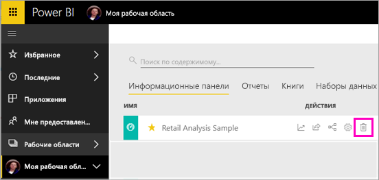

4. Выберите вкладку **Отчеты** и повторите действия по удалению для отчета "Анализ розничной торговли".

5. Выберите вкладку **Наборы данных** и повторите действия по удалению для набора данных "Анализ розничной торговли".

## Дальнейшие действия

В этом кратком руководстве описаны примеры панелей мониторинга и отчетов на мобильном устройстве Android. Изучите дополнительные сведения об использовании службы Power BI. 

> [!div class="nextstepaction"]
> [Краткое руководство. Навигация в службе Power BI](../end-user-experience.md)

