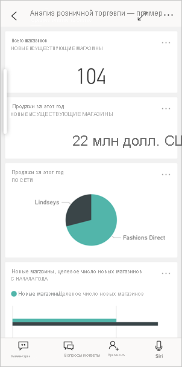
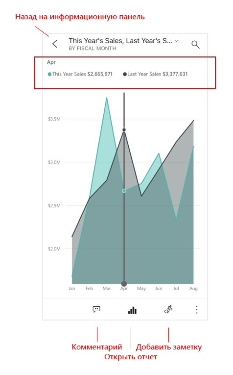
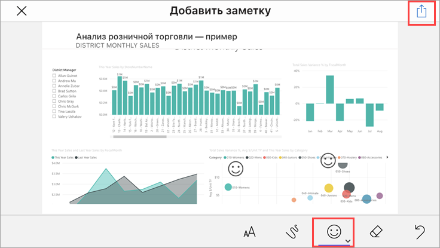
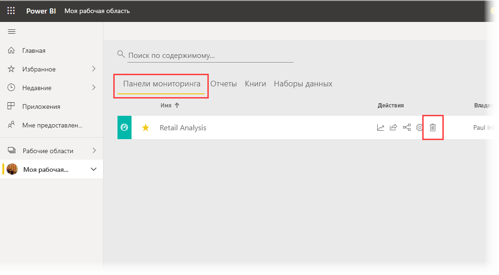

# Краткое руководство. Просмотр панелей мониторинга и отчетов в мобильных приложениях Power BI
В этом кратком руководстве приводится краткий обзор приложения Power BI Mobile и рассматриваются примеры панели мониторинга и отчета. Демонстрируется приложение Power BI для iOS, но можно использовать и другие устройства.

Область применения:

|  |  |  |  |
|:--- |:--- |:--- |:--- |
| iPhone | iPad | Android | Windows 10 |

>[!NOTE]
>Поддержка мобильного приложения Power BI для **телефонов под управлением Windows 10 Mobile** будет прекращена 16 марта 2021 г. [Дополнительные сведения](https://go.microsoft.com/fwlink/?linkid=2121400)

Панель мониторинга — это портал к жизнедеятельности и рабочим процессам вашей компании. Она представляет общую картину и служит единой точкой контроля текущего состояния бизнеса. Отчет — это интерактивное представление данных с визуальными элементами, которые отображают разные данные и связанные аналитические сведения. 

## Предварительные требования

* **Зарегистрируйтесь в Power BI**: Если вы не зарегистрированы в Power BI, перед началом работы [пройдите бесплатную регистрацию](https://app.powerbi.com/signupredirect?pbi_source=web).
* **Установите приложение Power BI для своего устройства**: Скачайте мобильное приложение Power BI** из [App Store](https://apps.apple.com/app/microsoft-power-bi/id929738808) (iOS) или [Google Play](https://play.google.com/store/apps/details?id=com.microsoft.powerbim&amp;amp;clcid=0x409) (Android).
* **Скачайте пример "Анализ розничной торговли"** : Для работы с этим кратким руководством вам нужно сначала скачать пример "Анализ розничной торговли" в службе Power BI. [Узнайте, как скачать пример](./mobile-apps-download-samples.md) в учетную запись Power BI, чтобы приступить к работе. Выбрать нужно именно пример "Анализ розничной торговли".

После выполнения предварительных требований и скачивания примера "Анализ розничной торговли" в учетную запись Power BI можно приступать к ознакомлению с обзором.

## Просмотр панели мониторинга на мобильном устройстве
1. На устройстве откройте приложение Power BI и введите учетные данные учетной записи Power BI, которую вы использовали ранее в браузерном интерфейсе службы Power BI.
 
1. Далее коснитесь значка **Рабочие области** , выберите **Мои рабочие области**, а затем коснитесь панели мониторинга "Анализ возможных сделок — пример", чтобы открыть ее.

    
   
    Панели мониторинга Power BI на мобильном устройстве выглядят немного не так, как в службе Power BI. Все плитки отображаются с той же шириной, но идут одна за другой сверху вниз.

6. Прокрутите список вниз и коснитесь заполненного графика "This Year's Sales, Last Year's Sales".

    

    График откроется в режиме фокусировки.

7. В режиме фокусировки коснитесь диаграммы **Апрель**. Теперь в верхней части диаграммы отображаются значения за апрель.

    

8. Коснитесь значка отчета  в нижней части экрана (на устройствах Android он может находиться вверху экрана). Откроется отчет, связанный с этой плиткой, в альбомной ориентации.

    

9. Коснитесь желтого пузырька "040 - Juniors" на пузырьковой диаграмме. Вы увидите, что на других диаграммах теперь выделены связанные с ним значения. 

    

10. Проведите пальцем вверх, чтобы открыть внизу панель инструментов, и коснитесь элемента **Дополнительные параметры (...)** .

    

11. Прокрутите список вниз и выберите элемент **Добавить заметку**.

    

12. На панели инструментов заметок коснитесь значка со смайликом, а затем коснитесь страницы отчета, на которую нужно добавить смайлики.
 
    

13. Теперь коснитесь элемента **Общий доступ** в правом верхнем углу.

14. Выберите способ предоставления общего доступа к отчету.  

    

    Этот моментальный снимок можно передать любому пользователю даже за пределами вашей организации. Если вы отправите это сообщение корпоративному пользователю с учетной записью Power BI, он сможет еще и открыть пример отчета "Анализ розничной торговли".

## Очистка ресурсов

Завершив работу с этим кратким руководством, вы можете при необходимости удалить примеры панели мониторинга, отчета и набора данных "Анализ розничной торговли".

1. Откройте службу Power BI ([служба Power BI](https://app.powerbi.com)) и войдите в нее.

2. На панели навигации выберите **Моя рабочая область**.

3. Выберите вкладку панелей мониторинга и щелкните значок корзины.

    

    Теперь откройте вкладку отчетов и сделайте то же самое.

4. Далее выберите вкладку наборов данных, щелкните **Дополнительные параметры** (…) и выберите пункт **Удалить**. 

    

## Дальнейшие действия

В этом кратком руководстве описаны примеры панелей мониторинга и отчетов на мобильном устройстве. Изучите дополнительные сведения об использовании службы Power BI. 

> [!div class="nextstepaction"]
> [Краткое руководство. Навигация в службе Power BI](../end-user-experience.md)

