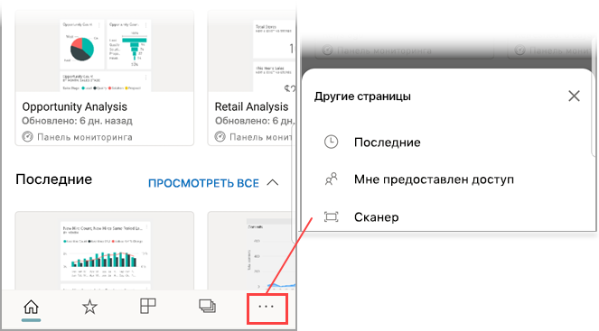

# Сканирование штрихкода с помощью мобильного приложения Power BI
Вы можете сканировать штрихкоды в реальном мире и сразу же переходить непосредственно к отфильтрованной соответствующим образом информации в мобильном приложении Power BI.

Применяется к:

|  |  |  |  |
|:--- |:--- |:--- |:--- |
|iPhone |iPad |Телефоны под управлением Android |Планшеты Android |

Предположим, коллега [указал, что поле в отчете Power BI Desktop содержит штрихкоды](../../transform-model/desktop-mobile-barcodes.md), и поделился этим отчетом с вами. 

Вы можете отсканировать штрихкод на изделии с помощью сканера в приложении Power BI на устройстве и сразу же перейти к отчету (или списку отчетов), которые его содержат. Этот отчет откроется и будет отфильтрован по данному штрихкоду.

## Сканирование штрихкода с помощью сканера Power BI
1. На панели навигации вверху выберите **Дополнительные параметры** (...), а затем — пункт **Сканер**.

    

2. Если камера не включена, разрешите приложению Power BI ее использовать. Это нужно сделать один раз. 
4. Наведите сканер на штрихкод на изделии. Вы увидите список отчетов, которые с ним связаны.
5. Коснитесь названия отчета, и он откроется на экране устройства (при этом он уже будет отфильтрован по данному штрихкоду).

## Фильтрация отчета по другому штрихкоду
Просматривая на устройстве отчет, отфильтрованный по определенному штрихкоду, вы можете решить выбрать другой код.

* Если на значке штрихкода изображен фильтр , то отчет уже отфильтрован по штрикходу. 
* Если на значке штрихкода нет фильтра , то данный фильтр неактивен и отчет не отфильтрован по штрихкоду. 

В обоих случаях нажмите на значок, чтобы открыть небольшое меню со сканером.

* Наведите сканер на другое изделие со штрихкодом, по которому хотите отфильтровать отчет. 
* Выберите **Очистить фильтр штрихкода**, чтобы вернуться к неотфильтрованной версии отчета.
* Выберите **Фильтр по последним штрихкодам**, чтобы выбрать для фильтрации один из штрихкодов, которые отсканировали во время текущего сеанса.

## Проблемы при сканировании штрихкодов
При сканировании штрихкодов на изделиях могут появляться различные сообщения.

### "Не удалось отфильтровать отчет..."
Отчет, который вы попытались отфильтровать, основан на модели данных, в которой нет этого значения штрихкода. Например, в отчете может не быть позиции под названием "минеральная вода".  

### Все или некоторые визуальные элементы в отчете не содержат значений
Значение отсканированного вами штрихкода есть в модели, однако все или некоторые визуальные элементы в отчете не содержат данного значения, поэтому фильтрация вернет пустой список. Загляните на другие страницы отчета или внесите в свои отчеты в Power BI изменения, добавив соответствующее значение. 

### "Вероятно, у вас нет отчетов, которые можно фильтровать по штрихкодам".
Это означает, что у вас нет отчетов, содержащих штрихкоды. Сканер штрихкодов способен фильтровать только отчеты, в которых есть столбцы, помеченные тегом **Штрихкод**.  

Вы или владелец отчета должны добавить в него соответствующую пометку**Barcode** в Power BI Desktop. Узнайте больше о [пометке полей со штрихкодами в Power BI Desktop](../../transform-model/desktop-mobile-barcodes.md).

### "Не удалось отфильтровать отчет. Похоже, этот штрихкод не существует в данных отчета".
Отчет, который вы попытались отфильтровать, основан на модели данных, в которой нет этого значения штрихкода. Например, в отчете может не быть позиции под названием "минеральная вода". Вы можете просканировать другое изделие, выбрать другой отчет (если у вас их несколько) или просмотреть отчет без фильтра. 

## Дальнейшие действия
* [Добавление тегов для поля со штрихкодом в Power BI Desktop](../../transform-model/desktop-mobile-barcodes.md)
* [Плитки панели мониторинга в Power BI](../end-user-tiles.md)
* [Панели мониторинга в Power BI](../end-user-dashboards.md)
