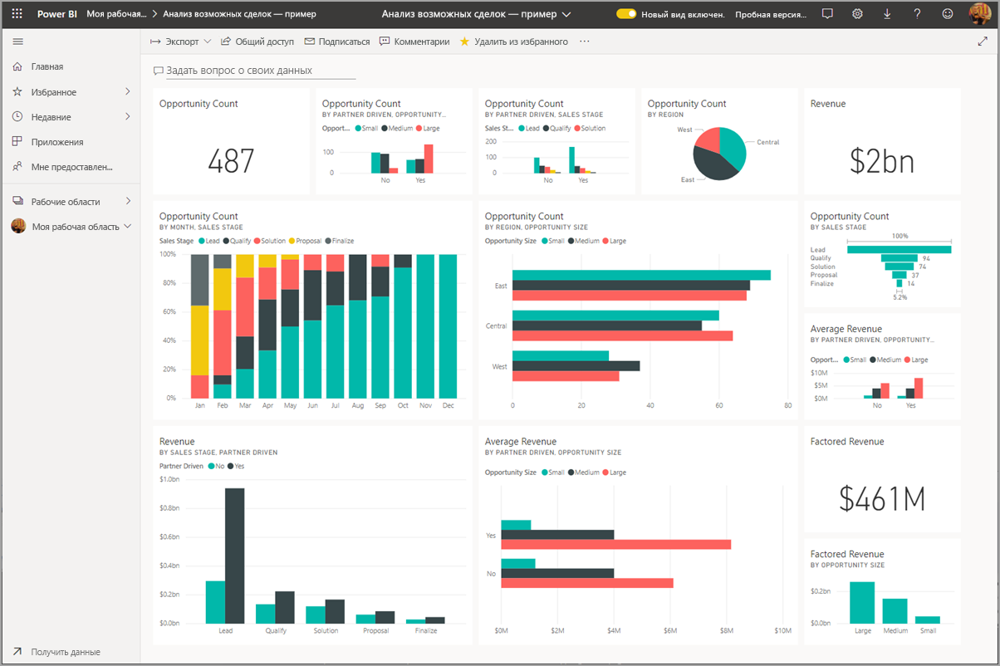
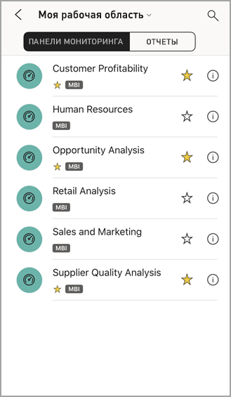

# Просмотрите панели мониторинга в мобильных приложениях Power BI
Применяется к:

|  |  |  |  | 
|:--- |:--- |:--- |:--- |:--- |
| [iPhone](mobile-apps-view-dashboard.md#view-dashboards-on-your-iphone) |[iPad](mobile-apps-view-dashboard.md#view-dashboards-on-your-ipad) |[Телефоны под управлением Android](mobile-apps-view-dashboard.md#view-dashboards-on-your-android-phone) |[Планшеты Android](mobile-apps-view-dashboard.md#view-dashboards-on-your-android-tablet) |

Панели мониторинга — это портал к жизнедеятельности и рабочим процессам вашей компании. Она представляет общую картину и служит единой точкой контроля текущего состояния бизнеса.

## Создание панелей мониторинга в службе Power BI (https://powerbi.com)
**В мобильных приложениях нельзя создавать панели мониторинга.** 

Чтобы просматривать панели мониторинга и отчеты на мобильном устройстве, необходимо создать их или подключиться к ним в веб-браузере. 

1. Перейдите к службе Power BI ([https://www.powerbi.com](https://www.powerbi.com)) и [зарегистрируйте учетную запись](../../fundamentals/service-self-service-signup-for-power-bi.md).
2. [Создайте собственные панели мониторинга и отчет Power BI](../../fundamentals/service-get-started.md) или подключитесь к существующим [приложениям Power BI](../../connect-data/service-connect-to-services.md) для различных служб, таких как [Microsoft Dynamics CRM](../../connect-data/service-connect-to-services.md).

Вот панель мониторинга Power BI в службе Power BI:

## Просмотр панелей мониторинга на iPhone
1. Откройте приложение Power BI на iPhone и выполните вход.
   
   Нужно [скачать приложение для iPhone](https://go.microsoft.com/fwlink/?LinkId=522062) из Apple App Store?
2. Коснитесь панели мониторинга, которую нужно открыть.  
   
    
   
   * Желтые звездочки  показывают избранные панели мониторинга. 
   * Нотация под названием каждой панели мониторинга (в этом примере — MBI)  показывает, как классифицируются данные на каждой панели мониторинга. Узнайте подробнее о [классификации данных в Power BI](../../create-reports/service-data-classification.md).
   
   По умолчанию панели мониторинга Power BI на iPhone выглядят немного иначе. Все плитки отображаются в том же размере, но идут одна за другой сверху вниз.
   
    
   
   > [!TIP]
   > Если панель мониторинга принадлежит вам, то в службе Power BI вы [сможете создать представление панели мониторинга специально для телефонов](../../create-reports/service-create-dashboard-mobile-phone-view.md) для просмотра в книжной ориентации. 
   > 
   > 
   
    Чтобы увидеть информационную панель на телефоне в альбомной ориентации, просто поверните его набок.
   
    
3. Смахните экран вверх, чтобы увидеть все плитки на панели мониторинга. Вы можете выбрать один из следующих вариантов.
   
   * [Коснитесь плитки](mobile-tiles-in-the-mobile-apps.md), чтобы открыть ее в режиме фокусировки и начать с ней работу.
   * Коснитесь значка звездочки , чтобы [добавить ее в избранное](mobile-apps-favorites.md).
   * Коснитесь значка **Пригласить** , чтобы [пригласить коллегу](mobile-share-dashboard-from-the-mobile-apps.md) к просмотру панели мониторинга.
   * [Синхронизировать панель мониторинга с устройством Apple Watch](mobile-apple-watch.md).
4. Чтобы вернуться к списку панелей мониторинга, коснитесь стрелки рядом с заголовком панели мониторинга, а затем выберите **Моя рабочая область**.
   
   

### Просмотр панелей мониторинга в альбомном режиме на телефонах iPhone
Просто поверните свой телефон набок, чтобы увидеть их в альбомной ориентации. Макет панели мониторинга изменится — вместо ряда плиток появится представление всей панели мониторинга, где все плитки будут расположены так же, как в службе Power BI.

Для увеличения и уменьшения масштаба различных областей панели мониторинга или панорамирования можно использовать жест сжатия или разведения двумя пальцами. Чтобы открыть плитку в режиме фокусировки и работать с данными, также можно [коснуться плитки](mobile-tiles-in-the-mobile-apps.md).

## Просмотр панелей мониторинга на iPad
1. Откройте приложение Power BI.
   
   Сначала хотите [скачать приложение для iPhone](https://go.microsoft.com/fwlink/?LinkId=522062) из Apple App Store?
2. Нажмите **Панели мониторинга** вверху приложения.  
   
   
   
   * Желтые звездочки  показывают избранные панели мониторинга. 
   * Нотация под названием каждой панели мониторинга (в этом примере — MBI)  показывает, как классифицируются данные на каждой панели мониторинга. Узнайте подробнее о [классификации данных в Power BI](../../create-reports/service-data-classification.md).
3. Вы можете предоставить доступ к панели мониторинга из своего рабочего пространства. Нажмите кнопку с многоточием ( **...** ) в правом нижнем углу плитки информационной панели и выберите **Пригласить других**.
   
   
4. Вы также можете нажать на панель мониторинга, чтобы открыть ее и увидеть содержащиеся в ней плитки. На панели мониторинга можно выполнять с ней перечисленные ниже действия.
   
   * [Нажимать на плитки](mobile-tiles-in-the-mobile-apps.md), чтобы выполнять с ними различные операции.
   * [Открывать отчеты](mobile-reports-in-the-mobile-apps.md), соответствующие плиткам.
   * [Приглашать других пользователей просмотреть панель мониторинга](mobile-share-dashboard-from-the-mobile-apps.md).
   * [Возможность добавить заметки и поделиться моментальным снимком](mobile-annotate-and-share-a-tile-from-the-mobile-apps.md) плитки.
5. Чтобы вернуться на страницу "Моя рабочая область", коснитесь имени панели мониторинга в верхнем левом углу, а затем выберите **Моя рабочая область**.
   
   

## Просмотр панелей мониторинга на устройстве Android
1. Откройте приложение Power BI на устройстве Android и выполните вход.
   
   Сначала требуется [скачать приложение Android](https://go.microsoft.com/fwlink/?LinkID=544867)?
2. Коснитесь панели мониторинга, которую нужно открыть.   
   
   

    Желтые звездочки  показывают избранные панели мониторинга. 

    Нотация под названием панели мониторинга (в этом примере — MBI)  показывает, как классифицируются данные на каждой панели мониторинга. Узнайте подробнее о [классификации данных в Power BI](../../create-reports/service-data-classification.md).

    Панели мониторинга Power BI на устройстве Android выглядят немного иначе. Все плитки отображаются с той же шириной, но идут одна за другой сверху вниз.

    

    Если панель мониторинга принадлежит вам, то в службе Power BI вы [сможете создать представление панели мониторинга специально для телефонов](../../create-reports/service-create-dashboard-mobile-phone-view.md) для просмотра в книжной ориентации. 

1. На панели мониторинга вы можете коснуться вертикальной кнопки **Дополнительные параметры** (...) рядом с именем, чтобы пригласить коллегу, обновить сведения или получить сведения о панели мониторинга.
   
   
2. Проведите по экрану вверх, чтобы увидеть [все плитки на информационной панели](mobile-tiles-in-the-mobile-apps.md). 
3. Для возврата на домашнюю страницу панелей мониторинга коснитесь названия панели, чтобы открыть путь навигации, а затем выберите **Моя рабочая область**.   

## Просмотр панелей мониторинга на планшете с Android
1. Откройте приложение Power BI на планшете с Android и выполните вход.
   
   Сначала требуется [скачать приложение Android](https://go.microsoft.com/fwlink/?LinkID=544867)?
2. Коснитесь панели мониторинга, которую нужно открыть.   
   
   
   
   * Желтые звездочки  показывают избранные панели мониторинга. 
   * Нотация под названием каждой панели мониторинга (в этом примере — MBI)  показывает, как классифицируются данные на каждой панели мониторинга. Узнайте подробнее о [классификации данных в Power BI](../../create-reports/service-data-classification.md).
3. На панели мониторинга вы можете коснуться вертикальной кнопки **Дополнительные параметры** (...) рядом с именем, чтобы пригласить коллегу, обновить сведения или получить сведения о панели мониторинга.
   
   
4. Проведите по экрану вверх, чтобы увидеть [все плитки на информационной панели](mobile-tiles-in-the-mobile-apps.md). 
   
   Для увеличения и уменьшения масштаба различных областей панели мониторинга или панорамирования можно использовать жест сжатия или разведения двумя пальцами. Чтобы открыть плитку в режиме фокусировки и работать с данными, также можно [коснуться плитки](mobile-tiles-in-the-mobile-apps.md).
5. Для возврата на домашнюю страницу панелей мониторинга коснитесь имени панели мониторинга, чтобы открыть путь навигации, а затем выберите **Моя рабочая область**:
   
    

    Для увеличения и уменьшения масштаба различных областей панели мониторинга или панорамирования можно использовать жест сжатия или разведения двумя пальцами. Чтобы открыть плитку в режиме фокусировки и работать с данными, также можно [коснуться плитки](mobile-tiles-in-the-mobile-apps.md).

## Создание представления панели мониторинга для телефонов в службе Power BI
Если панель мониторинга принадлежит вам, то *в службе Power BI* вы сможете создать представление панели специально для телефонов для просмотра в книжной ориентации. 

Прочитайте о [создании представлений панелей мониторинга для телефонов](../../create-reports/service-create-dashboard-mobile-phone-view.md).

## Дальнейшие действия
* [Скачивание приложения Android](https://go.microsoft.com/fwlink/?LinkID=544867) из Google Play.  
* [Начало работы с приложением Android для Power BI](mobile-android-app-get-started.md)  
* [Что такое Power BI?](../../fundamentals/power-bi-overview.md)
* У вас появились вопросы? [Попробуйте задать вопрос в сообществе Power BI.](https://community.powerbi.com/)
