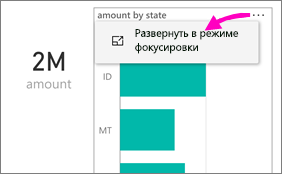
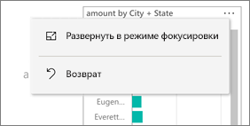
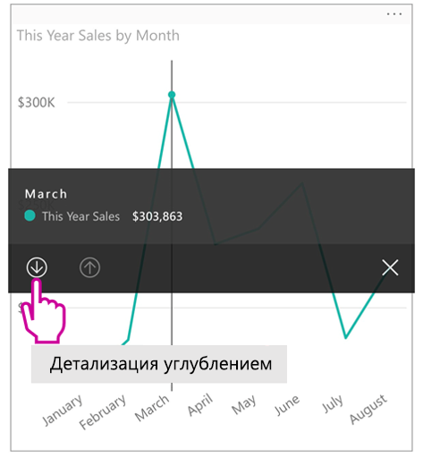
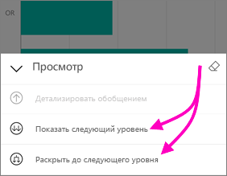
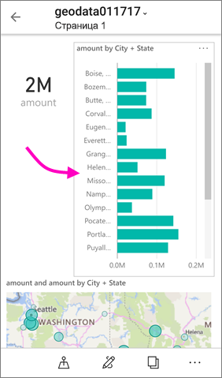
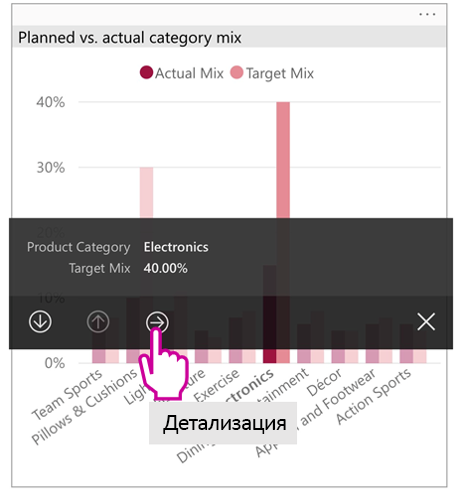
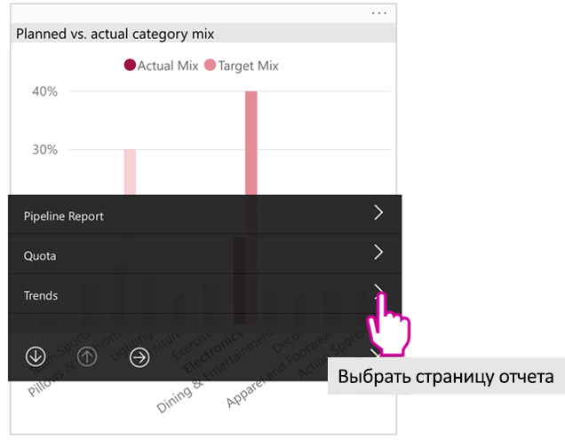

# Просмотр отчетов Power BI, оптимизированных для телефона

Применяется к:

|  |  |
|:--- |:--- |
| iPhone |Телефоны под управлением Android |

При просмотре отчета Power BI на телефоне Power BI проверяет, оптимизирован ли этот отчет для телефонов. Если это так, Power BI автоматически откроет оптимизированный отчет с книжной ориентацией.

Если найденный отчет не оптимизирован для телефона, он все равно будет открыт, только в неоптимизированном представлении в альбомной ориентации. Даже если вы повернете экран телефона при просмотре оптимизированного отчета, отчет откроется в неоптимизированном представлении исходного макета. Если оптимизированы только некоторые страницы, читатели увидят сообщение в книжной ориентации, которое уведомляет, что отчет доступен в альбомной.

Все остальные функции отчетов Power BI по-прежнему будут работать в отчетах, оптимизированных для просмотра на телефоне. Дополнительные сведения о возможностях:

* [Отчеты на устройствах iPhone](mobile-reports-in-the-mobile-apps.md). 
* [Отчеты на устройствах Android](mobile-reports-in-the-mobile-apps.md).

## Фильтрация страницы отчета на телефоне
Если в оптимизированном для телефона отчете заданы фильтры, вы сможете их использовать при просмотре такого отчета на телефоне. Отчет открывается на телефоне со значениями, отфильтрованными в соответствии со значениями отчета, настроенными через веб-интерфейс. Вы увидите сообщение о наличии активных фильтров на странице. Фильтры можно изменять прямо в телефоне.

1. Коснитесь значка фильтра  в нижней части страницы. 
2. Для просмотра необходимых результатов используйте основные или дополнительные фильтры.
   
    

## Перекрестно выделенные визуальные элементы
Перекрестное выделение визуальных элементов в книжной ориентации работает так же, как и в службе Power BI или на телефоне в альбомной ориентации: Когда вы выбираете данные в одном визуальном элементе, выделяются связанные данные в других визуальных элементах на этой странице.

См. дополнительную информацию о [фильтрах и выделении данных в отчетах Power BI](../../power-bi-reports-filters-and-highlighting.md).

## Выбор визуальных элементов
Если в мобильном отчете выбрать визуальный элемент, мобильный отчет выделяет его и фокусируется на нем, нейтрализуя другие жесты на холсте.

Если выбран визуальный элемент, вы можете выполнять такие действия, как прокрутка, только в этом элементе. Чтобы отменить выбор визуального элемента, просто коснитесь любой области за пределами этого элемента.

## Открытие визуальных элементов в режиме фокусировки
В мобильных отчетах также доступен режим фокусировки: Он позволяет увеличить отдельный визуальный элемент для более подробного его изучения.

* В отчете для телефона коснитесь многоточия ( **...** ) в правом верхнем углу визуального элемента и выберите пункт **Развернуть в режиме фокуса**.
  
    

Все, что вы делаете в режиме фокусировки, переносится на холст отчета, и наоборот. Например, если вы выделяете значение в визуальном элементе, а затем возвращаетесь в отчет, он будет отфильтрован по значению, выделенному в визуальном элементе.

Из-за ограниченного размера экрана некоторые действия можно выполнять только в режиме фокусировки.

* **Детализация** отображенной в элементе информации. Дополнительные сведения о [детализации](mobile-apps-view-phone-report.md#drill-down-in-a-visual) в отчете для телефона приведены ниже.
* **Сортировка** значений в визуальном элементе.
* **Отмена изменений** — отмена действий просмотра, выполненных в визуальном элементе, и возврат к набору определений, которые были созданы при создании отчета.
  
    Чтобы очистить все действия просмотра из визуального элемента, коснитесь многоточия ( **...** ) и выберите **Отменить изменения**.
  
    
  
    Отмена изменений доступна на уровне отчета, при этом очищаются действия просмотра во всех визуальных элементах или в выбранном элементе.   

## Детализация в визуальном элементе
Если в визуальном элементе определены уровни иерархии, вы можете детализировать сведения, отображенные в этом элементе, а затем вернуться на уровень выше. [Детализацию можно добавить в визуальный элемент](../end-user-drill.md) в службе Power BI или в программе Power BI Desktop.

Существует несколько типов детализации:

### Детализация по значениям
1. Длительно коснитесь (нажмите и удерживайте) точки данных в визуальном элементе.
2. Отобразится подсказка, и если иерархия определена, то в нижнем колонтитуле подсказки будет отображаться стрелка детализации и обобщения.
3. Касание стрелки вниз для детализации

    
    
4. Коснитесь стрелки вверх для обобщения.

### Детализация до следующего уровня
1. В отчете для телефона коснитесь многоточия ( **...** ) в правом верхнем углу визуального элемента и выберите **Развернуть в режиме фокуса**.
   
    
   
    В этом примере в полосах отображаются значения состояний.
2. Коснитесь значка просмотра  в нижнем левом углу.
   
    
3. Коснитесь элемента **Показать следующий уровень** или **Раскрыть до следующего уровня**.
   
    
   
    Теперь в полосах отображаются значения для городов.
   
    
4. Если вы коснетесь стрелки в левом верхнем углу, это позволит вам вернуться в отчет для телефона со значениями, все еще раскрытыми до нижнего уровня.
   
    
5. Чтобы вернуться к исходному уровню, коснитесь многоточия ( **...** ), а затем выберите **Отменить изменения**.
   
    

## Детализация из значения
Детализация соединяет значения на одной странице отчета с другими страницами отчета. При детализации из точки данных на другую страницу отчета значения точек данных используются для фильтрации детализируемой страницы либо обработка осуществляется в контексте выбранных данных.
Авторы отчетов могут [определять детализацию](https://docs.microsoft.com/power-bi/desktop-drillthrough) при создании отчета.

1. Длительно коснитесь (нажмите и удерживайте) точки данных в визуальном элементе.
2. Отобразится подсказка, и если детализация определена, то в нижнем колонтитуле подсказки будет отображаться стрелка детализации.
3. Касание стрелки для детализации

    

4. Выбор страницы отчета для детализации

    

5. Используйте кнопку "Назад" в заголовке приложения, чтобы вернуться на страницу, с которой вы начали.

## Дальнейшие действия
* [Создание отчетов, оптимизированных для мобильных приложений Power BI](../../desktop-create-phone-report.md)
* [Создание представления панели мониторинга для телефонов в Power BI](../../service-create-dashboard-mobile-phone-view.md)
* [Оптимизация визуальных элементов для любого размера](../../visuals/desktop-create-responsive-visuals.md)
* Появились дополнительные вопросы? [Попробуйте задать вопрос в сообществе Power BI.](https://community.powerbi.com/)

