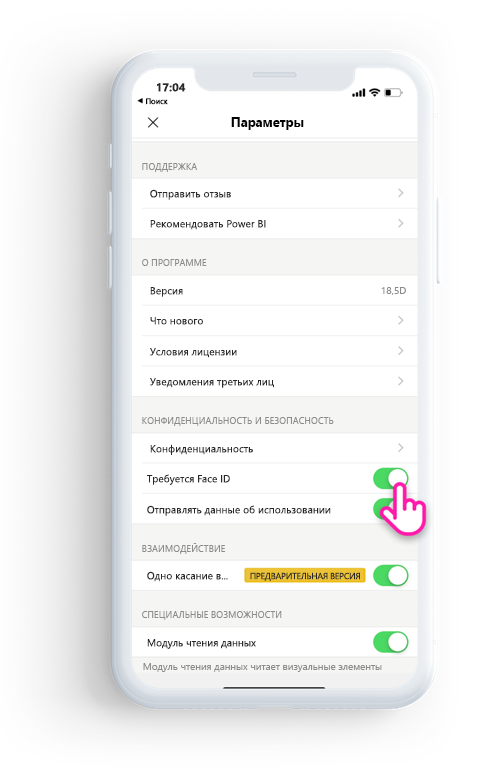
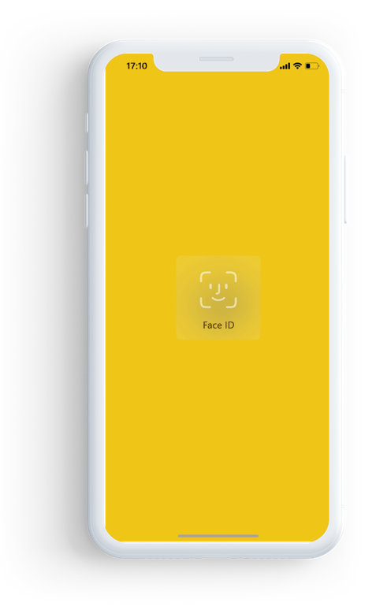

# Защита приложения Power BI с помощью Face ID, Touch ID или секретного кода 

Во многих случаях данные, управляемые в Power BI, являются конфиденциальными и должны быть защищены, чтобы доступ к ним имели только авторизованные пользователи. 

Приложение Power BI для iOS позволяет защитить данные, настроив дополнительную идентификацию. Вам потребуется предоставлять Face ID, Touch ID или секретный код при каждом запуске приложения либо при переключении приложения из фонового режима на передний план.

|  |  |
|:--- |:--- |
| iPhone |iPad |

## Включение Face ID, Touch ID или секретного кода в параметрах приложения

Чтобы использовать дополнительную идентификацию в Power BI, перейдите к параметрам приложения в разделе **Конфиденциальность и безопасность**. Вы увидите параметр для включения Face ID, Touch ID или секретного кода в зависимости от возможностей вашего устройства.

Когда этот параметр включен, при каждом запуске приложения Power BI или его переключении из фонового режима вам будет предложено указать свой идентификатор, прежде чем вы сможете получить доступ к приложению. 

Решение о запросе Face ID, Touch ID или секретного кода принимает iOS в зависимости от возможностей устройства. Если устройство поддерживает Face ID, потребуется использовать Face ID. Если оно поддерживает Touch ID, потребуется использовать Touch ID. Если ни одна из технологий не поддерживается, потребуется указать секретный код.

## Использование MDM для принудительного применения Face ID, Touch ID или секретного кода

В некоторых организациях действуют политики безопасности и нормативные требования, которые подразумевают дополнительную идентификацию перед доступом к конфиденциальным бизнес-данным. 

Мобильное приложение Power BI для iOS позволяет администраторам управлять этой настройкой, отправляя параметры конфигурации приложения из Microsoft Intune и других решений для управления мобильными устройствами (MDM). Администраторы могут использовать такую политику защиты приложений, чтобы включить этот параметр для всех пользователей или группы пользователей.

|Ключ  |Тип  |Описание  |
|---------|---------|---------|
| com.microsoft.powerbi.mobile.ForceDeviceAuthentication | Логический | По умолчанию используется значение False.  Если задано значение True, приложение требует от пользователя идентифицировать себя с помощью Face ID, Touch ID или секретного кода, прежде чем он сможет просматривать данные Power BI в приложении. Пользователям, у которых на устройстве не настроен Face ID, Touch ID или секретный код, потребуется настроить его, прежде чем получить доступ к Power BI.  |

## Дальнейшие действия

[Удаленная настройка приложения Power BI для iOS с помощью MDM](mobile-app-configuration.md)
