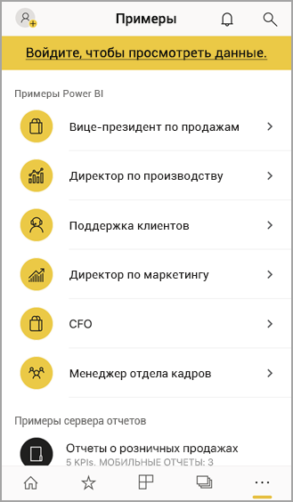

# Начало работы с мобильным приложением Power BI на устройствах iOS
Приложение Microsoft Power BI для iOS на устройствах iPhone и iPad позволяет работать со службой Power BI, Сервером отчетов Power BI и службами Reporting Services на мобильных устройствах. Благодаря возможностям динамического мобильного доступа с поддержкой сенсорного ввода вы можете легко просматривать и использовать корпоративные панели мониторинга как в локальной, так и облачной среде. Просматривайте данные на панелях мониторинга и используйте их совместно с коллегами в электронных и текстовых сообщениях. Отслеживайте актуальные данные на своих часах [Apple Watch](mobile-apple-watch.md).  

Создавайте отчеты Power BI в службе Power BI Desktop с последующей публикацией.

* [Публикуйте их в службе Power BI](../../fundamentals/service-get-started.md) и создавайте панели мониторинга.
* [Публикуйте их локально на Сервере отчетов Power BI](../../report-server/quickstart-create-powerbi-report.md).

Затем в мобильном приложении Power BI для iOS работайте с панелями мониторинга и отчетами как локально, так и в облаке.

Узнайте о [новых возможностях мобильных приложений Power BI](mobile-whats-new-in-the-mobile-apps.md).

## Загрузите приложение
[Скачайте приложение для iOS](https://go.microsoft.com/fwlink/?LinkId=522062 "Скачать приложение для iOS") для iPhone или iPad в Apple App Store.

Мобильное приложение Power BI для iOS можно запускать на любых устройствах, работающих под управлением iOS 11 и более поздних версий. 

## Регистрация в службе Power BI
Если вы еще не зарегистрировались, перейдите на сайт [powerbi.com](https://powerbi.microsoft.com/get-started/) и в разделе **Power BI — совместная работа и общий доступ в облаке** нажмите кнопку **Попробовать бесплатно**.

## Начало работы с приложением Power BI
1. Откройте приложение Power BI на устройстве iOS.
2. Чтобы войти в Power BI, коснитесь вкладки **Power BI** и введите данные для входа.  
   Чтобы получить доступ к мобильным отчетам и ключевым показателям эффективности Reporting Services, коснитесь вкладки **Сервер отчетов** и введите данные для входа.
   
   
   
   Для переключения между Power BI и сервером отчетов в приложении коснитесь изображения профиля учетной записи в левом верхнем углу экрана. 

## Примеры для Power BI и Reporting Services
Вы можете просматривать примеры Power BI и Reporting Services и взаимодействовать с ними даже без регистрации.

Чтобы открыть примеры, на панели навигации выберите **Дополнительные параметры** (...), а затем — пункт **Примеры**.

За рядом примеров для Power BI следует несколько примеров для Сервера отчетов.

   
   
   > [!NOTE]
   > В примерах доступны не все функции. Например, нельзя просматривать образцы отчетов, которые лежат в основе панелей мониторинга, предоставлять общий доступ к ним другим пользователям или добавлять их в избранное. 
   > 
   >

## Поиск содержимого в мобильных приложениях Power BI

Коснитесь значка лупы в заголовке, чтобы начать поиск содержимого Power BI.

## Просмотр избранных панелей мониторинга и отчетов
Коснитесь элемента **Избранное** () на панели навигации, чтобы открыть страницу "Избранное". 

Дополнительные сведения об избранном в мобильных приложениях Power BI см. [здесь](mobile-apps-favorites.md).

## Поддержка для организаций в мобильных приложениях Power BI
Организации могут использовать Microsoft Intune для управления устройствами и приложениями, включая мобильные приложения Power BI для iOS и Android.

Microsoft Intune позволяет управлять такими элементами, как требование ПИН-кода доступа, управление способом обработки данных в приложении и даже шифрование данных приложения, если приложение не используется.

> [!NOTE]
> Если вы используете мобильное приложение Power BI на устройстве iOS и в вашей организации настроены возможности Microsoft Intune MAM, то фоновое обновление данных будет отключено. Power BI обновит данные из службы Power BI в Интернете при следующем входе в приложение.
> 

[Информация о настройке мобильных приложений Power BI через Microsoft Intune](../../admin/service-admin-mobile-intune.md). 

## Дальнейшие действия

* [Что такое Power BI?](../../fundamentals/power-bi-overview.md)
* У вас появились вопросы? [Попробуйте задать вопрос в сообществе Power BI.](https://community.powerbi.com/)
