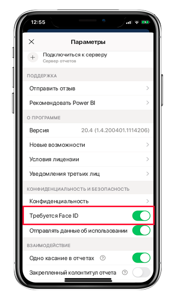
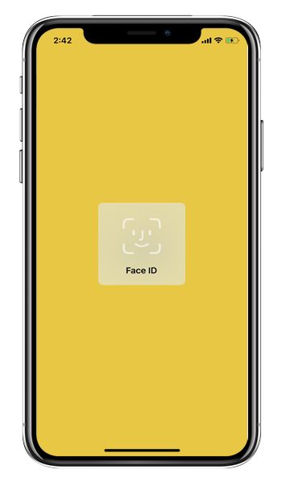
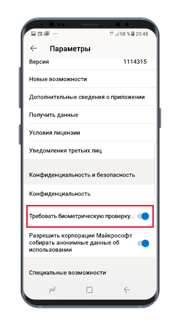
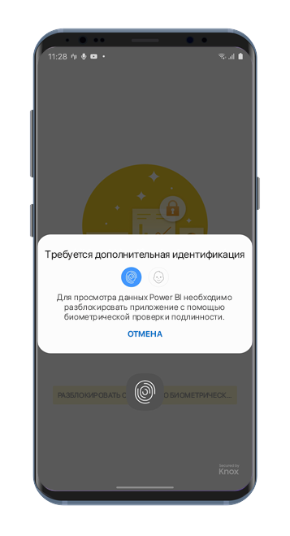

# Защита приложения Power BI с помощью Face ID, Touch ID, секретного кода или биометрических данных 

Во многих случаях данные, управляемые в Power BI, являются конфиденциальными и должны быть защищены, чтобы доступ к ним имели только авторизованные пользователи. 

Приложения Power BI для iOS и Android позволяют защитить данные, настроив дополнительную идентификацию. При каждом запуске приложения либо его переводе на передний план будет требоваться идентификация. В iOS потребуется предоставить Face ID, Touch ID или секретный код. В Android потребуется предоставить биометрические данные (Fingerprint ID).

Область применения:

|  |  |  |  |
|:--- |:--- |:--- |:--- |
|iPhones |iPad |Телефоны под управлением Android |Планшеты Android |

## Включение Face ID, Touch ID или секретного кода в iOS

Чтобы использовать дополнительную идентификацию в мобильном приложении Power BI для iOS, перейдите к параметрам приложения в разделе **Конфиденциальность и безопасность**. Вы увидите параметр для включения Face ID, Touch ID или секретного кода. Доступные параметры зависят от возможностей вашего устройства.

Когда этот параметр включен, при каждом запуске приложения или его переводе на передний план вам будет предложено указать свой идентификатор, прежде чем вы сможете получить доступ к приложению.

Тип запрашиваемого идентификатора зависит от возможностей устройства. Если устройство поддерживает Face ID, потребуется использовать Face ID. Если оно поддерживает Touch ID, потребуется использовать Touch ID. Если ни одна из технологий не поддерживается, потребуется указать секретный код. На рисунке ниже показан экран проверки подлинности с помощью Face ID.

## Включение биометрических данных (Fingerprint ID) на Android

Чтобы использовать дополнительную идентификацию в мобильном приложении Power BI для Android, перейдите к параметрам приложения в разделе **Конфиденциальность и безопасность**. Вы увидите параметр для включения биометрических данных.

Когда этот параметр включен, при каждом запуске приложения или его переводе на передний план вам будет предложено предоставить свои биометрические данные (Fingerprint ID), прежде чем вы сможете получить доступ к приложению.

На рисунке ниже показан экран проверки подлинности с помощью Fingerprint ID.

>[!NOTE]
>Чтобы иметь возможность использовать параметр "Требовать биометрическую проверку подлинности" в мобильном приложении, необходимо сначала настроить биометрию на устройстве Android. Если устройство не поддерживает биометрию, вы не сможете защитить доступ к данным Power BI с помощью этого параметра в мобильном приложении.
>
>Если администратор [удаленно включил безопасный доступ](#mdm-enforcement-of-secure-access-to-your-power-bi-mobile-app) для мобильного приложения, необходимо настроить биометрию на устройстве, чтобы получить доступ к приложению, если это еще не сделано. Если устройство не поддерживает биометрию, удаленный параметр к нему не применяется. Доступ к мобильному приложению останется незащищенным.

## Применение безопасного доступа к мобильному приложению Power BI посредством MDM

В некоторых организациях действуют политики безопасности и нормативные требования, которые подразумевают дополнительную идентификацию перед доступом к конфиденциальным бизнес-данным.

С целью их поддержки мобильное приложение Power BI позволяет администраторам управлять настройкой безопасного доступа, отправляя параметры конфигурации приложения из Microsoft Intune и других решений для управления мобильными устройствами (MDM). Администраторы могут использовать такую политику защиты приложений, чтобы включить этот параметр для всех пользователей или группы пользователей. Подробные сведения см. в статье [Удаленная настройка мобильного приложения Power BI с помощью MDM](mobile-app-configuration.md#data-protection-settings-ios-and-android).

## Дальнейшие действия
* [Удаленная настройка мобильного приложения Power BI с помощью MDM](mobile-app-configuration.md)
