# <a name="using-oauth-to-connect-to-power-bi-report-server-and-ssrs"></a>Использование OAuth для подключения к серверу отчетов Power BI и SSRS

С помощью OAuth можно подключаться к серверу отчетов Power BI и службам Reporting Services для отображения мобильных отчетов и ключевых показателей эффективности. Узнайте, как с помощью мобильного приложения Power BI настроить в среде поддержку проверки подлинности OAuth для подключения к серверу отчетов Power BI и SQL Server Reporting Services 2016 или более поздней версии.

> [!NOTE]
> Просмотр отчетов Power BI, размещенных на сервере отчетов Power BI, с использованием WAP для проверки подлинности сейчас поддерживается приложениями для iOS и Android.

## <a name="requirements"></a>Требования

ОС Windows Server 2016 является обязательным компонентом для прокси-службы веб-приложения (WAP) и серверов службы федерации Active Directory (AD FS). Домен функционального уровня Windows 2016 не требуется.

## <a name="domain-name-services-dns-configuration"></a>Конфигурация служб доменных имен (DNS)

Общедоступный URL-адрес, к которому будет подключаться мобильное приложение Power BI. Например, он может выглядеть следующим образом.

```https
https://reports.contoso.com
```

Ваша запись DNS для имени **reports** на общедоступный IP-адрес сервера прокси-службы веб-приложения (WAP). Также необходимо настроить общедоступную запись DNS для сервера ADFS. Например, вы можете настроить для сервера AD FS следующий URL-адрес.

```https
https://fs.contoso.com
```

Ваша запись DNS для имени **fs** на общедоступный IP-адрес сервера прокси-службы веб-приложения (WAP), так как он будет опубликован как часть приложения WAP.

## <a name="certificates"></a>Сертификаты

Необходимо настроить сертификаты как для приложения WAP, так и для сервера ADFS. Оба сертификата должны быть частью действительного центра сертификации, который распознают ваши мобильные устройства.

## <a name="reporting-services-configuration"></a>Настройка служб Reporting Services

На стороне служб Reporting Services не требуется сложная настройка. Необходимо просто указать допустимое имя субъекта-службы (SPN), которое обеспечивает правильную проверку подлинности Kerberos, и включить сервер Reporting Services для проверки подлинности с согласованием.

### <a name="service-principal-name-spn"></a>Имя субъекта-службы (SPN)

Имя субъекта-службы — это уникальный идентификатор для службы, которая использует проверку подлинности Kerberos. Убедитесь, что вы указали правильное имя субъекта-службы HTTP для сервера отчетов.

Руководство по настройке правильного имени субъекта-службы (SPN) для сервера отчетов см. в статье о [регистрации имени субъекта-службы (SPN) для сервера отчетов](/sql/reporting-services/report-server/register-a-service-principal-name-spn-for-a-report-server).

### <a name="enabling-negotiate-authentication"></a>Включение проверки подлинности с согласованием

Чтобы включить сервер отчетов для использования проверки подлинности Kerberos, необходимо указать RSWindowsNegotiate в качестве типа проверки подлинности на сервере отчетов. Это можно сделать в файле rsreportserver.config.

```xml
<AuthenticationTypes>  
    <RSWindowsNegotiate />  
    <RSWindowsKerberos />  
    <RSWindowsNTLM />  
</AuthenticationTypes>
```

Дополнительные сведения см. в статьях об [изменении файла конфигурации Reporting Services ](/sql/reporting-services/report-server/modify-a-reporting-services-configuration-file-rsreportserver-config) и [настройке проверки подлинности Windows на сервере отчетов](/sql/reporting-services/security/configure-windows-authentication-on-the-report-server).

## <a name="active-directory-federation-services-adfs-configuration"></a>Настройка служб федерации Active Directory (AD FS)

Вам необходимо настроить ADFS на сервере Windows 2016 в вашей среде. Для этой настройки, в диспетчере серверов в разделе "Управление" выберите "Добавить роли и компоненты". Дополнительные сведения см. в документации [служб федерации Active Directory](https://technet.microsoft.com/windows-server-docs/identity/active-directory-federation-services).

### <a name="create-an-application-group"></a>Создание группы приложений

На экране управления AD FS необходимо создать группу приложений для Reporting Services, которая будет содержать информацию для приложений Power BI Mobile.

Вот как создать группу приложений.

1. В приложении управления AD FS щелкните правой кнопкой мыши **Группы приложений** и выберите **Добавить группу приложений...**

   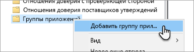

2. В мастере добавления группы приложений укажите **имя** группы приложений и выберите параметр **Собственное приложение, подключающееся к веб-API**.

   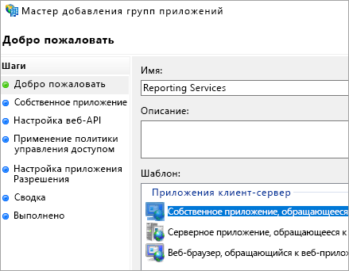

3. Нажмите кнопку **Далее**.

4. Укажите **имя** приложения, которое вы добавляете. 

5. Пока будет автоматически создаваться **идентификатор клиента**, укажите *484d54fc-b481-4eee-9505-0258a1913020* для iOS и Android.

6. Необходимо добавить следующие **URL-адреса перенаправления**:

   **Записи для Power BI Mobile для iOS:**  
   msauth://code/mspbi-adal://com.microsoft.powerbimobile  
   msauth://code/mspbi-adalms://com.microsoft.powerbimobilems  
   mspbi-adal://com.microsoft.powerbimobile  
   mspbi-adalms://com.microsoft.powerbimobilems

   **Приложения Android требуют только следующих шагов:**  
   urn:ietf:wg:oauth:2.0:oob

   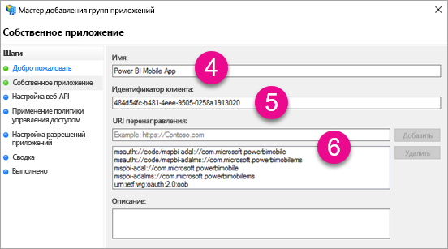
7. Нажмите кнопку **Далее**.

8. Укажите URL-адрес сервера отчетов. Это внешний URL-адрес, который будет обращаться к прокси-службе веб-приложения. Он должен быть в следующем формате.

   > [!NOTE]
   > URL-адрес вводится с учетом регистра.

   *https://<URL-адрес сервера отчетов>/*

   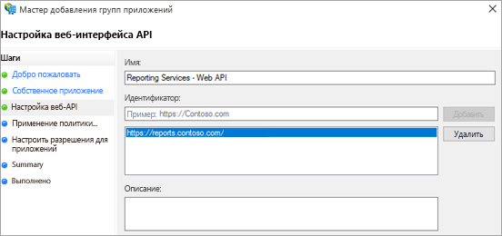
9. Нажмите кнопку **Далее**.

10. Выберите **политику управления доступом**, которая соответствует требованиям вашей организации.

    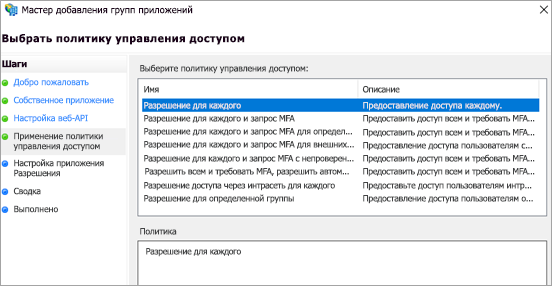

11. Нажмите кнопку **Далее**.

12. Нажмите кнопку **Далее**.

13. Нажмите кнопку **Далее**.

14. Выберите **Закрыть**.

По завершении свойства вашей группы приложений будут выглядеть приблизительно так:

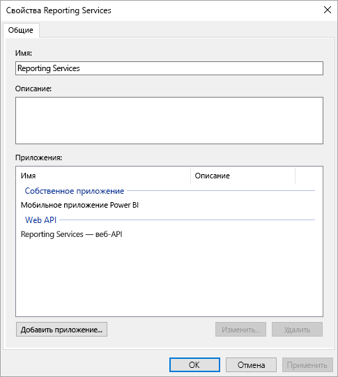

## <a name="web-application-proxy-wap-configuration"></a>Настройка прокси-службы веб-приложения (WAP)

Вам понадобится включить роль Windows прокси-службы веб-приложения (роль) на сервере в вашей среде. Эта роль должна быть включена на сервере Windows 2016. Дополнительные сведения см. в статье о [прокси-службе веб-приложения в Windows Server 2016](https://technet.microsoft.com/windows-server-docs/identity/web-application-proxy/web-application-proxy-windows-server) и в разделе о [публикации приложений с помощью предварительной проверки подлинности AD FS](https://technet.microsoft.com/windows-server-docs/identity/web-application-proxy/publishing-applications-using-ad-fs-preauthentication#a-namebkmk14apublish-an-application-that-uses-oauth2-such-as-a-windows-store-app).

### <a name="constrained-delegation-configuration"></a>Настройка ограниченного делегирования

Чтобы перейти с проверки подлинности OAuth на проверку подлинности Windows, понадобится использовать ограниченное делегирование с переходом протоколов. Это делегирование является частью конфигурации Kerberos. Вы уже определили SPN служб Reporting Services во время настройки Reporting Services.

Теперь необходимо настроить в Active Directory ограниченное делегирование на учетную запись компьютера сервера WAP. Если у вас нет прав на доступ Active Directory, обратитесь к администратору домена.

Чтобы настроить ограниченное делегирование, необходимо выполнить следующие шаги.

1. На компьютере со средствами Active Directory запустите средство **Пользователи и компьютеры Active Directory**.

2. Найдите учетную запись компьютера для сервера WAP. По умолчанию она будет находиться в контейнере компьютеров.

3. Щелкните правой кнопкой мыши сервер WAP и выберите пункт **Свойства**.

4. Выберите вкладку **Делегирование**.

5. Выберите параметр **Доверять компьютеру делегирование указанных служб** и **Использовать любой протокол проверки подлинности**.

   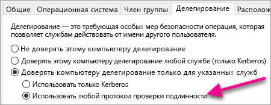

   Теперь для этой учетной записи компьютера сервера WAP настроено ограниченное делегирование. Далее нужно указать службы, которые этот компьютер может делегировать.

6. Нажмите кнопку **Добавить...** . в поле служб.

   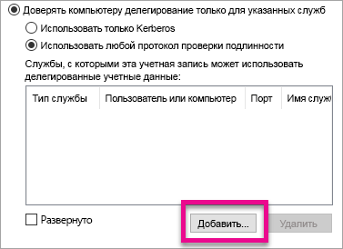

7. Выберите **Пользователи или компьютеры...**

8. Введите учетную запись службы, которую вы используете для Reporting Services. Эта учетная запись является учетной записью, в которую вы добавили имя субъекта-службы во время настройки Reporting Services.

9. Выберите имя субъекта-службы для Reporting Services и нажмите кнопку **ОК**.

   > [!NOTE]
   > Вы можете видеть только имя субъекта-службы NetBIOS. Фактически оно выбирает имена субъекта-службы NetBIOS и полного доменного имени, если они оба существуют.

   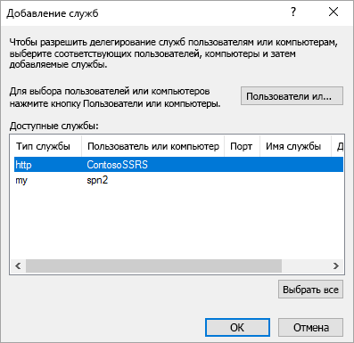

10. Если установлен флажок **Развернуто**, вы увидите похожий результат.

    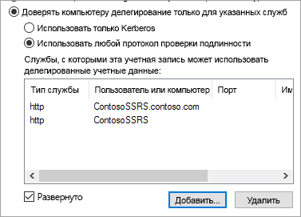

11. Выберите **ОК**.

### <a name="add-wap-application"></a>Добавление приложения WAP

Хотя вы можете публиковать приложения в консоли управления доступом к отчету, сначала потребуется создать приложение с помощью PowerShell. Выполните эту команду, чтобы добавить приложение.

```powershell
Add-WebApplicationProxyApplication -Name "Contoso Reports" -ExternalPreauthentication ADFS -ExternalUrl https://reports.contoso.com/ -ExternalCertificateThumbprint "0ff79c75a725e6f67e3e2db55bdb103efc9acb12" -BackendServerUrl https://ContosoSSRS/ -ADFSRelyingPartyName "Reporting Services - Web API" -BackendServerAuthenticationSPN "http/ContosoSSRS.contoso.com" -UseOAuthAuthentication
```

| Параметр | Комментарии |
| --- | --- |
| **ADFSRelyingPartyName** |Имя веб-API, созданное как часть группы приложений в ADFS. |
| **ExternalCertificateThumbprint** |Сертификат, используемый для внешних пользователей. Важно, чтобы этот сертификат был действителен для мобильных устройств и был издан доверенным центром сертификации. |
| **BackendServerUrl** |URL-адрес, который ведет на сервер отчетов с сервера WAP. Если сервер WAP находится в зоне DMZ, может потребоваться использовать полное доменное имя. Убедитесь, что вы можете открыть этот URL-адрес из браузера на сервере WAP. |
| **BackendServerAuthenticationSPN** |Имя субъекта-службы, созданное во время настройки служб Reporting Services. |

### <a name="setting-integrated-authentication-for-the-wap-application"></a>Настройка встроенной проверки подлинности для приложения WAP

После добавления приложения WAP необходимо указать для параметра BackendServerAuthenticationMode (Режим проверки подлинности внутреннего сервера) значение IntegratedWindowsAuthentication (Встроенная проверка подлинности Windows). Для его настройки потребуется идентификатор приложения WAP.

```powershell
Get-WebApplicationProxyApplication "Contoso Reports" | fl
```


Выполните следующую команду, чтобы указать для параметра BackendServerAuthenticationMode идентификатор приложения WAP.

```powershell
Set-WebApplicationProxyApplication -id 30198C7F-DDE4-0D82-E654-D369A47B1EE5 -BackendServerAuthenticationMode IntegratedWindowsAuthentication
```


## <a name="connecting-with-the-power-bi-mobile-app"></a>Подключение к приложению Power BI Mobile

В мобильном приложении Power BI необходимо подключиться к экземпляру служб Reporting Services. Для этого укажите **внешний URL-адрес** приложения WAP.

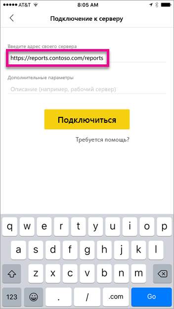

Нажав кнопку **Подключиться**, вы попадете на страницу входа в ADFS. Введите действительные учетные данные для домена.

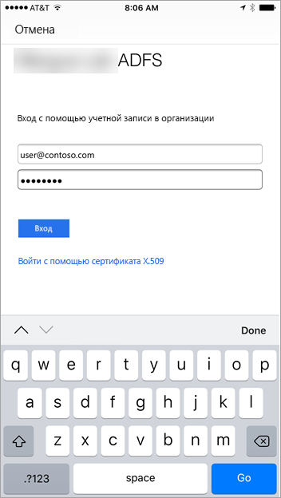

После того как вы нажмете кнопку **Войти**, вы увидите элементы с сервера Reporting Services.

## <a name="multi-factor-authentication"></a>Многофакторная проверка подлинности

Вы можете включить многофакторную проверку подлинности, чтобы повысить уровень безопасности среды. Дополнительные сведения см. в статье о [настройке AD FS 2016 и Многофакторной идентификации Azure](https://technet.microsoft.com/windows-server-docs/identity/ad-fs/operations/configure-ad-fs-2016-and-azure-mfa).

## <a name="troubleshooting"></a>Устранение неполадок

### <a name="you-receive-the-error-failed-to-login-to-ssrs-server"></a>Появилась ошибка "Не удалось войти на сервер SSRS."

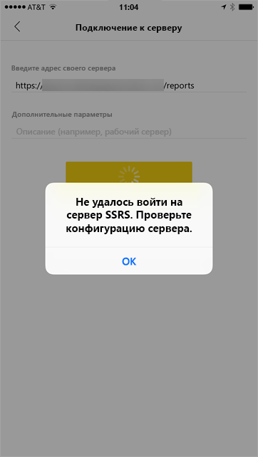

Вы можете настроить [Fiddler](https://www.telerik.com/fiddler) в качестве прокси-сервера для мобильных устройств, чтобы проанализировать ошибку. Чтобы включить прокси-сервер Fiddler для мобильного устройства, необходимо настроить [CertMaker для iOS и Android](https://www.telerik.com/fiddler/add-ons) на компьютере, на котором будет работать Fiddler. Дополнительный компонент, разработанный компанией Telerik для Fiddler.

Если при использовании Fiddler вы можете войти на сервер, это означает, что существуют проблемы с сертификатом приложения WAP или сервера ADFS. 

## <a name="next-steps"></a>Дальнейшие действия

[Регистрация имени субъекта-службы (SPN) для сервера отчетов](/sql/reporting-services/report-server/register-a-service-principal-name-spn-for-a-report-server)  
[Изменение файла конфигурации служб Reporting Services](/sql/reporting-services/report-server/modify-a-reporting-services-configuration-file-rsreportserver-config)  
[Настройка проверки подлинности Windows на сервере отчетов](/sql/reporting-services/security/configure-windows-authentication-on-the-report-server)  
[Службы федерации Active Directory](https://technet.microsoft.com/windows-server-docs/identity/active-directory-federation-services)  
[Прокси-служба веб-приложения в Windows Server 2016](https://technet.microsoft.com/windows-server-docs/identity/web-application-proxy/web-application-proxy-windows-server)  
[Публикация приложений с помощью предварительной проверки подлинности AD FS](https://technet.microsoft.com/windows-server-docs/identity/web-application-proxy/publishing-applications-using-ad-fs-preauthentication#a-namebkmk14apublish-an-application-that-uses-oauth2-such-as-a-windows-store-app)  
[Настройка AD FS 2016 и Многофакторной идентификации Azure](https://technet.microsoft.com/windows-server-docs/identity/ad-fs/operations/configure-ad-fs-2016-and-azure-mfa)  
Появились дополнительные вопросы? [Ответы на них см. в сообществе Power BI.](https://community.powerbi.com/)
