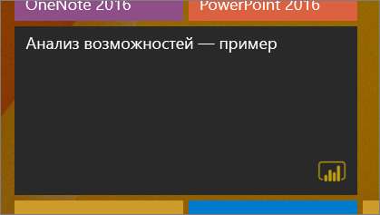
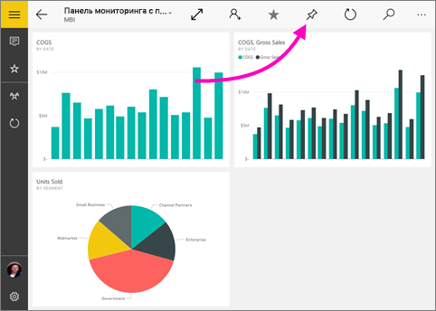
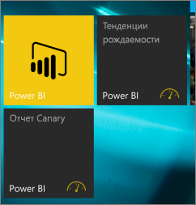

# Закрепление панели мониторинга на начальном экране Windows 10 из мобильного приложения Power BI
Вы можете закрепить панель мониторинга Power BI на начальном экране Windows из мобильного приложения Power BI для Windows 10. При касании плитки на начальном экране открывается панель мониторинга в мобильном приложении Power BI для Windows 10.

>[!NOTE]
>Поддержка мобильного приложения Power BI для **телефонов под управлением Windows 10 Mobile** будет прекращена 16 марта 2021 г. [Дополнительные сведения](https://go.microsoft.com/fwlink/?linkid=2121400)

## Закрепление панели мониторинга на начальном экране в качестве плитки
1. Откройте панель мониторинга.
2. Коснитесь значка **Закрепить на начальном экране** .
   
   
   
   Перейдите на начальный экран устройства, чтобы просмотреть плитку.
   
   

## Дальнейшие действия
* [Скачивание мобильного приложения Power BI для Windows 10](https://go.microsoft.com/fwlink/?LinkID=526478) из Магазина Windows.  
* [Начало работы с мобильным приложением Power BI для Windows 10](mobile-windows-10-phone-app-get-started.md)  
* [Что такое Power BI?](../../fundamentals/power-bi-overview.md)
* У вас появились вопросы? [Попробуйте задать вопрос в сообществе Power BI.](https://community.powerbi.com/)
