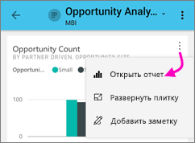
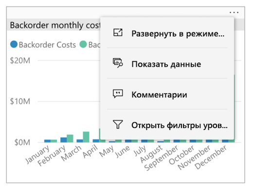
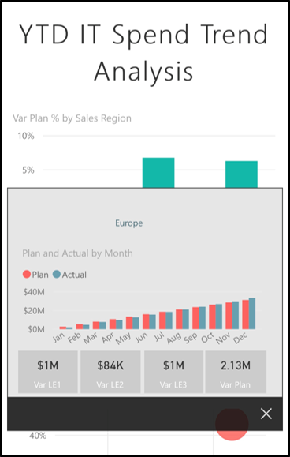
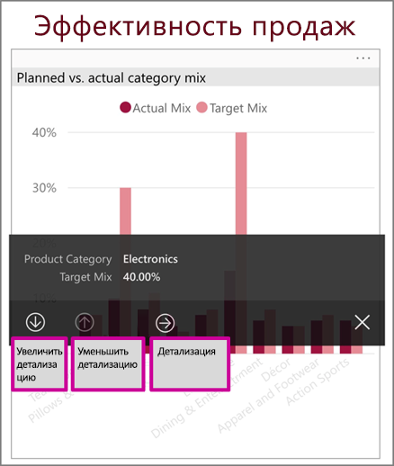
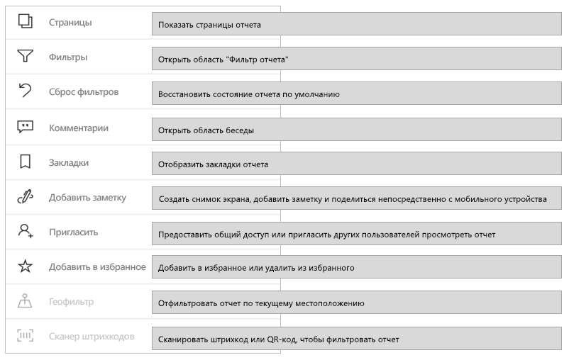
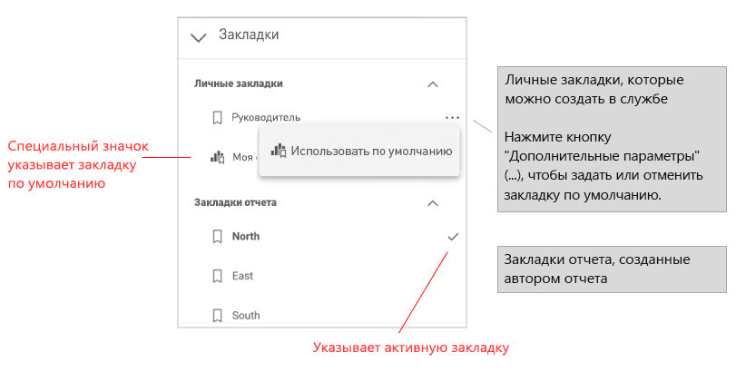
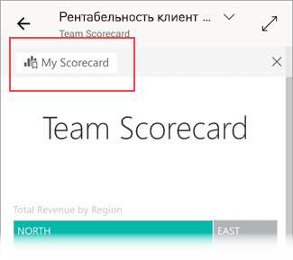

# Просмотр отчетов в мобильных приложениях Power BI
Применяется к:

|  |  |  |  |  |
|:---: |:---: |:---: |:---: |:---: |
| iPhone |iPad |Телефоны под управлением Android |Планшеты Android |Устройства под управлением Windows 10 |

>[!NOTE]
>Поддержка мобильного приложения Power BI для **телефонов под управлением Windows 10 Mobile** будет прекращена 16 марта 2021 г. [Дополнительные сведения](https://go.microsoft.com/fwlink/?linkid=2121400)

Отчет Power BI — это интерактивное представление данных с визуальными элементами, которые отображают различные результаты и сведения, полученные из этих данных. Просмотр отчетов в мобильных приложениях Power BI — это последний шаг трехэтапной процедуры:

1. [Создание отчетов в Power BI Desktop](../../create-reports/desktop-report-view.md). В Power BI Desktop можно даже [оптимизировать отчет для телефонов](mobile-apps-view-phone-report.md).
2. Публиковать эти отчеты можно в службе Power BI [(https://powerbi.com)](https://powerbi.com) или на [Сервере отчетов Power BI](../../report-server/get-started.md)).  
3. Работайте с отчетами в мобильных приложениях Power BI.

## Открытие отчета Power BI в мобильном приложении
Расположение отчетов Power BI в мобильном приложении зависит от места их получения. Они могут быть в расположении "Приложения", "Мне предоставлен доступ", "Рабочие области" (включая страницу "Моя рабочая область") или на сервере отчетов. Иногда получить отчет можно с помощью связанной панели мониторинга, а иногда он представлен в списке.

В списках и меню вы увидите значок рядом с именем отчета, что поможет понять, что этот элемент является отчетом:

Для отчетов в приложениях Power BI Mobile используются два значка:

*  Обозначает отчет, который будет отображаться в альбомной ориентации приложения. Он будет выглядеть так же, как в браузере.

*  Обозначает отчет, содержащий по меньшей мере одну страницу отчета, оптимизированную для телефона, которая будет представлена в книжной ориентации.

> [!NOTE]
> Удерживая телефон в альбомной ориентации, вы всегда получите альбомный макет, даже если для страницы отчета есть мобильный макет.

Чтобы получить отчет из панели мониторинга, коснитесь пункта **Дополнительные параметры** (…) в правом верхнем углу плитки и выберите команду **Открыть отчет**:
  
  
  
  Не все плитки можно открывать как отчеты. Например, плитки, созданные после ввода вопроса в поле вопросов и ответов, не открывают отчеты при касании.
  
## Работа с отчетами
После открытия отчета в приложении вы можете начать работу с ним. Вы можете выполнять разные действия с отчетами и данными. В нижнем колонтитуле отчета находятся действия, которые можно выполнять с ним. С помощью обычного и длительного касания данных, показанных в отчете, можно подробно проанализировать их.

### Взаимодействие одиночным или двойным касанием
После скачивания мобильного приложения Power BI в нем настроено взаимодействие одиночным касанием. Это означает, что при касании визуального элемента для выполнения какого-либо действия, например выбора объекта среза, перекрестного выделения, перехода по ссылке, нажатия кнопки и т. д., происходит одновременно выбор визуального элемента и выполнение требуемого действия.

При желании можно переключиться на взаимодействие двойным касанием. При использовании взаимодействия двойным касанием сначала нужно коснуться визуального элемента, чтобы выбрать его, а затем коснуться еще раз, чтобы выполнить нужное действие.

Переключаться между взаимодействием одиночным и двойным касанием можно в [параметрах взаимодействия с приложением](./mobile-app-interaction-settings.md).

### Режимы одиночного и множественного выбора точек данных

Чтобы выбрать точку данных в отчете, ее нужно коснуться. Вы можете выбрать режим одиночного или множественного выбора. В режиме одиночного выбора при касании точки данных она выбирается вместо всех ранее выбранных элементов. В режиме множественного выбора при касании точки данных она выбирается *в дополнение* ко всем ранее выбранным элементам. При этом выделяется совокупность всех элементов, выбранных во всех визуальных элементах отчета.

Чтобы отменить выбор точки данных, просто коснитесь ее еще раз.

Для переключения между режимами одиночного и множественного выбора перейдите в [параметры взаимодействия с приложением](./mobile-app-interaction-settings.md).

### Использование касания и длительного касания
Касание аналогично щелчку мыши. Если вы хотите осуществить перекрестное выделение отчета по точке данных, коснитесь ее.
При касании значения среза выбирается значение, а остальная часть отчета размещается по этому значению.
При касании ссылки, кнопки или закладки выполняется действие, определенное автором отчета.

Возможно, вы заметили, что при касании визуального элемента отображается граница. В правом верхнем углу границы находится пункт **Дополнительные параметры** (…). Нажав кнопку с многоточием, вы увидите меню действий, которые можно выполнить для этого визуального элемента:

### Подсказки и действия детализации
При длительном касании (нажатии и удерживании) точки данных отображается подсказка, представляющая значения этой точки данных:

Если автор отчета настроил подсказку для его страницы, она заменит собой подсказку по умолчанию:

> [!NOTE]
> Подсказки для отчетов поддерживаются для устройств с окном просмотра не менее 640 пикселей и 320 пикселей. Для устройств меньшего размера приложение использует подсказки по умолчанию.

Авторы отчетов могут определять иерархии в данных и связях между страницами отчета. Иерархия обеспечивает детализацию вверх и вниз, а также детализацию по другой странице отчета из визуального элемента и значения. Таким образом, при длительном касании значения в дополнение к подсказке в нижнем колонтитуле отображаются соответствующие параметры детализации:

Когда вы касаетесь определенной части визуального элемента и выбираете параметр *детализации* в Power BI, вы переходите на другую страницу отчета, отфильтрованную по выбранному значению. Автор отчета может задавать различные варианты детализации с переходом на разные страницы. В этом случае вы выбираете из них тот, который вам интересен. Чтобы вернуться на предыдущую страницу, нажмите кнопку "Назад".

Для получения дополнительных сведений см. раздел о том, как [добавить детализацию в Power BI Desktop](../../create-reports/desktop-drillthrough.md).
   
   > [!IMPORTANT]
   > В мобильных приложениях Power BI действия по детализации в визуальных элементах матрицы и таблицы включаются только через значения ячеек, а не через заголовки столбцов или строк.
   
   
   
### Использование действий в нижнем колонтитуле отчета
Нижний колонтитул отчета содержит действия, которые можно выполнить на текущей странице отчета или во всем отчете. Нижний колонтитул обеспечивает быстрый доступ к наиболее часто используемым действиям. Чтобы получить доступ к другим действиям, коснитесь кнопки **Дополнительные параметры** (…):

Ниже перечислены действия, которые можно выполнить из нижнего колонтитула:
* Сброс фильтра отчета и перекрестное выделение выбранных элементов обратно в исходное состояние.
* Открытие панели беседы для просмотра или добавления комментариев к этому отчету.
* Открытие панели фильтра, чтобы просмотреть и изменить примененный к отчету фильтр.
* Вывод всех страниц в отчете. Если коснуться имени страницы, загружается и выводится эта страница.
Для перемещения между страницами отчета можно провести пальцем от края до центра экрана.
* Просмотр всех действий с отчетом.

#### Все действия с отчетом
При нажатии кнопки **Дополнительные параметры** (…) в нижнем колонтитуле отчета отображаются все действия, которые можно выполнить с отчетом:

Некоторые действия могут быть отключены, так как они зависят от конкретных возможностей отчета.
Например:

Элемент **Закладки** имеется, только если в отчете заданы [закладки](mobile-reports-in-the-mobile-apps.md#bookmarks). Отображаются как личные закладки, которые можно определить в службе Power BI, так и закладки, установленные создателем отчета. Если одна из закладок была определена как закладка по умолчанию, при загрузке отчет будет открываться в этом представлении.

**Добавление заметок и общий доступ** могут быть отключены, если в вашей организации действует [политика защиты Intune](https://docs.microsoft.com/intune/app-protection-policies), запрещающая предоставление общего доступа из приложения Power BI Mobile.

**Приглашение** включается, только если у вас есть разрешение на предоставление этого отчета другим для общего доступа. Вы будете обладать разрешением, только если являетесь владельцем отчета или получили от владельца разрешение на повторное предоставление для общего доступа.

**Фильтр по текущему расположению** включается, если автор отчета классифицировал отчет с географическими данными. Дополнительные сведения см. в статье [определение географических данных в отчете](https://docs.microsoft.com/power-bi/desktop-mobile-geofiltering).

**Сканирование для фильтрации отчета по штрихкоду** включается, только если набор данных в отчете помечен как **штрихкод**. Дополнительные сведения см. в статье о том, как [отмечать штрихкоды в Power BI Desktop](https://docs.microsoft.com/power-bi/desktop-mobile-barcodes).

### Закладки

Мобильное приложение Power BI поддерживает как закладки отчета, установленные создателем отчета, так и личные закладки, которые можно определить в службе Power BI. Меню закладок доступно при выборе элемента **Дополнительные параметры** (...) на [панели инструментов с действиями отчета](mobile-reports-in-the-mobile-apps.md#all-report-actions).

Закладки по умолчанию обозначаются специальным значком. Для личных закладок можно задать, отменить или изменить параметр по умолчанию, коснувшись элемента **Дополнительные параметры (...)** рядом с нужной закладкой и выбрав пункт **Использовать по умолчанию** или **Очистить умолчания**.

При открытии представлении закладки имя закладки отображается вверху отчета.

[Дополнительные сведения о закладках в службе Power BI](https://docs.microsoft.com/power-bi/consumer/end-user-bookmarks).

## Настройка работы с отчетами
В мобильном приложении Power BI есть ряд параметров, позволяющих управлять работой с отчетами. В настоящее время доступны следующие параметры.
* **Взаимодействие с визуальными элементами отчета**. Можно выбрать взаимодействие одиночным или двойным касанием.
* **Способ обновления данных**. Можно выбрать обновление данных отчета с помощью кнопки обновления или действия "Потяните, чтобы обновить".
* **Отображение нижнего колонтитула отчета**. Можно выбрать закрепленный нижний колонтитул, который виден всегда, или динамический нижний колонтитул, который скрывается и отображается при выполнении определенных действий (например, при прокрутке).

Сведения о том, как изменить эти параметры, см. в разделе о [параметрах взаимодействия с приложением](./mobile-app-interaction-settings.md).

## Дальнейшие действия
* [Просмотр отчетов Power BI, оптимизированных для телефона, и взаимодействие с ними](mobile-apps-view-phone-report.md)
* [Создание версии отчета, оптимизированной для телефонов](../../create-reports/desktop-create-phone-report.md)
* У вас появились вопросы? [Попробуйте задать вопрос в сообществе Power BI.](https://community.powerbi.com/)
